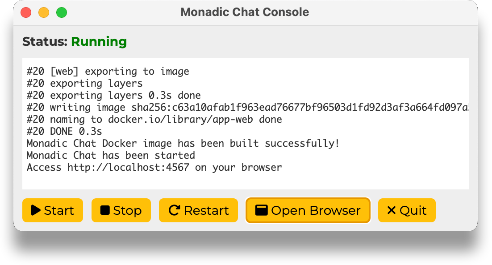

&nbsp;

 

🤖 + 🐳 + 🐧 <b>Grounding AI Chatbots with Full Linux Environment on Docker </b>

⚠️ This application is currently under active development

&nbsp;

## Overview

**Monadic Chat** is a framework designed to create and use intelligent chatbots. By providing a full-fledged Linux environment on Docker to GPT-4 and other LLMs, it allows the chatbots to perform advanced tasks that require external tools for searching, coding, testing, analysis, visualization, and more.

- Documentation
  - [English](https://yohasebe.github.io/monadic-chat/overview)
  - [日本語](https://yohasebe.github.io/monadic-chat/overview_ja)

- Download Installer
  - [MacOS (Apple Silicon/Intel)](https://yohasebe.github.io/monadic-chat/installation#macos)
  - [Windows](https://yohasebe.github.io/monadic-chat/installation#windows)

&nbsp;

&nbsp;

&nbsp;

&nbsp;

> There are two versions of Monadic Chat. One is a web browser-based app framework developed in this repository. The other is a command line app provided as a RubyGem. 

- [Monadic Chat](https://github.com/yohasebe/monadic-chat) (this repository)
- [Monadic Chat CLI](https://github.com/yohasebe/monadic-chat-cli)

## Features

### Basic Structure

- 🤖 Chat functionality powered by **GPT-4** via OpenAI's Chat API
- 👩‍💻 Installable as a GUI application on Mac and Windows using **Electron**
- 🌐 Usable as a **web application** in browsers

### AI + Linux Environment

- 🐧 Provides a Linux environment (Ubuntu) freely accessible by AI
- 🐳 Standard **Docker containers** available for LLMs
  - Python + pip
  - Ruby + gem
  - PGVector + PostgreSQL
  - Selenium + Chrome/Chromium

### Data Management

- 💾 **Export/import** conversation data
- 💬 Specify the number of recent messages (**active messages**) to send to the API
- 🔢 Generate **text embeddings** from data in **PDF files**
- 📂 Local data folders are synchronized with Docker containers for seamless interaction

### Voice Interaction

- 🎙️ Automatic transcription of **microphone input** using OpenAI's Whisper API
- 🔈 **Text-to-speech** functionality for AI assistant responses
- 🗺️ **Automatic language detection** for appropriate text-to-speech playback
- 🗣️ Choose the **language and voice** for text-to-speech
- 😊 Enable **interactive conversations** with the AI agent using speech recognition and text-to-speech

### Image and Video Recognition and Generation

- 🖼️ **Generate images** from text prompts using OpenAI's DALL·E 3 API
- 👀 Analyze and describe the content of **uploaded images**
- 🎥 Recognize and describe the content and audio of **uploaded videos**

### Configuration and Extension

- 💡 Customize the AI agent's behavior by specifying **API parameters** and the **system prompt**
- 💎 Extend functionality using the **Ruby** programming language
- 🐍 Extend functionality using the **Python** programming language
- 🌎 Perform **web scraping** using Selenium

### Message Editing

- 📝 **Edit** previous messages
- 🗑️ **Delete** specific messages
- 📜 **Set roles** (user, assistant, system) for new messages

### Support for Multiple LLM APIs

- 👥 In addition to OpenAI GPT-4 (default), basic functionality is also available for:
  - Google Gemini
  - Anthropic Claude
  - Cohere Command R

### Managing Conversations as Monads

- ♻️  Manage (invisible) **conversation state** by obtaining additional responses from LLM and updating values in a predefined JSON object

## Author

Yoichiro HASEBE 
[yohasebe@gmail.com](yohasebe@gmail.com)

## License

The gem is available as open source under the terms of the [MIT License](https://opensource.org/licenses/MIT).
