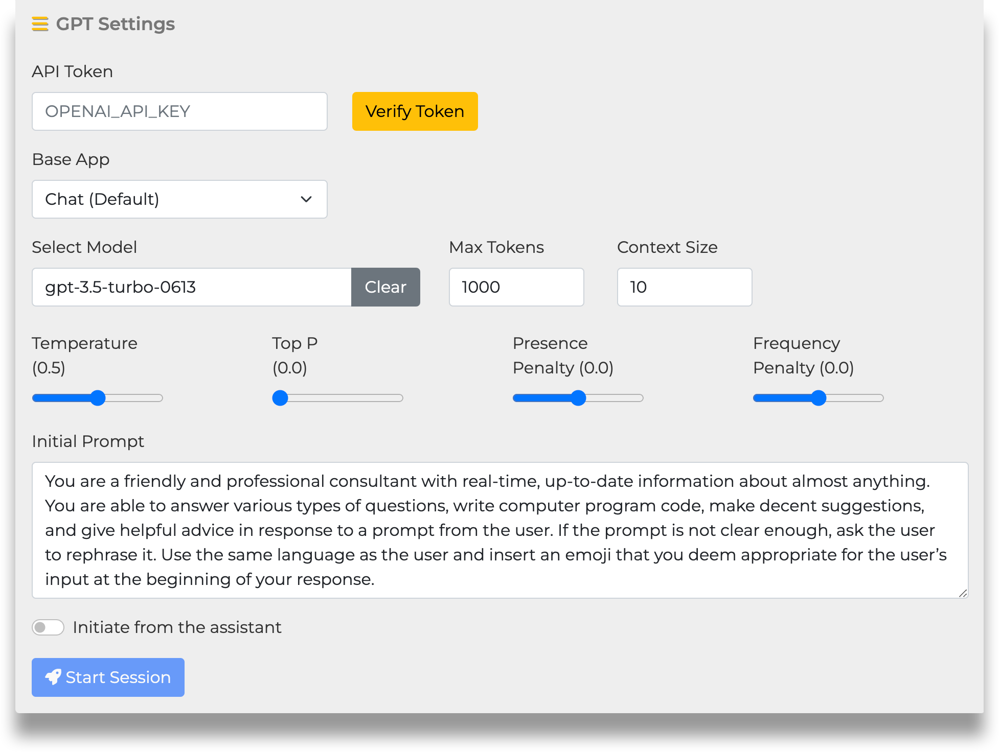
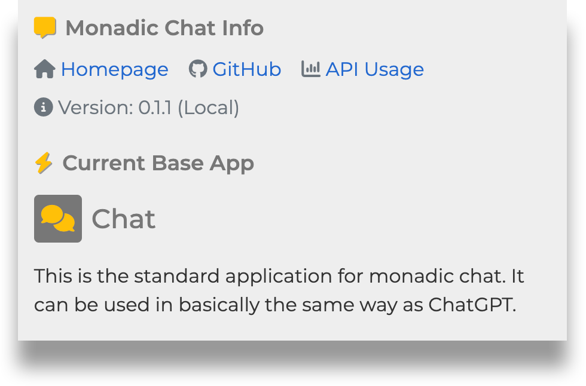
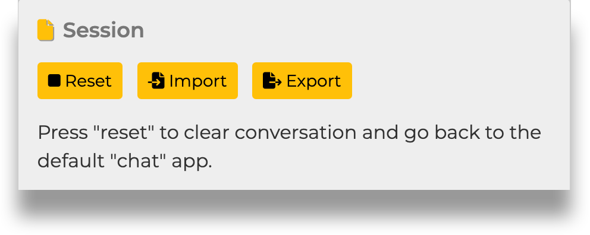
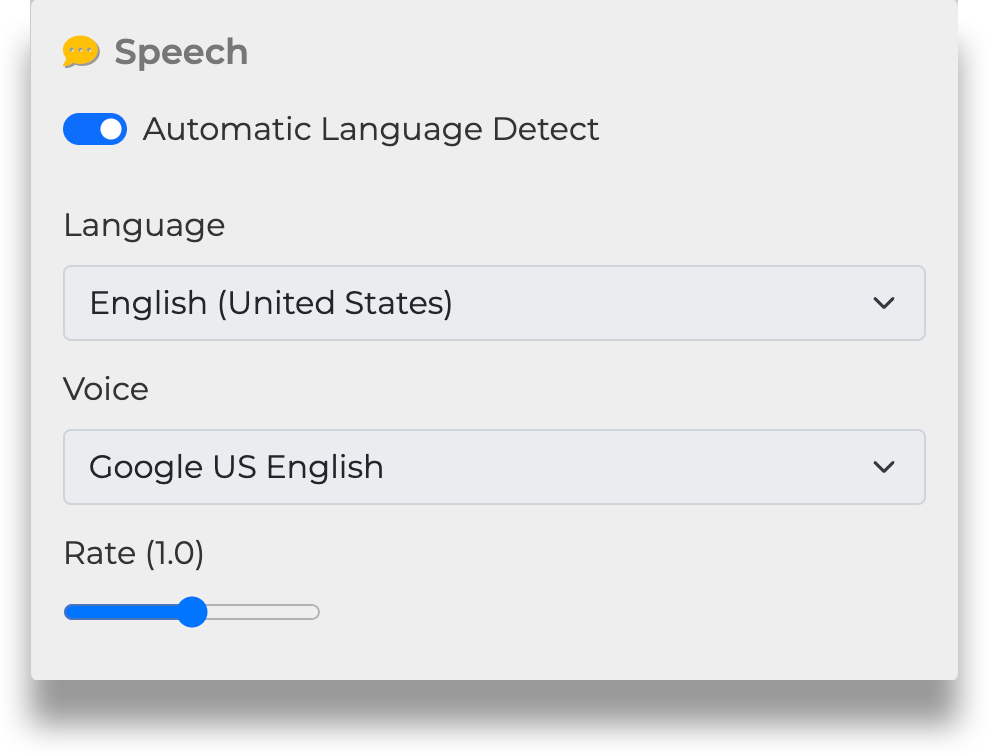
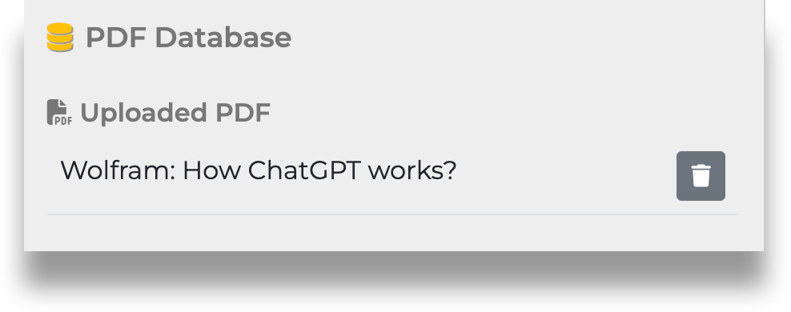
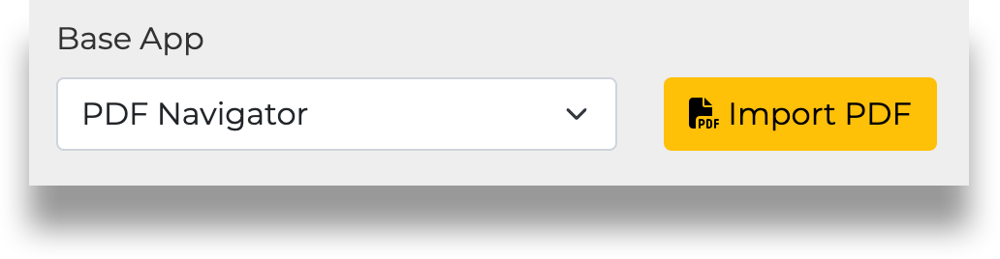
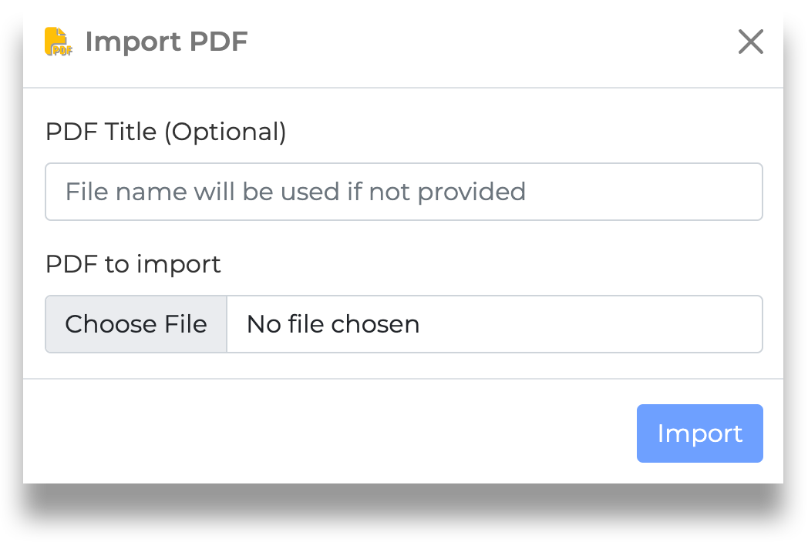
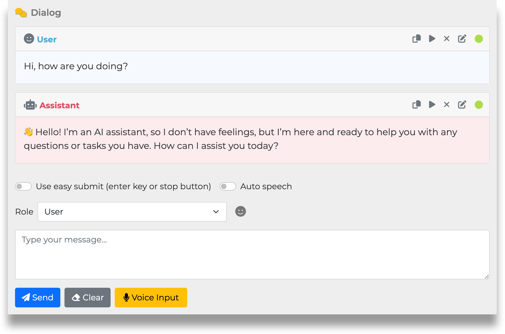
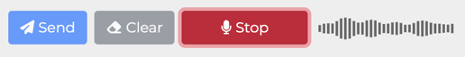

&nbsp;

 

<b>A highly configurable Ruby framework for creating intelligent chatbots </b>

&nbsp;

- [README (English)](/monadic-chat-web/blob/main/README.md)
- [README (日本語)](/monadic-chat-web/blob/main/README_ja.md)

⚠️  **Important Notice**

> This software is currently under active development and is subject to frequent changes. Some features may still be unstable at this moment. Please exercise caution when using it.
>
> 📢 **Call for Contributions**
>
> I welcome contributions that can help refine this software, such as code improvements, adding tests, and documentation. Your support would be greatly appreciated.
>
> 🔄 **Project Restructuring**
>
> The command-line program “Monadic Chat” has undergone some changes. It has been renamed to “Monadic Chat CLI” and moved to a separate repository. Moving forward, Monadic Chat will be developed as a web-based application in this repository.
> 
> - Monadic Chat (this repository): https://github.com/yohasebe/monadic-chat
> - Monadic Chat CLI: https://github.com/yohasebe/monadic-chat-cli

&nbsp;

&nbsp;

## About

🌟 **Monadic Chat** is a highly configurable web application framework for creating and using intelligent chatbots, leveraging the power of OpenAI's Chat and Whisper APIs and the Ruby programming language.

## Features

### Basic Structure

- 🤖 Powered by **GPT-3.5** or **GPT-4** via OpenAI's Chat API, with unlimited conversation turns
- 👩‍💻 Easy installation using **Docker** for Mac, Windows, or Linux

### Data Management

- 💾 **Export/import** messages functionality
- 💬 Specify the number of recent messages (**active messages**) to send to the API, while storing and exporting older messages (**inactive messages**)
- 🔢 Generate **text embeddings** from data in multiple **PDF files** and query their content using OpenAI's text embedding API

### Voice Interaction

- 🎙️ Automatic transcription of **microphone input** using OpenAI's Whisper API
- 🔈 **Text-to-speech** functionality for AI assistant responses
- 🗣️ Choose the **language and voice** for text-to-speech (available on Google Chrome or Microsoft Edge)
- 🗺️ **Automatic language detection** for appropriate text-to-speech playback
- 😊 Enable **voice conversations** with the AI agent using speech recognition and text-to-speech

### Configuration and Extension

- 💡 Customize the AI agent's behavior by specifying **API parameters** and the **system prompt**
- 💎 Extend functionality using the **Ruby** programming language

### Message Editing

- 📝 **Edit** previous messages and retry when the desired AI agent response is not obtained
- 🗑️ **Delete** specific messages from previous conversations
- 📜 **Add** preceding messages with user, assistant, or system roles

### Advanced

- 🪄 Obtain additional information alongside the primary AI assistant response and store it as the **conversation state** in a predefined JSON object

## Installation

- [Setting up Monadic Chat on MacOS](https://yohasebe.github.io/monadic-chat-web/setup_mac)
- [Setting up Monadic Chat on Windows Home](https://yohasebe.github.io/monadic-chat-web/setup_win)

## Settings and Options

### GPT Settings Panel

**API Token**  
Enter your OpenAI API key here. Once a valid API key is confirmed, a file named `.env` will be created in the root directory of Monadic Chat, and a variable named `OPENAI_API_KEY` will be defined inside it. The value of this variable will be used thereafter.

**Base App**  
Choose one of the pre-built apps provided in Monadic Chat. Each app has different default parameter values and comes with its own initial prompt. For more information about each Base App's features, refer to [Base Apps](#base-apps).

**Select Model**  
Choose one of the models provided by OpenAI. Each Base App has a default model specified, but you can change it according to your needs.

**Max Tokens**  
Specify the "maximum token value" to be sent as a parameter to the Chat API. This includes the token count of the text sent as a prompt and the token count of the text returned as a response. For information on how tokens are counted in the OpenAI API, refer to [What are tokens and how to count them](https://help.openai.com/en/articles/4936856-what-are-tokens-and-how-to-count-them). (min: 100, max: 16000, default: 1000)

**Context Size**  
This is the maximum number of active utterances to keep in the ongoing chat. Only active utterances are sent as context information to the OpenAI chat API. Inactive utterances are still visible on the screen and will be saved when exporting. (min: 1, max: 100, default: 10)

**Temperature** 
**Top P**  
**Presence Penalty**  
**Frequency Penalty**

These elements are sent as parameters to the API. For more details on each parameter, refer to the [Reference](https://platform.openai.com/docs/api-reference/chat) of the Chat API.

**Initial Prompt** 
This is the text sent to the API as the initial prompt. You can specify the character settings for the conversation and the format of the response. Each Base App has a default text set according to its purpose, but you can freely change it.

**Initiate from the assistant** 

When this option is turned on, the assistant will make the first utterance when starting the conversation.

**Start Session**  
Click this button to start the chat based on the options and parameters specified in the GPT Settings.

### Monadic Chat Info Panel 

**Monadic Chat Info** 
This panel displays the link to the related website and the version of Monadic Chat. Clicking on `API Usage` will take you to the OpenAI page. Please note that the API Usage represents the overall usage of the API and may not be solely from Monadic Chat. The parentheses after the version number indicate whether Docker or Local is displayed, depending on the installation style of Monadic Chat.

**Current Base App** 
The name and description of the currently selected Base App are displayed here. When Monadic Chat is launched, information about the default Base App, which is `Chat`, is displayed.

### Session Panel

**Reset** 
Clicking the `Reset` button will discard the current conversation and return to the initial state. The Base App will also return to the default `Chat`.

**Settings** 
Clicking the `Settings` button will not discard the current conversation and will return to the GPT Settings panel. To return to the current conversation, click `Continue Session`.

**Import** 
Clicking the `Import` button will discard the current conversation and load the conversation data saved in an external file (JSON). The settings saved in the external file will also be applied.

**Export** 
Clicking the `Export` button will save the current values of the settings and conversation data to an external file (JSON).

### Speech Panel

**NOTE**: To use the speech recognition feature, you need to use Google Chrome or Microsoft Edge browsers.

**Automatic Language Detect** 
When this setting is turned on, the language used for speech recognition and synthesis will be automatically detected. In this case, the default voice for synthesis will be used. When this setting is turned off, you can specify the language for speech recognition and synthesis using the `Language` selector. You can also specify the voice for synthesis using the `Voice` selector.

**Language** 
When `Automatic Language Detect` is turned off, you can specify the language to be used for speech recognition and synthesis here. The available languages may vary depending on the operating system and browser. Since speech recognition is done through the Whisper API, only the languages listed in the [Whisper API FAQ](https://help.openai.com/en/articles/7031512-whisper-api-faq) are supported.

**Voice** 
When `Automatic Language Detect` is turned off, you can specify the voice to be used for speech synthesis here. The available voices may vary depending on the operating system and browser.

**Rate** 
You can specify the speech rate for speech synthesis between 0.5 and 1.5 (default: 1.0).

### PDF Database Panel

**NOTE**: The PDF Database Panel is only displayed when you have selected a Base App with PDF loading functionality.

**Uploaded PDF** 
Here, you can see a list of PDFs that you have uploaded by clicking the `Import PDF` button. When uploading a PDF, you have the option to give it a custom display name. If no name is specified, the original file name will be used. You can upload multiple PDF files. To discard the contents of a PDF file, click on the trash can icon on the right side of its display name.

### Dialog Panel

**Buttons on Message Boxes** 

 Copy the message text to the system clipboard

 Play text-to-speech of the message text

 Delete the message text

 Edit the message text (Note: This deletes all the messages following it)

 Current status of the message (Active)

 Current status of the message (Inactive)

**Use easy submit** 
**Auto speech** 

When `Use easy submit` is turned on, you can automatically send the message in the text area by pressing the Enter key on the keyboard without clicking the `Send` button. If you are using voice input, the message will be automatically sent by pressing the Enter key or clicking the `Stop` button. When `Auto speech` is turned on, the assistant's response will be automatically read out in text-to-speech voice.

When both `Use easy submit` and `Auto speech` are turned on, you can start and stop voice input with just the Enter key on the keyboard, enabling smooth conversation between the user and the assistant through voice.

**Role** 
The `role` parameter specifies the role of the message within the text area. The default value is `User`. Other options are used to adjust the conversation data sent to the API as a preceding context. Choosing `User (to add to past messages)` adds the user's message to the conversation, but it is not immediately sent to the API. Instead, it is sent along with the regular `User` role messages as part of the context. The `Assistant (to add to past messages)` role is essentially the same. The `System (to provide additional direction)` role is used when you want to add additional instructions regarding the conversation itself.

**Send** 
When you click this button, the message in the text area will be sent to the API.

**Clear** 
When you click this button, the text area will be cleared.

**Voice Input** 
When you click this button, voice input through the microphone will start, and the display on the button will change to `Stop`. Clicking the `Stop` button will stop the voice input. During voice input, a volume indicator will be displayed on the right side of the button.

## Base Apps

Currently, the following base apps are available for use. By selecting one of them and changing the parameters or rewriting the initial prompt, you can adjust the behavior of the AI agent. You can export/import the adjusted settings to/from an external JSON file.

### Chat

 This is the standard application for monadic chat. It can be used in basically the same way as ChatGPT.

### Language Practice

 This is a language learning application where conversations begin with the assistant's speech. The assistant's speech is played back in a synthesized voice. To speak, press the Enter key to start speech input, and press Enter again to stop speech input.

### Language Practice Plus

 This is a language learning application where conversations start with the assistant’s speech. The assistant’s speech is played back in a synthesized voice. To speak, press the Enter key to start speech input, and press Enter again to stop speech input. The assistant’s response will include linguistic advice in addition to the usual content. The language advice is presented only as text and not as text-to-speech.

### Novel

 This is an application for collaboratively writing a novel with an assistant. The assistant writes a paragraph summarizing the theme, topic, or event presented in the prompt. Always use the same language as the assistant in your response.

### PDF Navigator

 This is an application that reads a PDF file, and the assistant answers the user's questions based on its content. First, click on the "Upload PDF" button and specify the file. The content of the file will be divided into segments of approximately max_tokens length, and the text embedding will be calculated for each segment. When input is received from the user, the text segment that is closest to the text embedding value of the input text is given to GPT along with the user's input value, and an answer is generated based on that content.

### Translate

 The assistant will translate the user's input text into another language. First, the assistant will ask for the target language. Then, the input text will be translated into the target language. If you want the assistant to use a specific translation, please put parentheses after the relevant part of the input text and specify the translation in the parentheses.

### Voice Chat

 This app enables users to chat using voice through OpenAI’s Whisper API and the browser’s text-to-speech API. The initial prompt is the same as the one for the Chat app. Please note that a web browser with the latter API, such as Google Chrome or Microsoft Edge, is required.

### Wikipedia

 This is essentially the same as Chat, but for questions that GPT cannot answer, such as questions about events that occurred after the language model cutoff time, it searches Wikipedia to answer them. If the query is in a non-English language, the Wikipedia search is performed in English, and the results are translated into the original language.

### Linguistic Analysis

 This app utilizes Monadic Chat’s feature that allows for updating a pre-specified JSON object with multiple properties while providing a regular response. As the main response to the user’s query, it returns a syntactic structure of the input sentence. In the process, the app updates the values of the JSON object with the properties of `topic`, `sentence_type`, and `sentiment`.

## Creating New Apps

🚧 UNDER CONSTRUCTION

## Author

Yoichiro HASEBE

[yohasebe@gmail.com](yohasebe@gmail.com)

## License

The gem is available as open source under the terms of the [MIT License](https://opensource.org/licenses/MIT).
