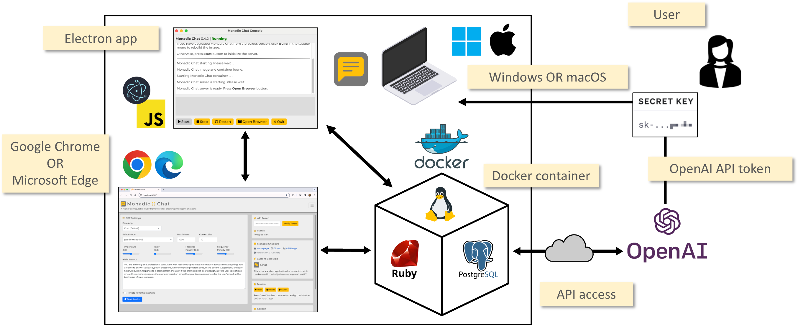

&nbsp;

 

<b>Grounding AI Chatbots with Full Linux Environment on Docker </b>

&nbsp;

## tl;dr

**Monadic Chat** is a framework designed to create and use intelligent chatbots. By providing a full-fledged Linux environment on Docker to GPT-4 and other LLMs, it allows the chatbots to perform advanced tasks that require external tools. It also supports voice interaction, image and video recognition and generation, and AI-to-AI chat, suitable not only for using AI but also for developing and researching various applications.

- Recene Updates
  - [Jun, 2024] Better uninstallation of containers
  - [Jun, 2024] Monadic Chat Console UI improved
  - [Jun, 2024] AI-User feature introduced
  - [Jun, 2024] Automatic Docker image rebuild feature
  - [Jun, 2024] Source code block copy button added
  - [Jun, 2024] Video Describer app added
  - [May, 2024] Talk to Claude/Command R/Gemini apps added
  - [May, 2024] Ruby/Python/PGVector/Selenium containers structure introduced
  - [Feb, 2024] Mermaid diagram support
  - [Feb, 2024] File reading feature
  - [Full Change Log](CHANGELOG.md)

## Documentation

  - [English Docummentation](https://yohasebe.github.io/monadic-chat/overview)
  - [日本語ドキュメント](https://yohasebe.github.io/monadic-chat/overview_ja)

## Installation

  - [MacOS (Apple Silicon/Intel)](https://yohasebe.github.io/monadic-chat/installation#macos)
  - [Windows](https://yohasebe.github.io/monadic-chat/installation#windows)

There are two versions of Monadic Chat. One is a web browser-based app framework developed in this repository. The other is a command line app provided as a RubyGem. 

- [Monadic Chat](https://github.com/yohasebe/monadic-chat) (active; this repository)
- [Monadic Chat CLI](https://github.com/yohasebe/monadic-chat-cli) (less active)

## Features

### Basic Structure

- 🤖 Chat functionality powered by **GPT-4** via OpenAI's Chat API
- 👩‍💻 Installable as a GUI application on Mac and Windows using **Electron**
- 🌐 Usable as a **web application** in browsers
- 👩💬 🤖💬 Both **human/AI chat** and **AI/AI chat** are supported

### AI + Linux Environment

- 🐧 Provides a **Linux** environment (Ubuntu) freely accessible by AI
- 🐳 Tools for LLMs via **Docker containers**
  - Python (+ pip) for tool/function calls
  - Ruby (+ gem) for tool/function calls
  - PGVector (+ PostgreSQL) for DAG using vector representation
  - Selenium (+ Chrome/Chromium) for web scraping
- 📦 Each container can be managed via **SSH**
- 📓 Python container can launch **Jupyter Notebook**

### Data Management

- 💾 **Export/import** conversation data
- 💬 Specify the number of recent messages (**active messages**) to send to the API
- 🔢 Generate **text embeddings** from data in **PDF files**
- 📂 Local data folders are synchronized with Docker containers for seamless interaction

### Voice Interaction

- 🎙️ Automatic transcription of **microphone input** using OpenAI's Whisper API
- 🔈 **Text-to-speech** functionality for AI assistant responses
- 🗺️ **Automatic language detection** for appropriate text-to-speech playback
- 🗣️ Choose the **language and voice** for text-to-speech
- 😊 Enable **interactive conversations** with the AI agent using speech recognition and text-to-speech

### Image and Video Recognition and Generation

- 🖼️ **Generate images** from text prompts using OpenAI's DALL·E 3 API
- 👀 Analyze and describe the content of **uploaded images**
- 🎥 Recognize and describe the content and audio of **uploaded videos**

### Configuration and Extension

- 💡 Customize the AI agent's behavior by specifying **API parameters** and the **system prompt**
- 💎 Extend functionality using the **Ruby** programming language
- 🐍 Extend functionality using the **Python** programming language
- 🌎 Perform **web scraping** using Selenium

### Message Editing

- 📝 **Edit** previous messages
- 🗑️ **Delete** specific messages
- 📜 **Set roles** (user, assistant, system) for new messages

### Support for Multiple LLM APIs

- 👥 **Multiple LLM APIs** are supported:
  - OpenAI GPT-4
  - Google Gemini
  - Anthropic Claude
  - Cohere Command R
- 🤖💬🤖 **AI/AI Chat** is available:

   | AI-Assistant     | AI-User      |
   |:-----------------|:-------------| 
   | OpenAI GPT-4     | OpenAI GPT-4 |
   | Google Gemini    | OpenAI GPT-4 |
   | Anthropic Claude | OpenAI GPT-4 |
   | Cohere Command R | OpenAI GPT-4 |

### Managing Conversations as Monads

- ♻️  Manage (invisible) **conversation state** by obtaining additional responses from LLM and updating values in a predefined JSON object

## Author

Yoichiro HASEBE 
[yohasebe@gmail.com](yohasebe@gmail.com)

## License

The gem is available as open source under the terms of the [MIT License](https://opensource.org/licenses/MIT).
