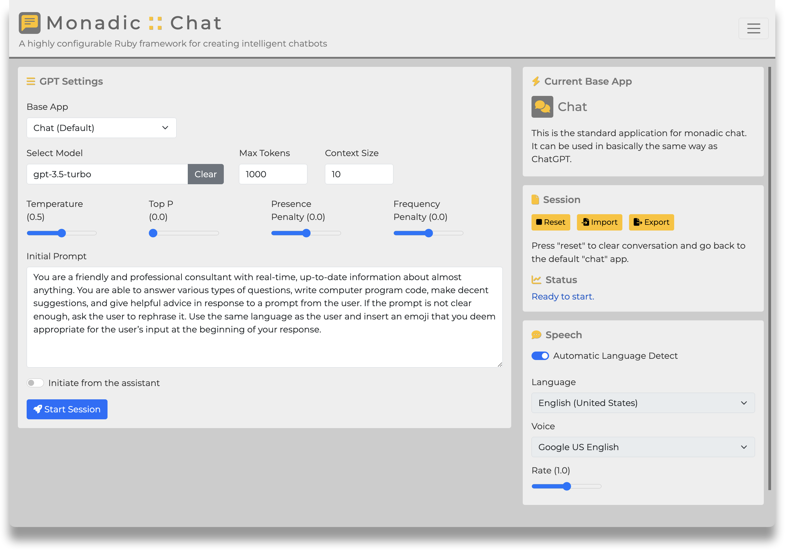

&nbsp;

 

<b>A highly configurable Ruby framework for creating intelligent chatbots </b>

&nbsp;

## Overview

🌟 **Monadic Chat** is a highly configurable web application framework for creating and using intelligent chatbots, leveraging the power of OpenAI's Chat and Whisper APIs and the Ruby programming language.

- Documentation
  - [English](https://yohasebe.github.io/monadic-chat/overview)
  - [日本語](https://yohasebe.github.io/monadic-chat/overview_ja)

- Download Installer
  - [MacOS (Apple Silicon/Intel)](https://yohasebe.github.io/monadic-chat/installation#macos)
  - [Windows](https://yohasebe.github.io/monadic-chat/installation#windows)

&nbsp;

&nbsp;

> There are two types of Monadic Chat: one is a web browser-based app provided in this repository, which is installed using Docker. The other is a command line application, which is provided as a RubyGem.

- [Monadic Chat](https://github.com/yohasebe/monadic-chat) (this repo) 
- [Monadic Chat CLI](https://github.com/yohasebe/monadic-chat-cli)

## Features

### Basic Structure

- 🤖 Powered by **GPT-3.5** or **GPT-4** via OpenAI's Chat API, with unlimited conversation turns
- 👩‍💻 Multi-OS support using **Docker** for Mac, Windows, or Linux

### Data Management

- 💾 **Export/import** messages and settings
- 💬 Specify the number of recent messages (**active messages**) to send to the API, while storing and exporting older messages (**inactive messages**)
- 🔢 Generate **text embeddings** from data in multiple **PDF files** and query their content using OpenAI's text embedding API

### Voice Interaction

- 🎙️ Automatic transcription of **microphone input** using OpenAI's Whisper API
- 🔈 Natural **text-to-speech** voices for AI assistant responses
- 🗺️ **Automatic language detection** for appropriate text-to-speech playback
- 😊 **Voice chat** with the AI agent using speech recognition and text-to-speech

### Image Generation

- 🖼️ **Generate images** from text prompt using OpenAI's DALL·E 3 API

### Image Understanding

- 👀 **Local images** can be uploaded and let AI assistant analyze what are in them

### Configuration and Extension

- 💡 Customize the AI agent's behavior by specifying **API parameters** and the **system prompt**
- 💎 Extend functionality using the **Ruby** programming language

### Message Editing

- 📝 **Edit** previous messages and retry when the desired AI agent response is not obtained
- 🗑️ **Delete** specific messages from previous conversations
- 📜 **Add** preceding messages with user, assistant, or system roles

### Advanced

- 🪄 Obtain additional information alongside the primary AI assistant response and store it as the **conversation state** in a predefined JSON object

## Author

Yoichiro HASEBE 
[yohasebe@gmail.com](yohasebe@gmail.com)

## License

The gem is available as open source under the terms of the [MIT License](https://opensource.org/licenses/MIT).
