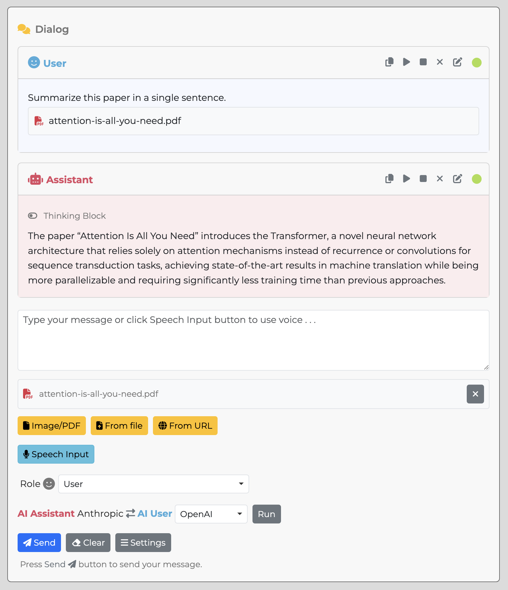
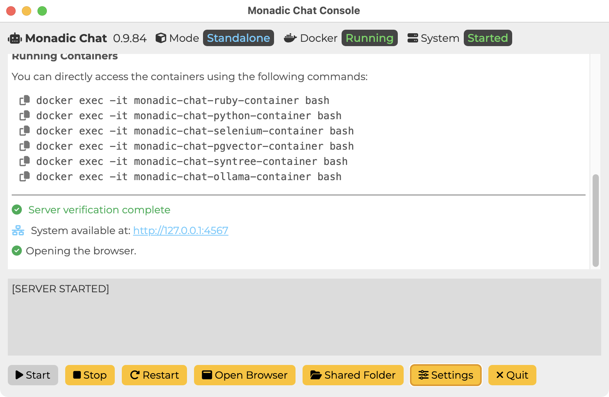

## Overview

🤖 + 🐳 + 🐧 [**Monadic Chat**](https://yohasebe.github.io/monadic-chat) is a locally hosted web application designed to create and utilize intelligent chatbots. By providing a Linux environment on Docker to GPT and other LLMs, it enables code execution (Python, Ruby, etc.) and advanced tasks that require external tools (Jupyterlab, ffmpeg, etc.). It also supports voice interaction, image/video recognition and generation, and AI-to-AI chat.

Available for **Mac**, **Windows**, and **Linux** (Debian/Ubuntu) with easy-to-use installers.

## Getting Started

- [**Documentation**](https://yohasebe.github.io/monadic-chat)
- [**Installation**](https://yohasebe.github.io/monadic-chat/#/installation)

## Latest Changes

- [Feb, 2025] 0.9.41
  - OpenAI o3-mini model supported with the `reasoning-effort` parameter
  - Jupyter Notebook apps improved with `jupyter.log` generated for each session
  - Perplexity `sonar-reasoning-pro` (DeepSeek R1) model supported
  - Math rendering option added to the web UI
  - Initial system prompt duplication issue fixed
- [Jan, 2025] 0.9.37
  - Perplexity `sonar-reasoning` (DeepSeek R1) model supported
  - OpenAI o1 models supported
  - DeepSeek models supported
  - Better logging for tool use (function calling)
  - New folder structure for config/data/logs introduced
  - Perplexity models supported
  - Start-up time (after build) improved
- [Dec, 2024] 0.9.30
  - Extract from URL feature added
  - Extract from file feature added (pdf, docx, pptx, xlsx, etc.)
  - xAI Grok models supported
  - Cohere API update to v2
  - Markdown rendering improved
  - Math Tutor app supports visualizations
  - Not require OpenAI's API token when using other APIs
  - Image generation feature improved
  - Many UI and under-the-hood improvements
  - User container rebuild feature fixed
  - Role selection issue fixed
- [Nov, 2024] 0.9.22
  - Rebuilding specific containers feature added
  - `pysetup.sh` extra installation script supported
  - Jupyter Notebook apps (for GPT and Claude) improved
  - Streaming supported for OpenAI's o1 models
  - CJK font issue on code apps addressed
  - Syntax highlighting theme option added
  - App settings convention enhanced with "group" attribute
  - Check for updates when starting the app
  - [Predicted output](https://platform.openai.com/docs/guides/latency-optimization#use-predicted-outputs) feature added for OpenAI's models
  - [PDF recognition](https://docs.anthropic.com/en/docs/build-with-claude/pdf-support) feature added for Claude Sonnet models
  - AI user feature improved

- [Changelog](https://yohasebe.github.io/monadic-chat/#/changelog)

## Screenshots

**Web Interface**

 

**Chat Window**

 

**Console Window**

 

## Author

Yoichiro Hasebe <yohasebe@gmail.com>

## License

Monadic Chat is distributed under [the MIT License](http://www.opensource.org/licenses/mit-license.php).

