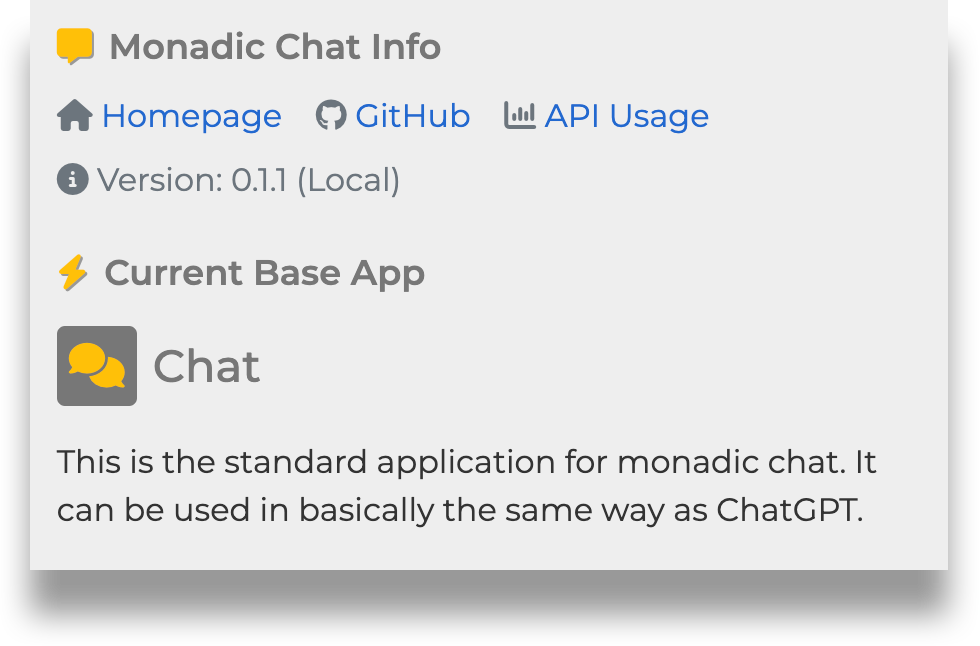
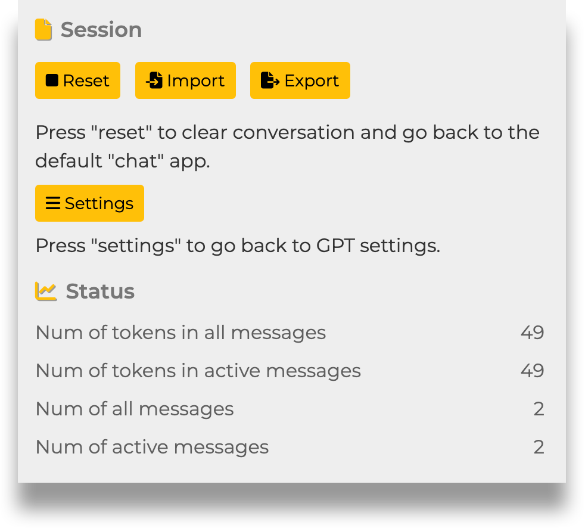
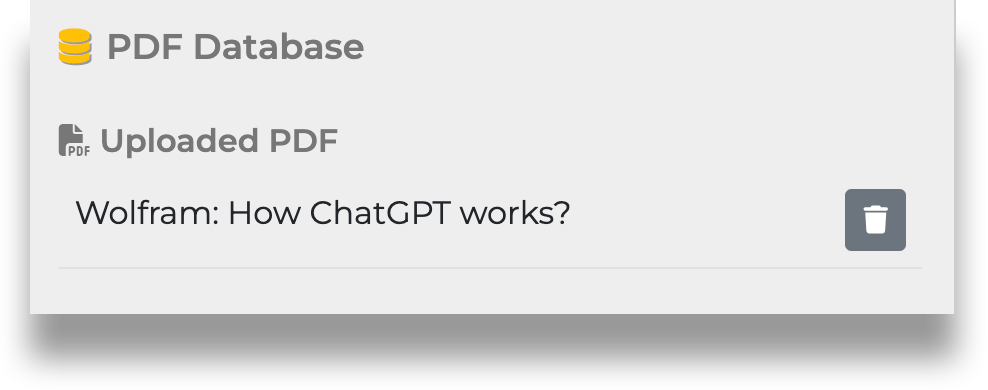
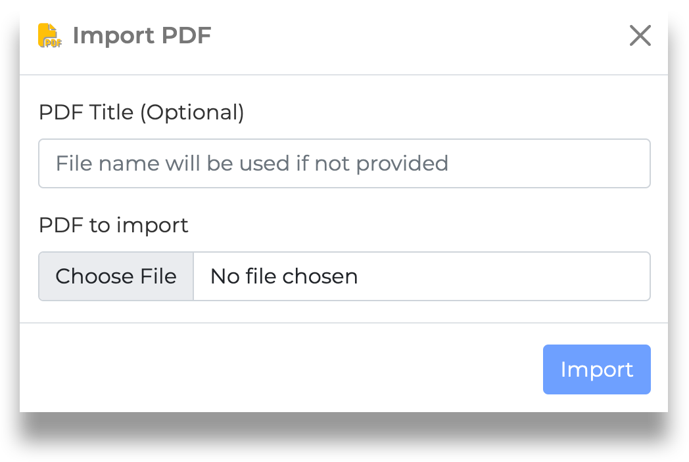
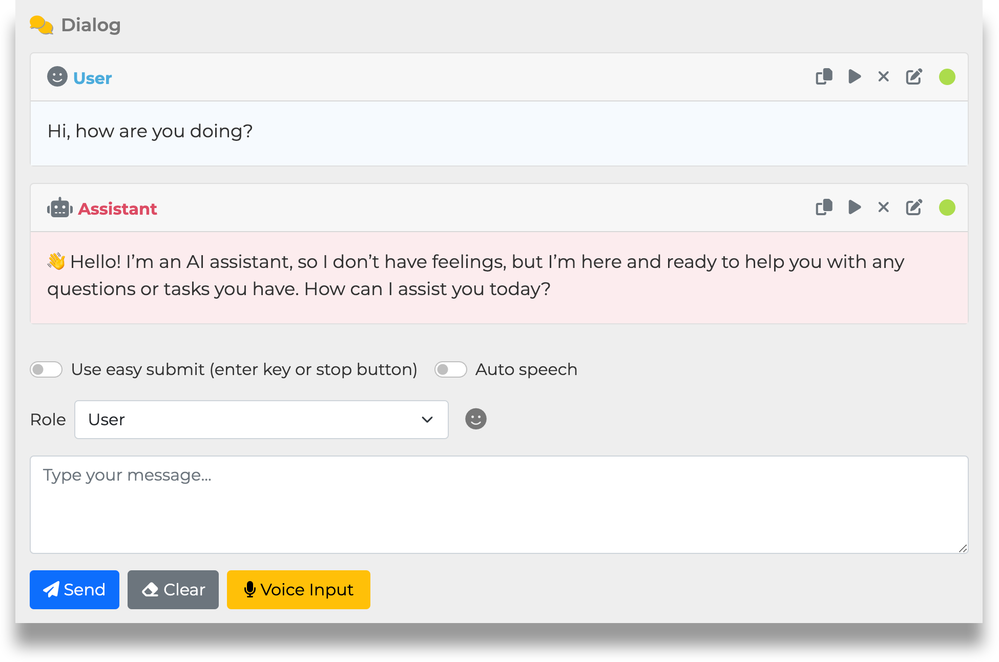

&nbsp;

 

<b>A highly configurable Ruby framework for creating intelligent chatbots </b>

- [README (English)](/monadic-chat-web/blob/main/README.md)
- [README (日本語)](/monadic-chat-web/blob/main/README_ja.md)

> ⚠️  **ご注意**
>
> このソフトウェアは現在、開発中であり、細部の仕様は今後変更される可能性があります。また、一部動作が不安定な機能があるかもしれませんので、使用の際にはご注意ください。
>
> 📢 **協力のお願い**
>
> コードの改善、テストの追加、ドキュメントの作成などの協力を歓迎します。
>
> 🔄 プロジェクトの再構成
>
> これまで開発してきたコマンドラインプログラムMonadic Chatは、名称をMonadic Chat CLIに更し、別のリポジトリに移動しました。今後Monadic Chatは、本リポジトリでウェブベースのアプリケーションとして開発されます。
> 
> - Monadic Chat（このリポジトリ）：https://github.com/yohasebe/monadic-chat
> - Monadic Chat CLI：https://github.com/yohasebe/monadic-chat-cli

&nbsp;

&nbsp;

## 概要

🌟 **Monadic Chat**はOpenAIのChat APIとWhisper API、そしてプログラミング言語のRubyを活用して高機能なチャットボットを作成・使用するためのフレームワークです。

## 特徴

### 基本構造

- 🤖 OpenAIのChat API（**GPT-3.5**または**GPT-4**）を使用し、ターン数制限のないチャットを実現
- 👩‍💻 **Docker Desktop**を使用して、Mac、Windows、Linuxにインストール可能

### データ管理

- 💾 会話データの**エクスポート/インポート**
- 💬 文脈データとしてAPIに送信するメッセージ（**アクティブメッセージ**）数の指定
- 🔢 Text Embedding APIを使用した、**PDFファイル**からの**テキスト埋め込み**生成とVector Databaseの構築

### 音声インタラクション

- 🎙️ Whisper APIを使用した、**マイク音声認識**
- 🔈 AIアシスタントによるレスポンス**テキスト読み上げ**
- 🗺️ テキスト読み上げのための**自動言語検出**
- 🗣️ テキスト読み上げのための**言語とボイス**の選択（Google ChromeまたはMicrosoft Edgeで利用可能）
- 😊 音声認識とテキスト読み上げを使用した、AIエージェントとの**インタラクティブな会話**

### 設定と拡張

- 💡 **APIパラメータ**と**システムプロンプト**を指定して、AIエージェントの設定や動作をカスタマイズ
- 💎 プログラミング言語Rubyを使用して機能を拡張することが可能

### メッセージの編集

- 📝 過去のメッセージの**再編集**が可能
- 🗑️ 特定のメッセージの**削除**が可能
- 📜 新規メッセージのロール（ユーザー、アシスタント、システム）設定

### 高度な機能

- 🪄 AIアシスタントからのメインのレスポンスに加えて、背後で追加のレスポンスを取得し、事前定義されたJSONオブジェクト内に値を格納することで会話の**状態**を実現

## インストール

- [環境構築とインストール（MacOS）](https://yohasebe.github.io/monadic-chat-web/setup_mac_ja)
    
- [環境構築とインストール（Windows Home）](https://yohasebe.github.io/monadic-chat-web/setup_win_ja)

## 設定項目と機能

### GPT Settings

**API Token**  
ここにはOpenAIのAPI keyを入れます。有効なAPI keyが確認されると、Monadic Chatのルート・ディレクトリに`.env`というファイルが作成され、その中に`OPENAI_API_KEY`という変数が定義され、その後はこの変数の値が用いられます。

**Base App**  
Monadic Chatであらかじめ用意されたアプリの中から1つを選択します。各アプリでは異なるデフォルト・パラメター値が設定されており、固有の初期プロンプトが与えられています。各Base Appの特徴については [Base Apps](#base-apps)を参照してください。

**Select Model**  
OpenAIが提供するモデルの中から1つを選びます。各Base Appでデフォルトのモデルが指定されていますが、目的に応じて変更することができます。

**Max Tokens**  
Chat APIにパラメターとして送られる「トークンの最大値」を指定します。これにはプロンプトとして送られるテキストのトークン数と、レスポンスとして返ってくるテキストのトークン数が含まれます。OpenAIのAPIにおけるトークンのカウント方法については[What are tokens and how to count them](https://help.openai.com/en/articles/4936856-what-are-tokens-and-how-to-count-them)を参照してください。

**Context Size**  
現在進行中のチャットに含まれるやりとりの中で、アクティブなものとして保つ発話の最大数です。アクティブな発話のみがOpenAIのchat APIに文脈情報として送信されます。インアクティブな発話も画面上では参照可能であり、エクスポートの際にも保存対象となります。

**Temperature** 
**Top P**  
**Presence Penalty**  
**Frequency Penalty**

以上の要素はパラメターとしてAPIに送られます。各パラメターの詳細はChat APIの[Reference](https://platform.openai.com/docs/api-reference/chat)を参照してください。

**Initial Prompt** 
初期プロンプトとしてAPIに送られるテキストです。会話のキャラクター設定や、レスポンスの形式などを指定することができます。各Base Appの目的に応じたデフォルトのテキストが設定されていますが、自由に変更することが可能です。

**Initiate from the assistant** 

このオプションをオンにすると、会話を始める時にアシスタント側が最初の発話を行います。

**Start Session**  
このボタンをクリックすると、GPT Settiingsで指定したオプションやパラメターのもとにチャットが開始されます。

### Monadic Chat Info Panel 

**Monadic Chat Info** 
関連するウェブサイトへのリンクとMonadic Chatのバージョンが示されます。`API Usage`をクリックするとOpenAIのページにアクセスします。API Usageで示されるのはAPI使用量の全体であり、Monadic Chatによるものだけとは限らないことに注意してください。バージョン番号の後の括弧には、Monadic Chatをインストールした際の様式に応じて、DockerもしくはLocalが表示されます。

**Current Base App** 
現在選択しているBase Appの名前と説明が表示されます。Monadic Chatの起動時にはデフォルトのBase Appである`Chat`に関する情報が表示されます。

### Session Panel

**Reset** 
`Reset`ボタンをクリックすると、現在の会話が破棄され、初期状態に戻ります。Base Appもデフォルトの`Chat`に戻ります。

**Settings** 
`Settings`ボタンをクリックすると、現在の会話を破棄しないで、GPT Settingsパネルに戻ります。その後、現在の会話に戻るには`Continue Session`をクリックします。

**Import** 
`Import`ボタンをクリックすると、現在の会話を破棄し、外部ファイル（JSON）に保存した会話データを読み込みます。また、外部ファイルに保存された設定が適用されます。

**Export** 
`Export`ボタンをクリックすると、現在の設定項目の値と会話データを外部ファイル（JSON）に保存します。

### Speech Panel

**NOTE**: 音声認識機能を使用するにはGoogle ChromeまたはMicrosoft Edgeブラウザを使用する必要があります。

**Automatic Language Detect** 
この設定をオンにすると、音声認識と音声合成の際に、使用言語を自動で検知します。このとき、合成音声のボイスはデフォルトのものが使用されます。この設定をオフにすると、音声認識と音声合成の言語を`Language`セレクターで指定できます。また、合成音声のボイスを`Voice`セレクターで指定できます。

**Language** 
`Automatic Language Detect`がオフのとき、ここで音声認識と音声合成に使用する言語を指定できます。指定できる言語はOSとブラウザーによって異なります。音声認識はWhisper APIを通じて行われるため、[Whisper API FAQ](https://help.openai.com/en/articles/7031512-whisper-api-faq)に記載されている言語のみが可能です。

**Voice** 
`Automatic Language Detect`がオフのとき、ここで音声合成に使用するボイスを指定できます。指定できるボイスはOSとブラウザーによって異なります。

**Rate** 
音声合成の際の発話スピードを0.5から1.5の間で指定することができます（デフォルト：0.0）。

### PDF Database Panel

**NOTE**: このパネルはPDF読み込み機能を備えたBase Appを選択しているときだけ表示されます。

**Uploaded PDF** 
ここには、`Import PDF`ボタンをクリックしてアップロードしたPDFのリストが表示されます。PDFをアップロードする際に、ファイルに個別の表示名を付けることができます。指定しない場合はオリジナルのファイル名が使用されます。複数のPDFファイルをアップロードすることが可能です。PDFファイル表示名の右側のゴミ箱アイコンをクリックするとそのPDFファイルの内容が破棄されます。

### Dialog Panel

**Buttons on Message Boxes** 

 Copy the message text to the system clipboard

 Play text-to-speech of the message text

 Delete the message text

 Edit the message text (Note: This deletes all the messages following it)

 Current status of the message (Active)

 Current status of the message (Inactive)

**Use easy submit** 
**Auto speech** 

`Use easy submit`がオンの時には、`Send`ボタンをクリックしなくても、キーボードのEnterキーを押すと自動的にテキストエリア内のメッセージが送信されます。もし音声入力中であれば、Enterキーを押すか、`Stop`ボタンをクリックすることで、自動的にメッセージが送信されます。`Auto speech`がオンの時には、アシスタントからのレスポンスが返ってくると自動的に合成音声での読み上げが行われます。

`Use easy submit`と`Auto speech`が両方ともオンの時には、キーボードのEnterキーだけで音声入力開始と音声入力停止を行うことができ、それに応じて動的にメッセージ送信とレスポンスの音声合成が行われるので、ユーザーとアシスタントとの間で音声による会話が実現します。

**Role** 
テキストエリア内のメッセージがどのRoleによるものかを指定します。デフォルトは`User`です。それ以外の選択肢はAPIに対して先行文脈として送信する会話データを調整するために用います。`User (to add to past messages)`を選ぶと、ユーザーからのメッセージが会話に追加されますが、APIには直ちに送信されず、後で通常の`User` Roleによるメッセージが送信されるときに、文脈の一部として一緒に送信されます。`Assistant (to add to past messages)`のRoleも基本的にこれと同様です。`System (to provide additional direction)`は会話自体の設定を追加したいときに用います。

**Send** 

このボタンをクリックするとテキストエリア内のメッセージがAPIに送信されます。

**Clear** 

このボタンをクリックするとテキストエリアをクリアします。

**Voice Input** 

このボタンをクリックすると、マイクを通じての音声入力が開始され、ボタン上の表示が`Stop`に変わります。`Stop`ボタンをクリックすると音声入力を停止します。音声入力中はボタンの右側に音量のインジケーター表示されます。

## Base Apps

以下は、使用可能なBase Appの一覧です。これらのいずれかを選択し、パラメータを変更したり初期プロンプトを書き換えたりすることで、AIエージェントの動作を調整することができます。調整した設定を外部のJSONファイルにエクスポート/インポートすることもできます。

### Chat

Monadic Chatの標準アプリケーションです。ChatGPTと基本的に同じような方法で使用することができます。 

### Language Practice

AIアシスタントの音声で会話が始まる言語学習アプリケーションです。アシスタントの音声は合成音声で再生されます。Enterキーを押すと音声入力が開始します。再度Enterキーを押すと音声入力が停止します。

### Language Practice Plus

AIアシスタントの音声で会話が始まる言語学習アプリケーションです。アシスタントの音声は合成音声で再生されます。Enterキーを押すと音声入力が開始します。再度Enterキーを押すと音声入力が停止します。 通常のレスポンスに加えて、学習言語のアドバイスが示されます。アドバイスは読み上げられず、通常のテキストとして表示されます。

### Novel

 アシスタントと共同で小説を執筆するためのアプリケーションです。プロンプトでテーマ、トピック、またはイベントを提示すると、それらを含んだパラグラフを書きます。

### PDF Navigator

PDFファイルを読み込み、AIアシスタントがその内容に基づいてユーザーの質問に答えるアプリケーションです。`PDF Upload`ボタンをクリックしてファイルを指定します。ファイルの内容は、`max_tokens`で指定した長さに収まるサイズのセグメントに分割され、各セグメントのテキスト埋め込みが生成されます。ユーザーからメッセージを受け取ると、そのメッセージのテキスト埋め込みに最も近いセグメントがGPTに与えられ、その内容に基づいた回答が行われます。

### Translate

AIアシスタントが、ユーザーの入力テキストを別の言語に翻訳します。アシスタントは最初に対象言語を尋ねます。AIアシスタントに特定の訳語を使わせたいときは、入力テキストの該当部分の後ろに括弧を付け、括弧内にその訳語をあらかじめ指定することができます

### Voice Chat

OpenAIのWhisper APIとブラウザのテキスト読み上げAPIを使用して、音声を通じてチャットすることができます。初期プロンプトはChatアプリと同じです。音声認識機能を使用するためにはGoogle ChromeまたはMicrosoft Edgeを使用する必要があります。

### Wikipedia

 基本的にChatと同じですが、言語モデルのカットオフ時点以降に発生したイベントなど、GPTが答えられない質問については、Wikipediaを検索して回答します。クエリが非英語の場合、Wikipediaの検索は英語で行われ、結果は元の言語に翻訳されます。

### Linguistic Analysis

指定された構造のJSONオブジェクトを「状態」とみなして、これを更新するタイプのBase Appです。ユーザーへのレスポンスとして、入力文の統語構造を返します。その背後でtopic、sentence_type、sentimentの状態値を更新します。

## 新規Base Appの作成手順

🚧 UNDER CONSTRUCTION

## 開発者

Yoichiro HASEBE 
[yohasebe@gmail.com](yohasebe@gmail.com)

## ライセンス

このソフトウェアは [MIT License](aki:wkttps://opensource.org/licenses/MIT) の条件の下でオープンソースとして利用可能です。

