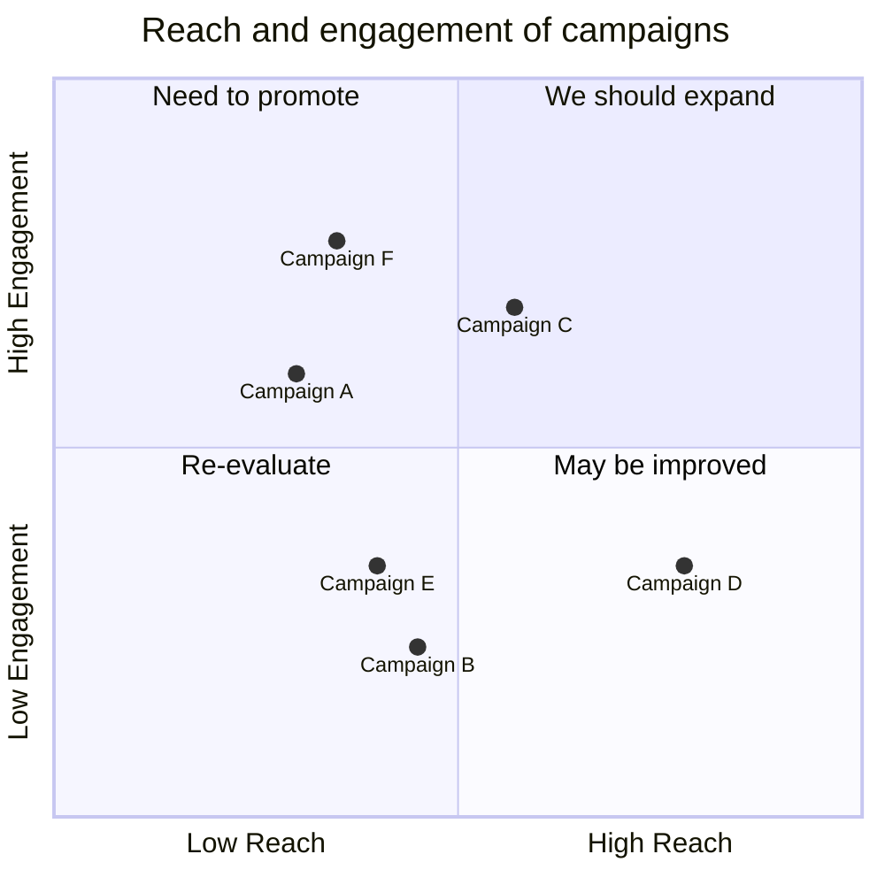
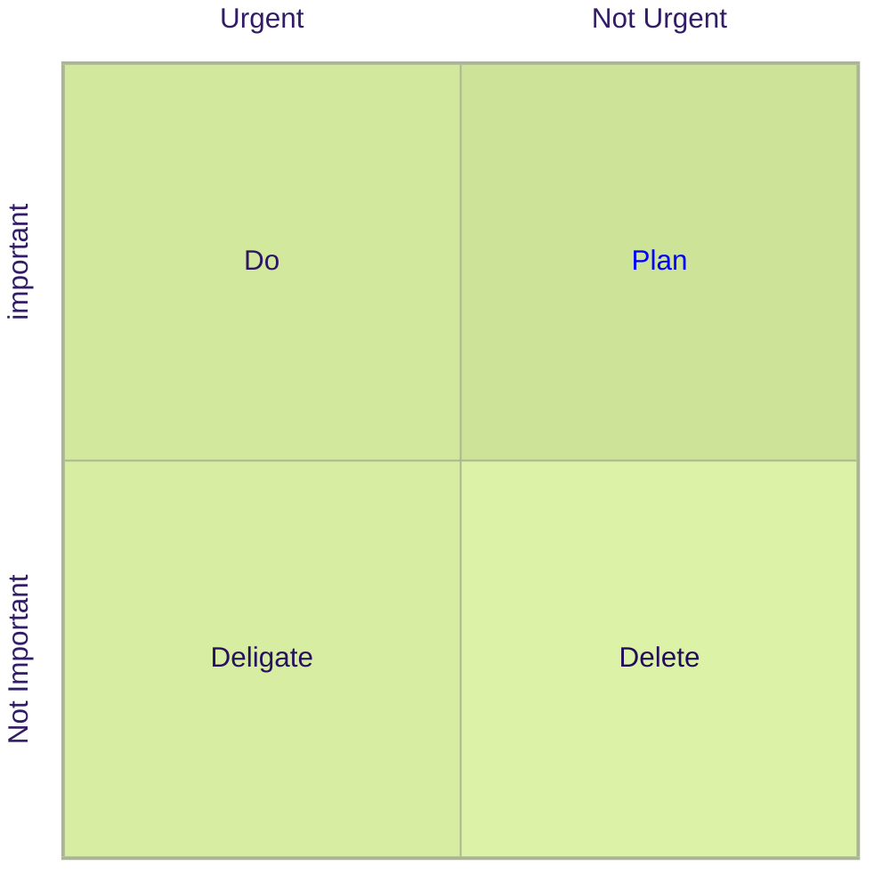
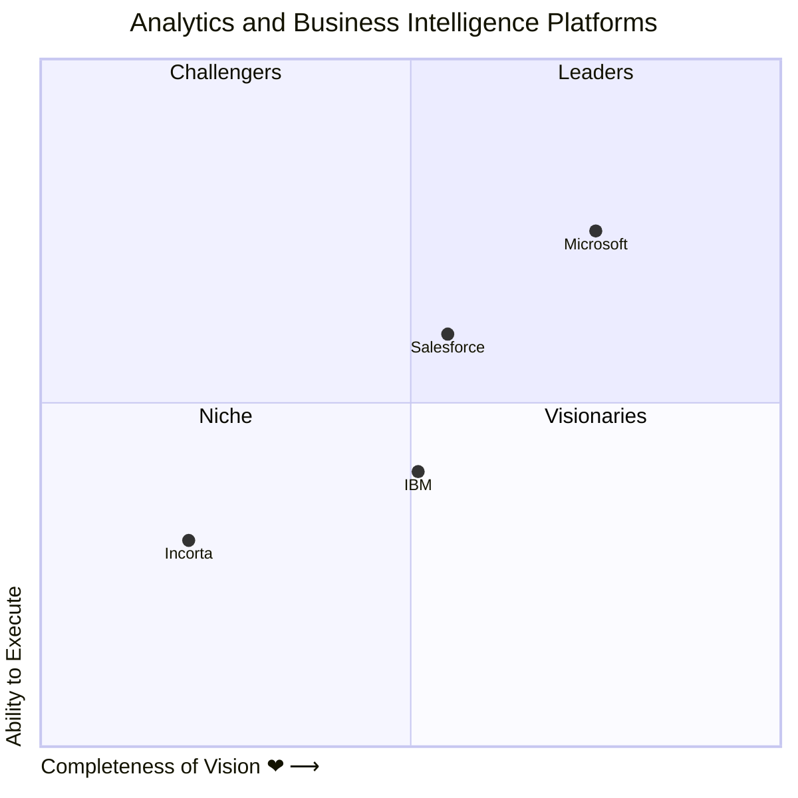

# Quadrant Chart Examples

```mermaid
quadrantChart
    title Reach and engagement of campaigns
    x-axis Low Reach --> High Reach
    y-axis Low Engagement --> High Engagement
    quadrant-1 We should expand
    quadrant-2 Need to promote
    quadrant-3 Re-evaluate
    quadrant-4 May be improved
    Campaign A: [0.3, 0.6]
    Campaign B: [0.45, 0.23]
    Campaign C: [0.57, 0.69]
    Campaign D: [0.78, 0.34]
    Campaign E: [0.40, 0.34]
    Campaign F: [0.35, 0.78]
```

```mermaid
%%{init: {"quadrantChart": {"quadrantPadding": 10}, "theme": "forest", "themeVariables": {"quadrant1TextFill": "blue"}} }%%
quadrantChart
  x-axis Urgent --> Not Urgent
  y-axis Not Important --> important
  quadrant-1 Plan
  quadrant-2 Do
  quadrant-3 Deligate
  quadrant-4 Delete
```

```mermaid
%%{init: {"quadrantChart": {"chartWidth": 600, "chartHeight": 600} } }%%
quadrantChart
  title Analytics and Business Intelligence Platforms
  x-axis "Completeness of Vision ❤" -->
  y-axis Ability to Execute
  quadrant-1 Leaders
  quadrant-2 Challengers
  quadrant-3 Niche
  quadrant-4 Visionaries
  Microsoft: [0.75, 0.75]
  Salesforce: [0.55, 0.60]
  IBM: [0.51, 0.40]
  Incorta: [0.20, 0.30]
```
