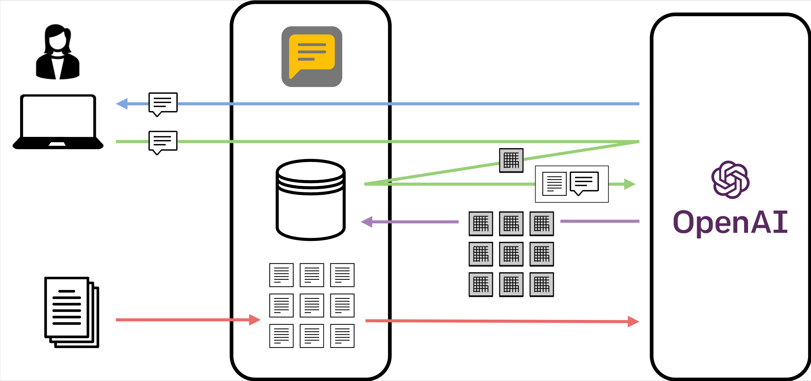

# 基本アプリ
{:.no_toc}

[English](/monadic-chat/apps) |
[日本語](/monadic-chat/apps_ja)

## 目次
{:.no_toc}

1. toc
{:toc}

現在、以下の基本アプリが使用可能です。いずれかの基本アプリを選択し、パラメータを変更したり、初期プロンプトを書き換えたりすることで、AIエージェントの挙動を調整できます。調整した設定は、外部のJSONファイルにエクスポートしたり、逆にインポートしたりできます。

## Chat

 標準的なチャットアプリケーションです。ChatGPTと基本的に同様の方法で利用できます。

## Language Practice

 アシスタントの発話から会話が始まる語学学習アプリケーションです。アシスタントの発話は音声合成で再生されます。ユーザーは、Enterキーを押して発話入力を開始し、もう一度Enterキーを押して発話入力を終了します。

## Language Practice Plus

 アシスタントの発話から会話が始まる語学学習アプリケーションです。アシスタントの発話は音声合成で再生されます。ユーザーは、Enterキーを押して発話入力を開始し、もう一度Enterキーを押して発話入力を終了します。アシスタントは、通常の応答に加えて、言語的なアドバイスを含めます。言語的なアドバイスは、音声ではなくテキストとしてのみ提示されます。

## Novel Writer

 アシスタントと共同で小説を執筆するためのアプリケーションです。魅力的なキャラクター、鮮やかな描写、そして、説得力のあるプロットで小説を作り上げましょう。ユーザーのプロンプトに基づいてストーリーを展開し、一貫性と流れを維持します。

## PDF Navigator

 PDFファイルを読み込み、アシスタントがその内容に基づいてユーザーの質問に答えるアプリケーションです。「PDFアップロード」ボタンをクリックしてファイルを指定してください。ファイルの内容はmax_tokensの長さのセグメントに分割され、セグメントごとにテキスト埋め込みが計算されます。ユーザーからの入力を受け取ると、入力文のテキスト埋め込み値に最も近いテキストセグメントがユーザーの入力値とともにGPTに渡され、その内容に基づいて回答が生成されます。



## Talk to Cohere Command R

 Cohere Command R (Plus) APIにアクセスして、幅広いトピックに関する質問に答えるアプリケーションです。APIトークンとモデル名を `~/monadic/data/.env` に設定してください。

Example:

```
COHERE_API_KEY=api_key
COHERE_MODEL=command-r-plus
```

## Talk to Anthropic Claude

 Anthropic Claude APIにアクセスして、幅広いトピックに関する質問に答えるアプリケーションです。APIトークンとモデル名を `~/monadic/data/.env` に設定してください。

Example:

```
ANTHROPIC_API_KEY=api_key
ANTHROPIC_MODEL=claude-3-opus-20240229
```

## Talk to Google Gemini

 Google Gemini APIにアクセスして、幅広いトピックに関する質問に答えるアプリケーションです。APIトークンとモデル名（`model/`付で）を `~/monadic/data/.env` に設定してください。

Example:

```
GEMINI_API_KEY=api_key
GEMINI_MODEL=models/gemini-1.5-pro-latest
```

## Translate

 ユーザーの入力テキストを別の言語に翻訳します。まず、アシスタントは翻訳先の言語を尋ねます。次に、入力されたテキストを指定された言語に翻訳します。特定の翻訳結果を反映させたい場合は、入力テキストの該当箇所に括弧を付け、括弧内に翻訳を指定してください。

## Voice Chat

 OpenAIのWhisper APIとブラウザの音声合成APIを用いて、音声でチャットを行うことができるアプリケーションです。初期プロンプトはChatアプリと同じです。Google Chrome、Microsoft Edgeなど、ブラウザのText to Speech APIが動作するWebブラウザが必要です。

## Voice Interpreter

 ユーザーの入力テキストを別の言語に翻訳し、音声合成で発話します。まず、アシスタントは翻訳先の言語を尋ねます。次に、入力されたテキストを指定された言語に翻訳します。

## Wikipedia

 基本的にChatと同じですが、言語モデルのカットオフ日時以降に発生したイベントに関する質問など、GPTが回答できない質問に対しては、Wikipediaを検索して回答します。問い合わせが英語以外の言語の場合、Wikipediaの検索は英語で行われ、結果は元の言語に翻訳されます。

## Math Tutor

 AIチャットボットがMathJaxの数式表記を用いて応答するアプリケーションです。このアプリは数式を表示できますが、数学的計算能力はOpenAIのGPTモデルに基づいており、時折、誤った計算結果が出力されることが知られています。そのため、計算の正確性が求められる場合は、このアプリの使用には注意が必要です。

## Image Generator

 説明に基づいて画像を生成するアプリケーションです。プロンプトが具体的でない場合や、英語以外の言語で書かれている場合は、改善されたプロンプトを返し、改善されたプロンプトで続行するかどうかを尋ねます。

## Mail Composer

 アシスタントと共同でメールの草稿を作成するためのアプリケーションです。ユーザーの要望や指定に応じて、アシスタントがメールの草稿を作成します。

## Flowchart Grapher

 mermaid.jsを活用してデータを視覚化するアプリケーションです。任意のデータを入力すると、エージェントが最適なダイアグラムの種類を選択し、mermaidコードを提供します。このコードからダイアグラムを作成できます。

## Music Composer

 楽譜を作成し、Midiで演奏するアプリケーションです。使用する楽器と音楽のジャンルやスタイルを指定します。

## Content Reader

 インポートされたファイルやWeb URLの内容を調べて説明するAIチャットボットを特徴とするアプリケーションです。説明は、わかりやすく、初心者にも理解しやすいように提示されます。ユーザーは、プログラミングコードを含む、さまざまなテキストデータを含むファイルやURLをアップロードすることができます。プロンプトメッセージにURLが記載されている場合、アプリは自動的にコンテンツを取得し、GPTとの会話にシームレスに統合します。

<script src="https://cdn.jsdelivr.net/npm/jquery@3.5.0/dist/jquery.min.js"></script>
<script src="https://cdn.jsdelivr.net/npm/lightbox2@2.11.3/src/js/lightbox.js"></script>

---

<script>
  function copyToClipBoard(id){
    var copyText =  document.getElementById(id).innerText;
    document.addEventListener('copy', function(e) {
        e.clipboardData.setData('text/plain', copyText);
        e.preventDefault();
      }, true);
    document.execCommand('copy');
    alert('copied');
  }
</script>
