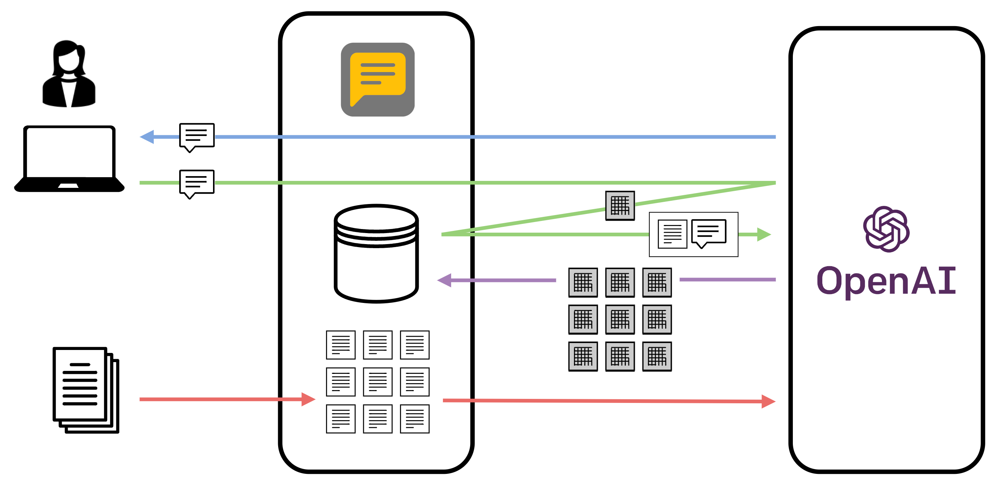

# 基本アプリ
{:.no_toc}

[English](/monadic-chat/apps) |
[日本語](/monadic-chat/apps_ja)

## 目次
{:.no_toc}

1. toc
{:toc}

現在、以下の基本アプリが使用可能です。いずれかの基本アプリを選択し、パラメータを変更したり、初期プロンプトを書き換えたりすることで、AIエージェントの挙動を調整できます。調整した設定は、外部のJSONファイルにエクスポートしたり、逆にインポートしたりできます。

## Chat

 標準的なチャットアプリケーションです。ChatGPTと基本的に同様の方法で利用できます。

Recipe file: [chat_app.rb](https://github.com/yohasebe/monadic-chat/blob/main/docker/services/ruby/apps/chat/chat_app.rb)

## Language Practice


アシスタントの発話から会話が始まる語学学習アプリケーションです。アシスタントの発話は音声合成で再生されます。ユーザーは、Enterキーを押して発話入力を開始し、もう一度Enterキーを押して発話入力を終了します。

Recipe file: [language_practice_app.rb](https://github.com/yohasebe/monadic-chat/blob/main/docker/services/ruby/apps/language_practice/language_practice_app.rb)

## Language Practice Plus

 

アシスタントの発話から会話が始まる語学学習アプリケーションです。アシスタントの発話は音声合成で再生されます。ユーザーは、Enterキーを押して発話入力を開始し、もう一度Enterキーを押して発話入力を終了します。アシスタントは、通常の応答に加えて、言語的なアドバイスを含めます。言語的なアドバイスは、音声ではなくテキストとしてのみ提示されます。

Recipe file: [language_practice_plus_app.rb](https://github.com/yohasebe/monadic-chat/blob/main/docker/services/ruby/apps/language_practice_plus/language_practice_plus_app.rb)

## Novel Writer

 

アシスタントと共同で小説を執筆するためのアプリケーションです。魅力的なキャラクター、鮮やかな描写、そして、説得力のあるプロットで小説を作り上げましょう。ユーザーのプロンプトに基づいてストーリーを展開し、一貫性と流れを維持します。

Recipe file: [novel_writer_app.rb](https://github.com/yohasebe/monadic-chat/blob/main/docker/services/ruby/apps/novel_writer/novel_writer_app.rb)

## PDF Navigator

 

PDFファイルを読み込み、アシスタントがその内容に基づいてユーザーの質問に答えるアプリケーションです。`Upload PDF` ボタンをクリックしてファイルを指定してください。ファイルの内容はmax_tokensの長さのセグメントに分割され、セグメントごとにテキスト埋め込みが計算されます。ユーザーからの入力を受け取ると、入力文のテキスト埋め込み値に最も近いテキストセグメントがユーザーの入力値とともにGPTに渡され、その内容に基づいて回答が生成されます。

Recipe file: [pdf_navigator_app.rb](https://github.com/yohasebe/monadic-chat/blob/main/docker/services/ruby/apps/pdf_navigator/pdf_navigator_app.rb)



## Talk to Cohere Command R


Cohere Command R (Plus) APIにアクセスして、幅広いトピックに関する質問に答えるアプリケーションです。APIトークンを `~/monadic/data/.env` に設定してください。

Example:

```
COHERE_API_KEY=api_key
```

Recipe file: [cohere_command_r_app.rb](https://github.com/yohasebe/monadic-chat/blob/main/docker/services/ruby/apps/talk_to_cohere/talk_to_cohere_app.rb)

## Talk to Anthropic Claude


Anthropic Claude APIにアクセスして、幅広いトピックに関する質問に答えるアプリケーションです。APIトークンを `~/monadic/data/.env` に設定してください。

Example:

```
ANTHROPIC_API_KEY=api_key
```

Recipe file: [anthropic_claude_app.rb](https://github.com/yohasebe/monadic-chat/blob/main/docker/services/ruby/apps/talk_to_claude/talk_to_claude_app.rb)

## Talk to Google Gemini


Google Gemini APIにアクセスして、幅広いトピックに関する質問に答えるアプリケーションです。APIトークンを `~/monadic/data/.env` に設定してください。

Example:

```
GEMINI_API_KEY=api_key
```

Recipe file: [google_gemini_app.rb](https://github.com/yohasebe/monadic-chat/blob/main/docker/services/ruby/apps/talk_to_gemini/talk_to_gemini_app.rb)

## Mistral AI (Chat)


Mistral AI APIにアクセスして、幅広いトピックに関する質問に答えるアプリケーションです。APIトークンを `~/monadic/data/.env` に設定してください。

Example:

```
MISTRAL_API_KEY=api_key
```

Recipe file: [talk_to_mistral_app.rb](https://github.com/yohasebe/monadic-chat/blob/main/docker/services/ruby/apps/talk_to_mistral/talk_to_mistral_app.rb)

## Translate

 

ユーザーの入力テキストを別の言語に翻訳します。まず、アシスタントは翻訳先の言語を尋ねます。次に、入力されたテキストを指定された言語に翻訳します。特定の翻訳結果を反映させたい場合は、入力テキストの該当箇所に括弧を付け、括弧内に翻訳を指定してください。

Recipe file: [translate_app.rb](https://github.com/yohasebe/monadic-chat/blob/main/docker/services/ruby/apps/translate/translate_app.rb)

## Voice Chat


OpenAIのWhisper APIとブラウザの音声合成APIを用いて、音声でチャットを行うことができるアプリケーションです。初期プロンプトはChatアプリと同じです。Google Chrome、Microsoft Edgeなど、ブラウザのText to Speech APIが動作するWebブラウザが必要です。

Recipe file: [voice_chat_app.rb](https://github.com/yohasebe/monadic-chat/blob/main/docker/services/ruby/apps/voice_chat/voice_chat_app.rb)

## Voice Interpreter

 

ユーザーの入力テキストを別の言語に翻訳し、音声合成で発話します。まず、アシスタントは翻訳先の言語を尋ねます。次に、入力されたテキストを指定された言語に翻訳します。

Recipe file: [voice_interpreter_app.rb](https://github.com/yohasebe/monadic-chat/blob/main/docker/services/ruby/apps/voice_interpreter/voice_interpreter_app.rb)

## Wikipedia


基本的にChatと同じですが、言語モデルのカットオフ日時以降に発生したイベントに関する質問など、GPTが回答できない質問に対しては、Wikipediaを検索して回答します。問い合わせが英語以外の言語の場合、Wikipediaの検索は英語で行われ、結果は元の言語に翻訳されます。

Recipe file: [wikipedia_app.rb](https://github.com/yohasebe/monadic-chat/blob/main/docker/services/ruby/apps/wikipedia/wikipedia_app.rb)

## Math Tutor


AIチャットボットが [MathJax](https://www.mathjax.org/) の数式表記を用いて応答するアプリケーションです。このアプリは数式を表示できますが、数学的計算能力はOpenAIのGPTモデルに基づいており、時折、誤った計算結果が出力されることが知られています。そのため、計算の正確性が求められる場合は、このアプリの使用には注意が必要です。

Recipe file: [math_tutor_app.rb](https://github.com/yohasebe/monadic-chat/blob/main/docker/services/ruby/apps/math_tutor/math_tutor_app.rb)

## Image Generator


説明に基づいて画像を生成するアプリケーションです。プロンプトが具体的でない場合や、英語以外の言語で書かれている場合は、改善されたプロンプトを返し、改善されたプロンプトで続行するかどうかを尋ねます。内部でDall-E 3 APIを使用しています。

画像は`Shared Folder`に保存されると共に、チャット上でも表示されます。

Recipe file: [image_generator_app.rb](https://github.com/yohasebe/monadic-chat/blob/main/docker/services/ruby/apps/image_generator/image_generator_app.rb)

## Mail Composer


アシスタントと共同でメールの草稿を作成するためのアプリケーションです。ユーザーの要望や指定に応じて、アシスタントがメールの草稿を作成します。

Recipe file: [mail_composer_app.rb](https://github.com/yohasebe/monadic-chat/blob/main/docker/services/ruby/apps/mail_composer/mail_composer_app.rb)

## Flowchart Grapher


[mermaid.js](https://mermaid.js.org/) を活用してデータを視覚化するアプリケーションです。任意のデータや指示文を入力すると、エージェントがフローチャートのMermaid コードを生成して画像を描画します。

Recipe file: [flowchart_grapher_app.rb](https://github.com/yohasebe/monadic-chat/blob/main/docker/services/ruby/apps/flowchart_grapher/flowchart_grapher_app.rb)

## Music Composer


[ABC](https://en.wikipedia.org/wiki/ABC_notation)記法で簡単な楽譜を作成し、Midiで演奏するアプリケーションです。使用する楽器と音楽のジャンルやスタイルを指定します。

Recipe file: [music_composer_app.rb](https://github.com/yohasebe/monadic-chat/blob/main/docker/services/ruby/apps/music_composer/music_composer_app.rb)

## Content Reader


提供されたファイルやWeb URLの内容を調べて説明するAIチャットボットを特徴とするアプリケーションです。説明は、わかりやすく、初心者にも理解しやすいように提示されます。ユーザーは、プログラミングコードを含む、さまざまなテキストデータを含むファイルやURLをアップロードすることができます。プロンプトメッセージにURLが記載されている場合、アプリは自動的にコンテンツを取得し、GPTとの会話にシームレスに統合します。

AIに読み込ませたいファイルを指定するには、`Shared Folder` にファイルを保存して、Userメッセージの中でファイル名を指定してください。AIがファイルの場所を見つけられない場合は、ファイル名を確認して、現在のコード実行環境から利用可能であることをメッセージ中で伝えてください。

`Shared Folder`から、下記のフォーマットのファイルを読み込むことができます。

- PDF
- Microsoft Word (docx)
- Microsoft PowerPoint (pptx)
- Microsoft Excel (xlsx)
- CSV
- Text (txt)

PNGやJPEGなどの画像ファイルを読み込んで、その内容を認識・説明させることもできます。また、MP3などの音声ファイルを読み込んで、内容をテキストに書き出すことも可能です。

Recipe file: [content_reader_app.rb](https://github.com/yohasebe/monadic-chat/blob/main/docker/services/ruby/apps/content_reader/content_reader_app.rb)

## Code Interpreter


AIにプログラムコードを作成・実行させるアプリケーションです。プログラムの実行には、Dockerコンテナ内のPython環境が使用されます。実行結果として得られたテキストデータや画像は`Shared Folder`に保存されると共に、チャット上でも表示されます。

AIに読み込ませたいファイル（PythonコードやCSVデータなど）がある場合は、`Shared Folder` にファイルを保存して、Userメッセージの中でファイル名を指定してください。AIがファイルの場所を見つけられない場合は、ファイル名を確認して、現在のコード実行環境から利用可能であることを伝えてください。

Recipe file: [code_interpreter_app.rb](https://github.com/yohasebe/monadic-chat/blob/main/docker/services/ruby/apps/code_interpreter/code_interpreter_app.rb)

## Jupyter Notebook


AIがJupyter Notebookを作成して、ユーザーからのリクエストに応じてセルを追加し、セル内のコードを実行するアプリケーションです。コードの実行には、Dockerコンテナ内のPython環境が使用されます。作成されたNotebookは`Shared Folder`に保存されます。実行結果はJupyter Notebookに上書きされます。

Recipe file: [jupyter_notebook_app.rb](https://github.com/yohasebe/monadic-chat/blob/main/docker/services/ruby/apps/jupyter_notebook/jupyter_notebook_app.rb)


## Coding Assistant


これはコンピュータプログラムコードを書くためのアプリケーションです。プロフェッショナルなソフトウェアエンジニアとして設定が与えられたAIと対話することができます。ユーザーからのプロンプトを通じて様々なな質問に答え、コードを書き、適切な提案を行い、役立つアドバイスを提供します。

Recipe file: [coding_assistant_app.rb](https://github.com/yohasebe/monadic-chat/blob/main/docker/services/ruby/apps/coding_assistant/coding_assistant_app.rb)

## Video Describer


これは、動画コンテンツを分析し、その内容を説明するアプリケーションです。AIが動画コンテンツを分析し中で何が起こっているのかを詳細に説明します。アプリ内部で動画からフレームを抽出し、それらをbase64形式のPNG画像に変換します。さらに、ビデオから音声データを抽出し、MP3ファイルとして保存します。これらに基づいてAIが動画ファイルに含まれる視覚および音声情報の全体的な説明を行います。

このアプリを使用するには、ユーザーは動画ファイルを`Shared Folder`に格納して、ファイル名を伝える必要があります。また、フレーム抽出のための秒間フレーム数（fps）を指定する必要があります。総フレーム数が50を超える場合はビデオから比例的に50フレームのみが抽出されます。

Recipe file: [video_describer_app.rb](https://github.com/yohasebe/monadic-chat/blob/main/docker/services/ruby/apps/video_describer/video_describer_app.rb)

<!--
## Discourse Analysis


ユーザーの発話を分析し要約するアプリケーションです。AIはユーザーのメッセージを要約し、主要なトピックを特定し、文の種類を分類し、メッセージの感情を判断します。このアプリはMonadic Chatのモナド機能を使用しています。過去の発話内容を蓄積し要約して、次の会話ターンに引き継ぎます。

Recipe file: [discourse_analysis_app.rb](https://github.com/yohasebe/monadic-chat/blob/main/docker/services/ruby/apps/discourse_analysis/discourse_analysis_app.rb)
-->

## Speech Draft Helper


このアプリでは、ユーザーがスピーチ原稿をテキスト文字列、Wordファイル、PDFファイルの形で提出することができます。アプリはそれを分析し、修正版を返します。また、ユーザーが必要であれば、スピーチをより魅力的で効果的なものにするための改善案やヒントを提供します。 また、スピーチのmp3ファイルを提供することもできます。

Recipe file: [speech_draft_helper_app.rb](https://github.com/yohasebe/monadic-chat/blob/main/docker/services/ruby/apps/speech_draft_helper/speech_draft_helper_app.rb)

---

<script src="https://cdn.jsdelivr.net/npm/jquery@3.5.0/dist/jquery.min.js"></script>
<script src="https://cdn.jsdelivr.net/npm/lightbox2@2.11.3/src/js/lightbox.js"></script>
<script>
  function copyToClipBoard(id){
    var copyText =  document.getElementById(id).innerText;
    document.addEventListener('copy', function(e) {
        e.clipboardData.setData('text/plain', copyText);
        e.preventDefault();
      }, true);
    document.execCommand('copy');
    alert('copied');
  }
</script>
