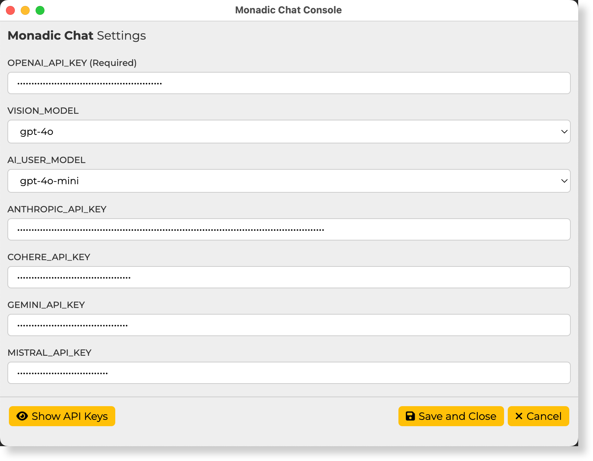

# Monadic Chat Console Panel

## Console Button Items

**Start**  
Launch Monadic Chat. The initial startup may take some time due to environment setup on Docker.

**Stop**  
Stop Monadic Chat.

**Restart**  
Restart Monadic Chat.

**Open Browser**  
Open the default browser to access Monadic Chat at `http://localhost:4567`.

**Shared Folder**  
Open the folder shared between the host and Docker containers. It can be used for importing and exporting files. It is also used when installing additional apps.

**Quit** 
Exit the Monadic Chat Console.

## Console Menu Items

**Rebuild**  
Rebuild the Docker images and containers for Monadic Chat.

**Uninstall Images and Containers**  
Remove the Docker images and containers for Monadic Chat.

**Start JupyterLab**  
Launch JupyterLab. It can be accessed at `http://localhost:8888`.

**Stop JupyterLab**  
Stop JupyterLab.

**Export Document DB**  
Export PDF document data stored in Monadic Chat's PGVector database. The exported file will be saved as `monadic.json` in the shared folder.

**Import Document DB**  
Import PDF document data exported by Monadic Chat's export feature into the PGVector database. When importing, place a file named `monadic.json` in the shared folder.

## API Token Settings Screen

All settings here are saved in the `~/monadic/data/.env` file.

**OPENAI_API_KEY** (Required) 
Enter your OpenAI API key. This key is used to access the Chat API, DALL-E image generation API, Whisper speech recognition API, and speech synthesis API. It can be obtained from the [OpenAI API page](https://platform.openai.com/docs/guides/authentication).

**VISION_MODEL** 
Select the model used for image and video recognition. Currently, `gpt-4o` and `gpt-4o-mini` are available. The default is `gpt-4o-mini`.

**AI_USER_MODEL** 
Select the model used for the AI User feature, which creates messages on behalf of the user. Currently, `gpt-4o` and `gpt-4o-mini` are available. The default is `gpt-4o-mini`.

**ANTHROPIC_API_KEY** 
Enter your Anthropic API key. This key is required to use the Anthropic Claude (Chat) and Anthropic Claude (Code Interpreter) apps. It can be obtained from [https://console.anthropic.com].

**COHERE_API_KEY** 
Enter your Cohere API key. This key is required to use the Cohere Command R (Chat) and Cohere Command R (Code Interpreter) apps. It can be obtained from [https://dashboard.cohere.com].

**GEMINI_API_KEY** 
Enter your Google Gemini API key. This key is required to use the Google Gemini (Chat) app. It can be obtained from [https://ai.google.dev/].

**MISTRAL_API_KEY** 
Enter your Mistral API key. This key is required to use the Mistral AI (Chat) app. It can be obtained from [https://console.mistral.ai/].

