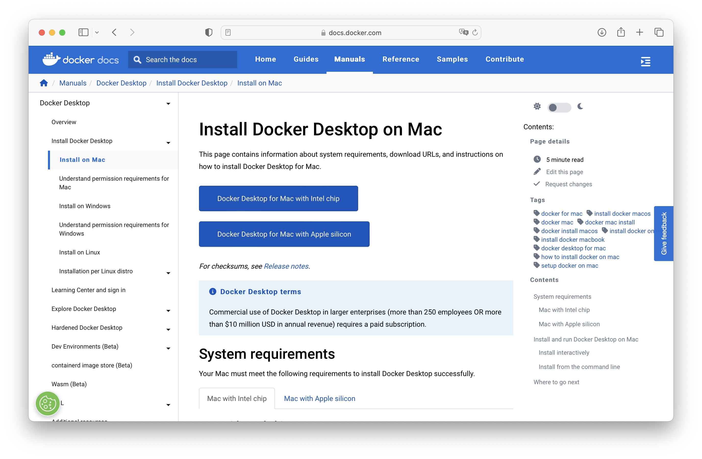
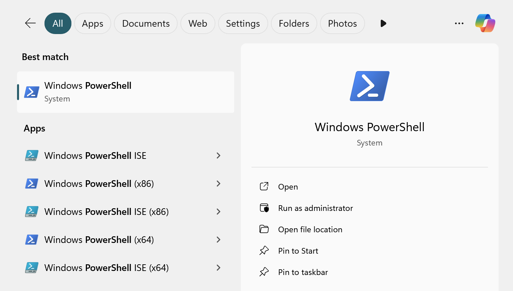
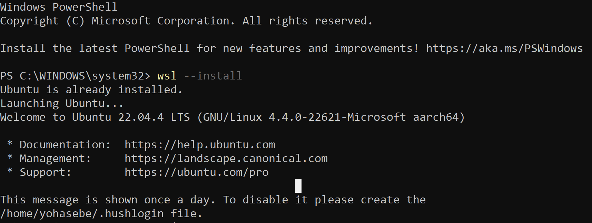
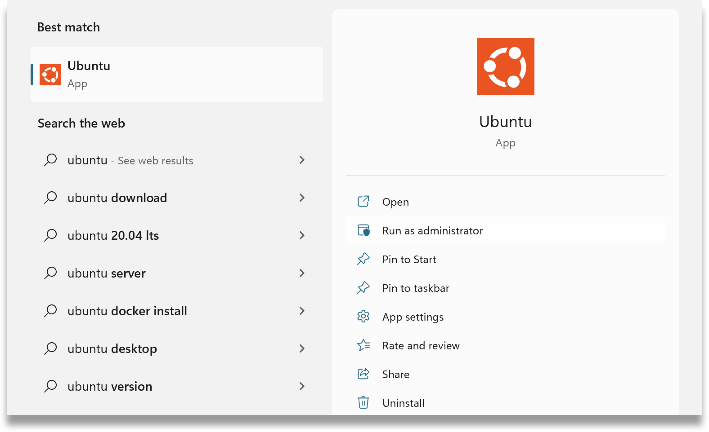
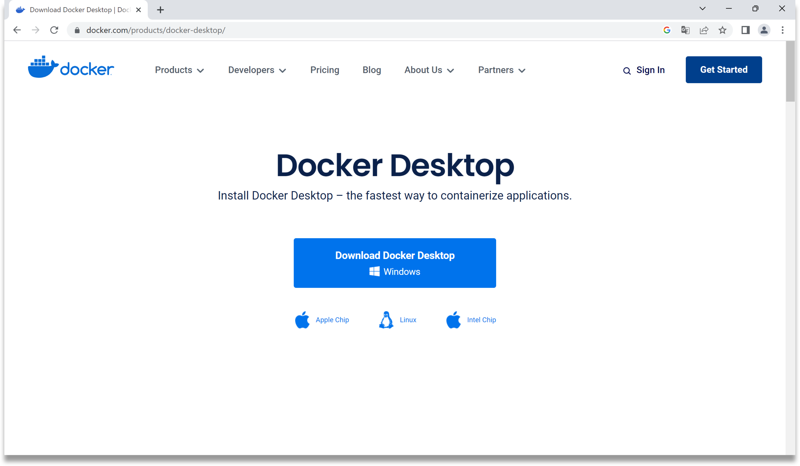
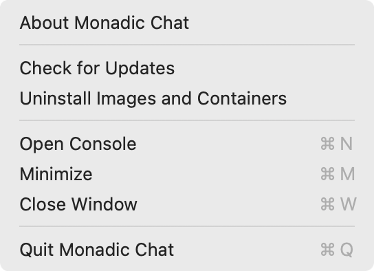

# Installation

## Basic Steps

<!-- tabs:start -->

### **macOS**

For macOS, follow these steps to install Monadic Chat.

1. Install Docker Desktop for Mac.
2. Download and install the Monadic Chat installer.

- [📦 Installer package for macOS ARM64 (Apple Silicon)](https://yohasebe.com/assets/apps/Monadic%20Chat-0.9.69-arm64.dmg) (0.9.69)
- [📦 Installer package for macOS x64 (Intel)](https://yohasebe.com/assets/apps/Monadic%20Chat-0.9.69.dmg) (0.9.69)

### **Windows**

For Windows, follow these steps to install Monadic Chat.

1. Install WSL2.
2. Install Docker Desktop for Windows.
3. Download and install the Monadic Chat installer.

- [📦 Installer package for Windows](https://yohasebe.com/assets/apps/Monadic%20Chat%20Setup%200.9.69.exe) (0.9.69)

### **Linux**

For Linux (Ubuntu/Debian), follow these steps to install Monadic Chat.

1. Install Docker Desktop for Linux.

Refer to: [Install Docker Desktop on Linux](https://docs.docker.jp/desktop/install/linux-install.html)

2. Download the Monadic Chat installer.

- [📦 Installer package for Linux (Ubuntu/Debian) x64](https://yohasebe.com/assets/apps/monadic-chat_0.9.69_amd64.deb) (0.9.69)
- [📦 Installer package for Linux (Ubuntu/Debian) arm64](https://yohasebe.com/assets/apps/monadic-chat_0.9.69_arm64.deb) (0.9.69)

3. Run the following command in the terminal.

```shell
$ sudo apt install ./monadic-chat_xx.xx.xx_xxx64.deb
```

<!-- tabs:end -->

## Preparation

<!-- tabs:start -->

### **macOS**

For macOS, follow these steps to install Docker Desktop.

Next, install Docker Desktop. Docker Desktop is software for creating containerized virtual environments.

Use different packages depending on your Mac's CPU. You can check the type of CPU with the following command in the terminal.

```shell
$ sysctl -n machdep.cpu.brand_string
```

Download and install Docker Desktop from [Install Docker Desktop on Mac](https://hub.docker.com/editions/community/docker-ce-desktop-mac). For Intel, download `Docker Desktop Installer.dmg`, and for Apple Silicon, download `Docker Desktop Installer Apple Silicon.dmg`.



Double-click the downloaded dmg file to display a window, then drag the Docker icon to the Applications folder. Once the installation is complete, launch Docker Desktop. You will be asked to agree to the service agreement (accept it). You will also be asked whether to use the recommended settings (use the recommended settings unless you have specific preferences). You will also be prompted to enter your Mac username and password for internal use of osascript.

Once Docker Desktop is launched, the Docker icon will appear in the taskbar. You can close the Docker Desktop dashboard window at this point.

### **Windows**

To use Monadic Chat on Windows 11, you need to install Windows Subsystem for Linux 2 (WSL2) and Docker Desktop. Below is the method to install Monadic Chat on Windows 11 Home. The same method can be used for Windows 11 Pro and Windows 11 Education.

#### Installing WSL2

First, install [WSL2](https://brew.sh), which is a mechanism to realize a Linux environment on Windows.

Open PowerShell in administrator mode. Search for PowerShell in the Windows search box and select "Run as administrator" to launch powershell.exe.



Next, execute the following command in PowerShell (the initial `>` represents the command line prompt).

```shell
> wsl --install -d Ubuntu 
```



Then restart your computer. After restarting, WSL2 and Ubuntu will be installed. During this process, you will be prompted to enter a username and password for the Linux environment. Enter any username and password. You will need to remember this username and password for later use.

This completes the installation of WSL2. Ubuntu is now available on Windows. Search for "Ubuntu" in the Windows search box and open the Ubuntu terminal.



#### Installing Docker Desktop

Next, install Docker Desktop, software for creating virtual environments using containers.

Download Docker Desktop from [Install Docker Desktop on Windows](https://hub.docker.com/editions/community/docker-ce-desktop-windows).



Double-click the downloaded exe file to start the installation. Once the installation is complete, launch Docker Desktop. When you first launch Docker Desktop, you will be asked to agree to the service agreement (agree) and whether to select settings (use recommended settings).

Once these are complete, the Docker Desktop icon will appear in the task tray at the bottom right of the screen. Once Docker Desktop is launched, you can close the Docker Desktop Dashboard window.

### **Linux**

For Linux (Ubuntu/Debian), refer to the following pages to install Docker Desktop.

- [For Debian](https://docs.docker.jp/desktop/install/debian.html)
- [For Ubuntu](https://docs.docker.jp/desktop/install/ubuntu.html)

<!-- tabs:end -->

## Update



To check if there is a newer version of Monadic Chat, run `Check for Updates` from the menu. If there is a new version, a download link will be displayed. Click the download link to download the installer for the new version.
