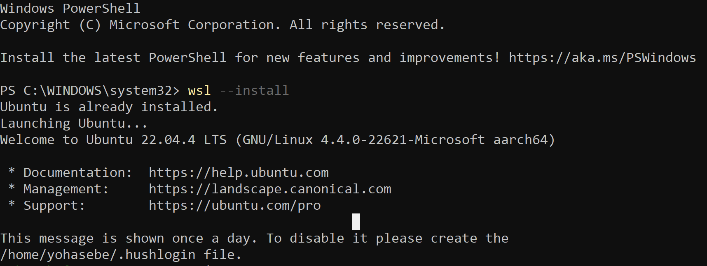

# Installation
{:.no_toc}

[English](/monadic-chat/installation) |
[日本語](/monadic-chat/installation_ja)

## Table of Contents
{:.no_toc}

1. toc
{:toc}

## Installer Download 

### MacOS

1. Install Docker Desktop for Mac (see [below](#install-docker-macos)).
2. Install Monadic Chat.

- [📦 Installer package for MacOS ARM64 (Apple Silicon)](https://yohasebe.com/assets/apps/monadic-chat-0.5.2-arm64.dmg) (0.5.2)
- [📦 Installer package for MacOS x64 (Intel)](https://yohasebe.com/assets/apps/monadic-chat-0.5.2.dmg) (0.5.2)

### Windows

1. Install WSL2 (see [below](#install-wsl2-win)).
2. Install Docker Desktop for Windows (see [below](#install-docker-win)).
2. Install Monadic Chat.

- [📦 Installer package for Windows](https://yohasebe.com/assets/apps/monadic-chat%20Setup%200.5.2.exe) (0.5.2)

## How to Install Dependencies

### MacOS

<b id="install-docker-macos">Install Docker Desktop</b>

Next, install Docker Desktop, which is software for creating container-based virtual environments.

Choose on of the two different packages depending on your Mac's CPU. You can check the type of CPU on the terminal with the following command:

```shell
$ sysctl -n machdep.cpu.brand_string
```

Download Docker Desktop from [Install Docker Desktop on Mac](https://hub.docker.com/editions/community/docker-ce-desktop-mac), but for Intel, download `Docker Desktop Installer.dmg`, and for Apple Silicon, download `Docker Desktop Installer Apple Silicon.dmg`.


Double-click the downloaded dmg file. Then drag and drop the docker icon to the Applications folder to install it. Once the installation is complete, start Docker Desktop. When you start Docker Desktop first time, you will be asked to accept the service agreement (→ press accept), choose settings (→ use recommended settings), and allow privileged access to apply configuration (→ enter your Mac username and password).

Once everything has been set up, the Docker Desktop icon will appear in the menu bar at the top right of the screen. After Docker Desktop has started, you may close the Docker Desktop Dashboard window if it is open.

### Windows

Below, the method to install Monadic Chat on Windows 11 Home will be explained. The same method can be used for Windows 11 Pro and Windows 11 Education as well.

<b id="install-wsl2-win">Install WSL2</b>

First, install [WSL2](https://brew.sh), which is a Linux environment for Windows.

Open PowerShell in the administrator mode. To do this, search PowerShell (`Start -> Windows PowerShell`) and select "Run as administrator".


Then execute the following command (the first `>` represents the command line prompt):

```shell
> wsl --install
```



Then reboot your computer. After rebooting, WSL2 and its default Linux distribution Ubuntu will be installed. During this process, you will be asked to enter a username and password for the Linux environment. Enter any username and password you like. You will need to remember this username and password later.

Now you have completed the installation of WSL2. You can start the Linux environment by searching for "Ubuntu" in the Windows search box and open the Ubuntu terminal. 


<b id="install-docker-win">Install Docker Desktop</b>

Next, install Docker Desktop, which is software for creating container-based virtual environments.

Download Docker Desktop from [Install Docker Desktop on Windows](https://hub.docker.com/editions/community/docker-ce-desktop-windows).


Double-click the downloaded exe file. Once the installation is complete, start Docker Desktop. When you start Docker Desktop first time, you may be asked to accept the service agreement (→ press accept) and choose settings (→ use recommended settings).

Once everything has been set up, the Docker Desktop icon will appear in the task tray at the bottom right of the screen. After Docker Desktop has started, you may close the Docker Desktop Dashboard window if it is open.

## How to Update

1. Click the Monadic Chat icon in the menu bar and select `Check for Updates`. If an update is available, click `Download` to download the latest version.
2. Quit Monadic Chat.
3. Run the installer for the latest version.
4. **Important**: After reinstalling, click `Build` in the Monadic Chat menu bar icon to update the Docker containers. (Simply double-clicking the installer to reinstall will not update the Docker containers.)

<script src="https://cdn.jsdelivr.net/npm/jquery@3.5.0/dist/jquery.min.js"></script>
<script src="https://cdn.jsdelivr.net/npm/lightbox2@2.11.3/src/js/lightbox.js"></script>

## How to Uninstall

1. Click the Monadic Chat icon in the menu bar and select `Uninstall`. This will remove the Docker containers and images shown below.
2. Quit Monadic Chat.
3. For **macOS**, open the `Applications` folder in Finder and drag Monadic Chat to the trash. For **Windows**, uninstall Monadic Chat from `Add or Remove Programs`.

**Containers**

- `monadic-chat-container`

**Images**

- `yohasebe/monadic-chat`
- `yohasebe/python`
- `yohasebe/selenium`
- `yohasebe/pgvector`

---

<script>
  function copyToClipBoard(id){
    var copyText =  document.getElementById(id).innerText;
    document.addEventListener('copy', function(e) {
        e.clipboardData.setData('text/plain', copyText);
        e.preventDefault();
      }, true);
    document.execCommand('copy');
    alert('copied');
  }
</script>
