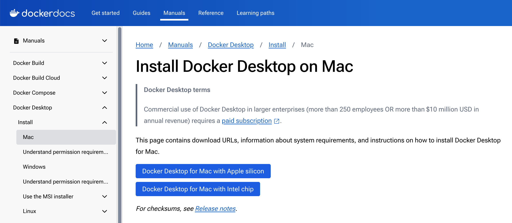
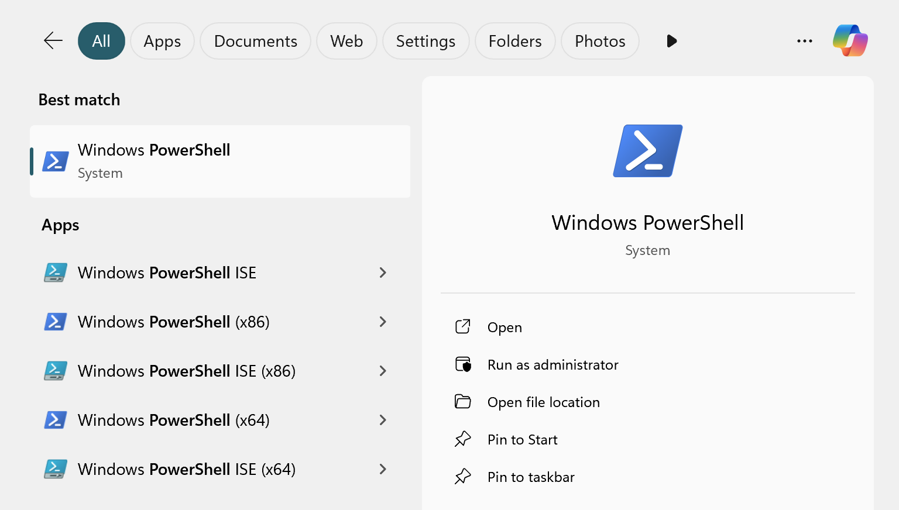
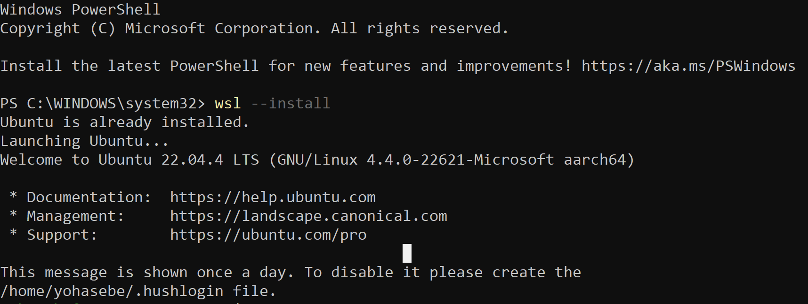
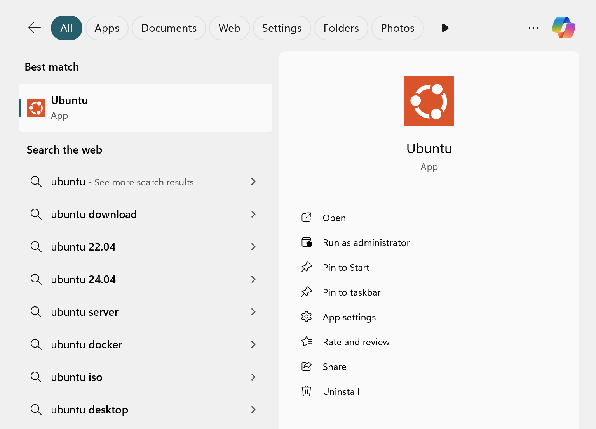
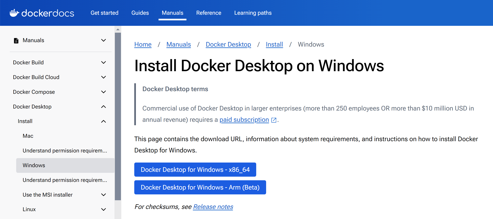

# インストール

## 基本的な手順

<!-- tabs:start -->

### **macOS**

macOSの場合、以下の手順でMonadic Chatをインストールします。

1. Docker Desktop for Macをインストールします。
2. Monadic Chat のインストーラーをダウンロードしてインストールします。

- [📦 Installer package for macOS ARM64 (Apple Silicon)](https://yohasebe.com/assets/apps/Monadic%20Chat-0.9.50-arm64.dmg) (0.9.50)
- [📦 Installer package for macOS x64 (Intel)](https://yohasebe.com/assets/apps/Monadic%20Chat-0.9.50.dmg) (0.9.50)

### **Windows**

Windowsの場合、以下の手順でMonadic Chatをインストールします。

1. WSL2をインストールします。
2. Docker Desktop for Windowsをインストールします。
3. Monadic Chat のインストーラーをダウンロードしてインストールします。

- [📦 Installer package for Windows](https://yohasebe.com/assets/apps/Monadic%20Chat%20Setup%200.9.50.exe) (0.9.50)

### **Linux**

Linux (Ubuntu/Debian) の場合、以下の手順でMonadic Chatをインストールします。

1. Docker Desktop for Linuxをインストールします。

参考：[LinuxにDocker Desktopをインストール](https://docs.docker.jp/desktop/install/linux-install.html)

2. Monadic Chat のインストーラーをダウンロードします。

- [📦 Installer package for Linux (Ubuntu/Debian) x64](https://yohasebe.com/assets/apps/monadic-chat_0.9.50_amd64.deb) (0.9.50)
- [📦 Installer package for Linux (Ubuntu/Debian) arm64](https://yohasebe.com/assets/apps/monadic-chat_0.9.50_arm64.deb) (0.9.50)

3. ターミナルで以下のコマンドを実行します。

```shell
$ sudo apt install ./monadic-chat_xx.xx.xx_xxx64.deb
```

<!-- tabs:end -->

## 事前の準備

<!-- tabs:start -->

### **macOS**

macOSの場合、以下の手順でDocker Desktopをインストールします。

次にDocker Desktopをインストールします。Docker Desktopはコンテナ型の仮想環境を作成するためのソフトウェアです。

ご自身のMacのCPUに応じて異なるパッケージを用います。CPUの種類はターミナル上で以下のコマンドで確認できます。

```shell
$ sysctl -n machdep.cpu.brand_string
```

[Install Docker Desktop on Mac](https://hub.docker.com/editions/community/docker-ce-desktop-mac)からDocker Desktopをダウンロードしてインストールしますが、その際、Intelの場合は`Docker Desktop Installer.dmg`を、Apple Siliconの場合は`Docker Desktop Installer Apple Silicon.dmg`をダウンロードしてください。



ダウンロードしたdmgファイルをダブルクリックするとウィンドウが表示されるので、DockerのアイコンをApplicationsフォルダーにドラッグしてください。インストールが完了したら、Docker Desktopを起動しましょう。その際、service agreementへの同意が求められます（acceptしてください）。また、推奨設定を使用するかどうかを確認されます（特にこだわりがなければ推奨設定を用いてください）。また、内部でosascriptを使用するため、Macのユーザ名とパスワードの入力が求められます。

Docker Desktopの起動が完了すると、タスクバーにDockerのアイコンが表示されます。ここでDocker Desktopのダッシュボード・ウィンドウは閉じてしまって構いません。

### **Windows**

Windows 11でMonadic Chatを使用するためには、Windows Subsystem for Linux 2（WSL2）とDocker Desktopのインストールが必要です。以下では、Windows 11 HomeにMonadic Chatをインストールする方法を説明します。Windows 11 ProやWindows 11 Educationの場合でも基本的に同様の方法でインストール可能です。

#### WSL2のインストール

まずはをインストールします。[WSL2](https://brew.sh)はWindows上でLinux環境を実現する仕組みです。

PowerShellを管理者モードで開きます。Windowsの検索ボックスでPowerShellを検索し、"管理者として実行"を選択してpowershell.exeを起動してください。



次にPowerShell上で次のコマンドを実行します（最初の`>`はコマンドラインのプロンプトを表します）。

```shell
> wsl --install -d Ubuntu
```



そしてコンピュータを再起動します。再起動後、WSL2とUbuntuがインストールされます。このプロセスの中で、Linux環境のユーザ名とパスワードを入力するよう求められます。任意のユーザ名とパスワードを入力してください。このユーザ名とパスワードは覚えておく必要があります。

これでWSL2のインストールは完了です。Windows上でUbuntuが使えるようになりました。Windowsの検索ボックスで"Ubuntu"を検索し、Ubuntuのターミナルを開いてみてください。



#### Docker Desktopのインストール

次に、コンテナを使った仮想環境を作成するためのソフトウェアであるDocker Desktopをインストールします。

[Install Docker Desktop on Windows](https://hub.docker.com/editions/community/docker-ce-desktop-windows)からDocker Desktopをダウンロードします。



ダウンロードしたexeファイルをダブルクリックしてインストールを開始します。インストールが完了したら、Docker Desktopを起動します。Docker Desktopを初めて起動するとき、サービス契約に同意するかどうか（→同意する）、設定を選択するかどうか（→推奨設定を使用する）を求められます。

これらが完了すると、画面右下のタスクトレイにDocker Desktopのアイコンが表示されます。Docker Desktopが起動したら、Docker Desktop Dashboardウィンドウを閉じて構いません。

### **Linux**

Linux (Ubuntu/Debian) の場合、下記のページを参照してDocker Desktopをインストールしてください。

- [Debianの場合](https://docs.docker.jp/desktop/install/debian.html)
- [Ubuntuの場合](https://docs.docker.jp/desktop/install/ubuntu.html)

<!-- tabs:end -->

## アップデート


Monadic Chatのより新しいバージョンがあるかどうかを確認するには、メニューの`Check for Updates`を実行してください。もし新しいバージョンがある場合、ダウンロードリンクが表示されます。ダウンロードリンクをクリックして、新しいバージョンのインストーラーをダウンロードしてください。

