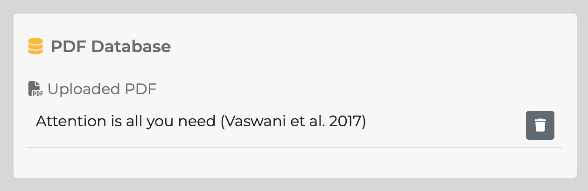

# 機能・設定

 

## コンソールボタン項目

**Start**  
Monadic Chatを起動します。初回起動時はDocker上での環境構築のため少し時間がかかります。

**Stop**  
Monadic Chatを停止します。

**Restart**  
Monadic Chatを再起動します。

**Open Browser**  
Monadic Chatを使用するためにデフォルト・ブラウザーを開いて`http://localhost:4567`にアクセスします。

**Shared Folder**  
ホストコンピュータととDockerコンテナ間で共有されるフォルダーを開きます。ファイルのインポートやエクスポートに使用します。

**Quit**
Monadic Chat Consoleを終了します。

## コンソールメニュー項目

**Rebuild**  
Monadic ChatのDockerイメージおよびコンテナを再構築します。

**Uninstall Images and Containers**  
Monadic ChatのDockerイメージおよびコンテナを削除します。

**Start JupyterLab**  
JupyterLabを起動します。JupyterLabは`http://localhost:8888`でアクセスできます。

**Stop JupyterLab**  
JupyterLabを停止します。

**Import Document DB**  
Monadic ChatのPGVectorデータベースにPDFドキュメントデータをインポートします。インポートの際には、共有フォルダに`monadic.json`という名前のファイルを配置してください。

**Export Document DB**  
Monadic ChatのPGVectorデータベースに保存されているPDFドキュメントデータをエクスポートします。エクスポートされたファイルは`monadic.json`という名前で共有フォルダに保存されます。

## APIトークン設定画面

ここでの設定はすべて `~/monadic/data/.env` ファイルに保存されます。

**OPENAI_API_KEY** （必須） 
OpenAI API キーを入力してください。このキーはChat API、DALL-E 画像生成 API、Whisper 音声認識 API、音声合成 API などにアクセスするため使用されます。[OpenAI API page](https://platform.openai.com/docs/guides/authentication) で取得できます。

**VISION_MODEL** 
画像認識と動画認識に使用するモデルを選択します。現在は `gpt-4o` と `gpt-4o-mini` が利用可能です。デフォルトは `gpt-4o-mini` です。

**AI_USER_MODEL** 
AIがユーザーの代わりにメッセージを作成するAI User機能に使用するモデルを選択します。現在、`gpt-4o`と`gpt-4o-mini`が利用可能です。デフォルトは`gpt-4o-mini`です。

**ANTHROPIC_API_KEY** 
Anthropic APIキーを入力してください。このキーはAnthropic Claude (Chat) と Anthropic Claude (Code Interpreter) アプリを使用するのに必要です。[https://console.anthropic.com] で取得できます。

**COHERE_API_KEY**  Cohere API キーを入力してください。このキーは、Cohere Command R (Chat) および Cohere Command R (Code Interpreter) アプリを使用するのに必要です。[https://dashboard.cohere.com] で取得できます。

**GEMINI_API_KEY**  Google Gemini API キーを入力してください。このキーはGoogle Gemini (Chat) アプリを使用するのに必要です。[https://ai.google.dev/]で取得できます。

**MISTRAL_API_KEY**  Mistral APIキーを入力してください。このキーは「Mistral AI (Chat) アプリを使用するのに必要です。[https://console.mistral.ai/]で取得できます。

## チャット設定画面

**Base App**  
Monadic Chatであらかじめ用意された基本アプリの中から1つを選択します。各アプリでは異なるデフォルト・パラメター値が設定されており、固有の初期プロンプトが与えられています。各アプリの特徴については [Base Apps](#base-apps)を参照してください。

**Model**  
OpenAIが提供するモデルの中から1つを選びます。各アプリでデフォルトのモデルが指定されていますが、目的に応じて変更することができます。

**Max Tokens**  
チェックマークをオンにすると、APIに送信されるテキスト（過去のやりとりと新たなメッセージ）を指定されたトークン数に限定します。OpenAIのAPIにおけるトークンのカウント方法については[What are tokens and how to count them](https://help.openai.com/en/articles/4936856-what-are-tokens-and-how-to-count-them)を参照してください。

Chat APIにパラメターとして送られる「トークンの最大値」を指定します。これにはプロンプトとして送られるテキストのトークン数と、レスポンスとして返ってくるテキストのトークン数が含まれます。OpenAIのAPIにおけるトークンのカウント方法については[What are tokens and how to count them](https://help.openai.com/en/articles/4936856-what-are-tokens-and-how-to-count-them)を参照してください。

**Context Size**  
現在進行中のチャットに含まれるやりとりの中で、アクティブなものとして保つ発話の最大数です。アクティブな発話のみがOpenAIのchat APIに文脈情報として送信されます。インアクティブな発話も画面上では参照可能であり、エクスポートの際にも保存対象となります。

**Parameters** 

- Temperature
- Top P
- Presence Penalty
- Frequency Penalty

以上の要素はパラメターとしてAPIに送られます。各パラメターの詳細はChat APIの[Reference](https://platform.openai.com/docs/api-reference/chat)を参照してください。

**Show Initial Prompt** 
初期プロンプトとしてAPIに送られるテキスト（システムプロンプトと呼ばれることもあります）を表示または編集するにはオンにします。初期プロンプトによって、会話のキャラクター設定や、レスポンスの形式などを指定することができます。各アプリ の目的に応じたデフォルトのテキストが設定されていますが、自由に変更することが可能です。

**Show Initial Prompt for AI-User** 
AIユーザー機能を有効にしたときAIユーザーに与えられる初期プロンプトを表示します。AIユーザーが有効なとき、最初のメッセージは（AIでない）ユーザー自身が作成する必要がありますが、それ以降はAIアシスタントからのメッセージの内容に応じて、AIが「ユーザーになりきって」メッセージを代わりに作成してくれます。テキストボックスに入力されたAIユーザーによるメッセージをユーザー自身が編集したり、追記したりすることができます。

**Enable AI-User** 
AIユーザー機能を有効にするかどうかを指定します。

**Chat Interaction Controls** 
Monadic Chatを音声入力による会話に適した形に設定するためのオプションです。音声入力による会話を行う場合には、以下のオプション（`Start from assistant`, `Auto speech`, `Easy submit`）をすべてオンにするとよいでしょう。`check all` または `uncheck all` をクリックすることで、すべてのオプションを一括でオンまたはオフにすることができます。

**Start from assistant** 

オンにすると、会話を始める時にアシスタント側が最初の発話を行います。

**Auto speech** 

オンにすると、アシスタントからのレスポンスが返ってくると自動的に合成音声での読み上げが行われます。

**Easy submit** 

オンにすると、`Send`ボタンをクリックしなくても、キーボードのEnterキーを押すと自動的にテキストエリア内のメッセージが送信されます。もし音声入力中であれば、Enterキーを押すか、`Stop`ボタンをクリックすることで、自動的にメッセージが送信されます。

**Start Session**  
このボタンをクリックすると、GPT Settiingsで指定したオプションやパラメターのもとにチャットが開始されます。

## 基本情報パネル

**Monadic Chat Info** 
関連するウェブサイトへのリンクとMonadic Chatのバージョンが示されます。`API Usage`をクリックするとOpenAIのページにアクセスします。API Usageで示されるのはAPI使用量の全体であり、Monadic Chatによるものだけとは限らないことに注意してください。バージョン番号の後の括弧には、Monadic Chatをインストールした際の様式に応じて、DockerもしくはLocalが表示されます。

**Current Base App** 
現在選択している基本アプリの名前と説明が表示されます。Monadic Chatの起動時にはデフォルトのアプリである`Chat`に関する情報が表示されます。

## セッション表示パネル

**Reset** 
`Reset`ボタンをクリックすると、現在の会話が破棄され、初期状態に戻ります。アプリの選択もデフォルトの`Chat`に戻ります。

**Settings** 
`Settings`ボタンをクリックすると、現在の会話を破棄しないで、GPT Settingsパネルに戻ります。その後、現在の会話に戻るには`Continue Session`をクリックします。

**Import** 
`Import`ボタンをクリックすると、現在の会話を破棄し、外部ファイル（JSON）に保存した会話データを読み込みます。また、外部ファイルに保存された設定が適用されます。

**Export** 
`Export`ボタンをクリックすると、現在の設定項目の値と会話データを外部ファイル（JSON）に保存します。

## 音声設定パネル

**NOTE**: 音声機能を使用するにはGoogle ChromeまたはMicrosoft Edgeブラウザを使用する必要があります。

**Text-to-Speech (TTS) Voice** 
音声合成に使用するボイスを指定できます。

**TTS Speed** 
音声合成の際の発話スピードを0.5から1.5の間で指定することができます（デフォルト：0.0）。

**Automatic-Speech-Recognition (ASR) Language** 
音声認識にはWhisper APIを用いており、`Automatic` が選択されていると異なる言語による音声入力を自動で認識します。特定の言語を指定したい場合にはセレクターで言語を選択してください。
参考：[Whisper API FAQ](https://help.openai.com/en/articles/7031512-whisper-api-faq)

## PDFデータベース表示パネル

**NOTE**: このパネルはPDF読み込み機能を備えたアプリを選択しているときだけ表示されます。

**Uploaded PDF** 
ここには、`Import PDF`ボタンをクリックしてアップロードしたPDFのリストが表示されます。PDFをアップロードする際に、ファイルに個別の表示名を付けることができます。指定しない場合はオリジナルのファイル名が使用されます。複数のPDFファイルをアップロードすることが可能です。PDFファイル表示名の右側のゴミ箱アイコンをクリックするとそのPDFファイルの内容が破棄されます。
