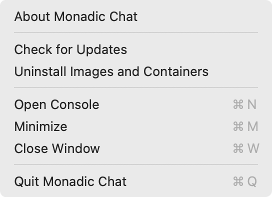

# アンインストール

## 基本的な手順

Monadic Chatをアンインストールする基本的な手順は以下の通りです。

- Monadic Chatの終了
- Dockerコンテナとイメージの削除
- Monadic Chatのアンインストール

<!-- tabs:start -->

### **macOS**

1. メニューの`Uninstall Images and Containers`を実行します。これにより、下に示すDockerコンテナとイメージが削除されます。
2. Monadic Chatを終了します。
3. Finderで`Applications`フォルダーを開き、Monadic Chatをゴミ箱にドラッグします。

### **Windows**

1. メニューの`Uninstall Images and Containers`を実行します。これにより、下に示すDockerコンテナとイメージが削除されます。
2. Monadic Chatを終了します。
3. `プログラムの追加と削除`からMonadic Chatをアンインストールします。

### **Linux**

1. メニューの`Uninstall Images and Containers`を実行します。これにより、下に示すDockerコンテナとイメージが削除されます。
2. Monadic Chatを終了します。
3. ターミナルで以下のコマンドを実行します。

```shell
$ sudo apt remove monadic-chat
```

<!-- tabs:end -->



## クリーンアップ（任意）

万が一`Uninstall Images and Containers`を実行してもコンテナとイメージが削除されなかったり、アップデート時またはアンインストール時に問題が生じた場合は、以下のDockerコンテナとイメージを手動で削除して、再度Monadic Chatをインストールしてください。

### Dockerコンテナとイメージ

#### Containers

- `monadic-chat-container`
    - `monadic-chat-ruby-container`
    - `monadic-chat-python-container`
    - `monadic-chat-selenium-container`
    - `monadic-chat-pgvector-container`

#### Images

- `yohasebe/monadic-chat`
- `yohasebe/python`
- `yohasebe/selenium`
- `yohasebe/pgvector`
