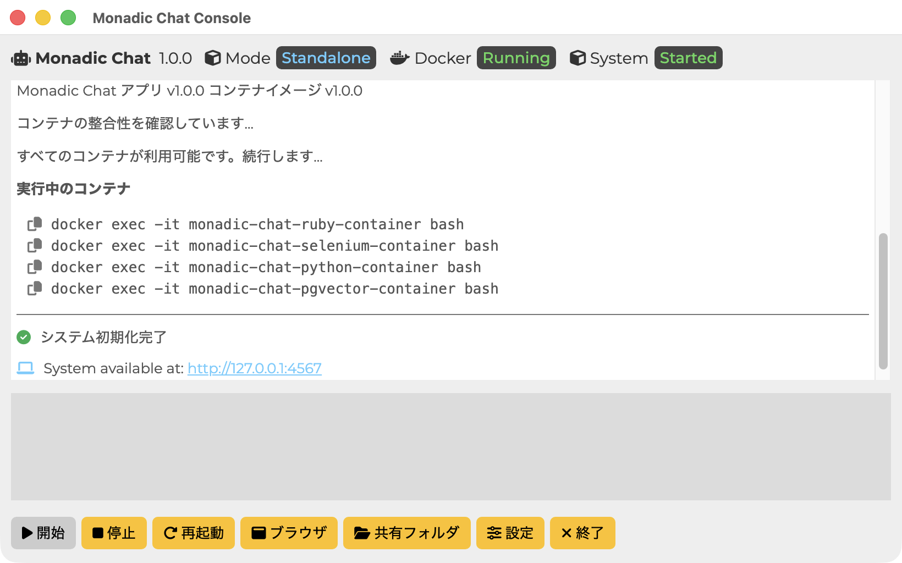
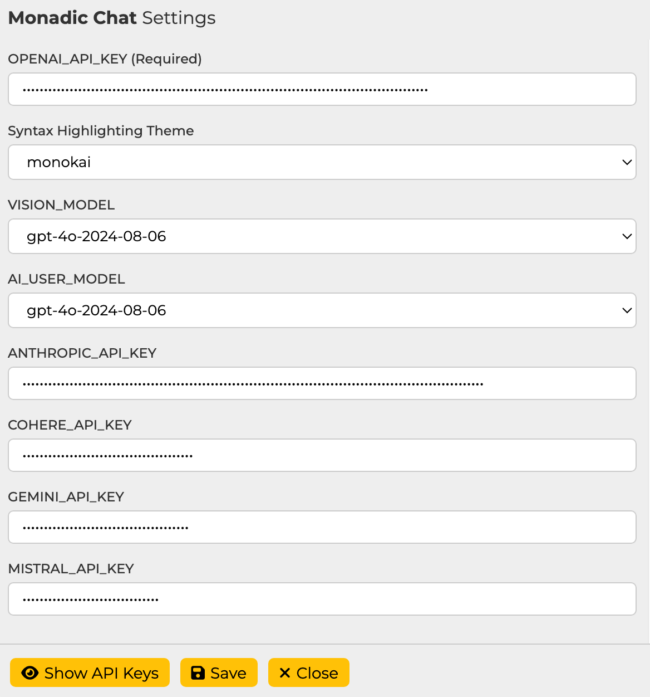

# Monadic Chat コンソール

## コンソールボタン項目

**Start**  
Monadic Chatを起動します。初回起動時はDocker上での環境構築のため少し時間がかかります。

**Stop**  
Monadic Chatを停止します。

**Restart**  
Monadic Chatを再起動します。

**Open Browser**  
Monadic Chatを使用するためにデフォルト・ブラウザーを開いて`http://localhost:4567`にアクセスします。

**Shared Folder**  
ホストコンピュータととDockerコンテナ間で共有されるフォルダーを開きます。ファイルのインポートやエクスポートに使用します。

**Quit**
Monadic Chat Consoleを終了します。

## コンソールメニュー項目

**Rebuild**  
Monadic ChatのDockerイメージおよびコンテナを再構築します。

**Uninstall Images and Containers**  
Monadic ChatのDockerイメージおよびコンテナを削除します。

**Start JupyterLab**  
JupyterLabを起動します。JupyterLabは`http://localhost:8888`でアクセスできます。

**Stop JupyterLab**  
JupyterLabを停止します。

**Import Document DB**  
Monadic ChatのPGVectorデータベースにPDFドキュメントデータをインポートします。インポートの際には、共有フォルダに`monadic.json`という名前のファイルを配置してください。

**Export Document DB**  
Monadic ChatのPGVectorデータベースに保存されているPDFドキュメントデータをエクスポートします。エクスポートされたファイルは`monadic.json`という名前で共有フォルダに保存されます。

## APIトークン設定画面

ここでの設定はすべて `~/monadic/data/.env` ファイルに保存されます。

**OPENAI_API_KEY** （必須） 
OpenAI API キーを入力してください。このキーはChat API、DALL-E 画像生成 API、Whisper 音声認識 API、音声合成 API などにアクセスするため使用されます。[OpenAI API page](https://platform.openai.com/docs/guides/authentication) で取得できます。

**VISION_MODEL** 
画像認識と動画認識に使用するモデルを選択します。現在は `gpt-4o` と `gpt-4o-mini` が利用可能です。デフォルトは `gpt-4o-mini` です。

**AI_USER_MODEL** 
AIがユーザーの代わりにメッセージを作成するAI User機能に使用するモデルを選択します。現在、`gpt-4o`と`gpt-4o-mini`が利用可能です。デフォルトは`gpt-4o-mini`です。

**ANTHROPIC_API_KEY** 
Anthropic APIキーを入力してください。このキーはAnthropic Claude (Chat) と Anthropic Claude (Code Interpreter) アプリを使用するのに必要です。[https://console.anthropic.com] で取得できます。

**COHERE_API_KEY**  Cohere API キーを入力してください。このキーは、Cohere Command R (Chat) および Cohere Command R (Code Interpreter) アプリを使用するのに必要です。[https://dashboard.cohere.com] で取得できます。

**GEMINI_API_KEY**  Google Gemini API キーを入力してください。このキーはGoogle Gemini (Chat) アプリを使用するのに必要です。[https://ai.google.dev/]で取得できます。

**MISTRAL_API_KEY**  Mistral APIキーを入力してください。このキーは「Mistral AI (Chat) アプリを使用するのに必要です。[https://console.mistral.ai/]で取得できます。

