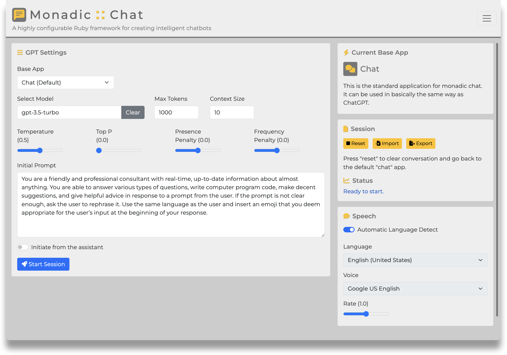
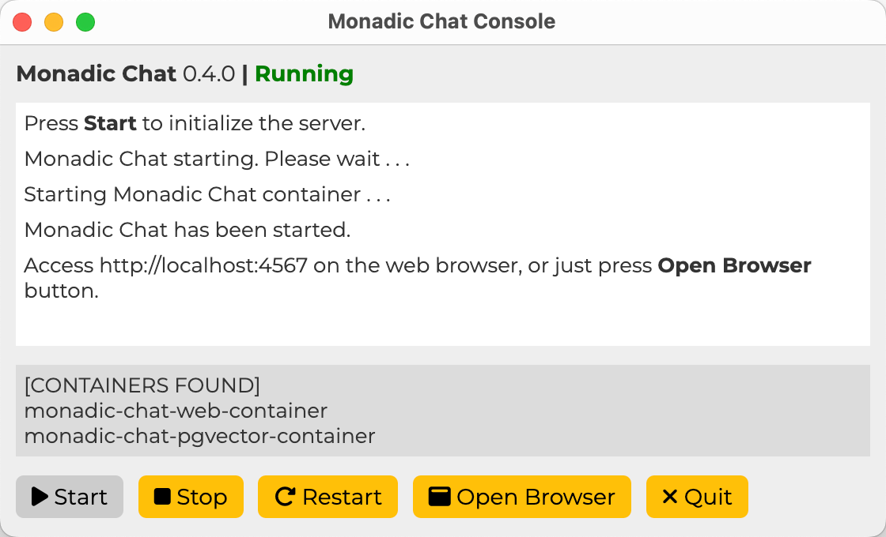
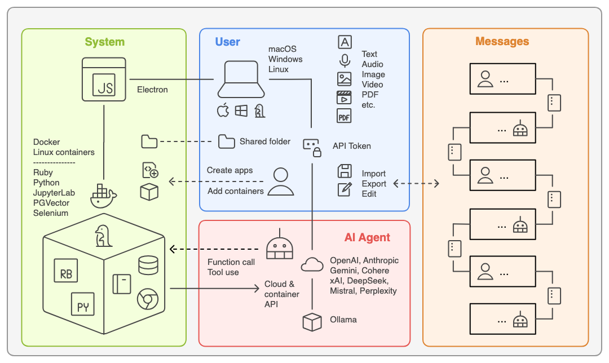

# Overview

[English](/monadic-chat/overview) |
[日本語](/monadic-chat/overview_ja)

🌟 **Monadic Chat** is a highly configurable web application framework for creating and using intelligent chatbots, leveraging the power of OpenAI's Chat and Whisper APIs and the Ruby programming language.

⚠️  **Important Notice**

This software is currently under active development and is subject to frequent changes. Some features may still be unstable at this moment. Please exercise caution when using it.

📢 **Call for Contributions**

I welcome contributions that can help refine this software, such as code improvements, adding tests, and documentation. Your support would be greatly appreciated.

## Features

### Basic Structure

- 🤖 Powered by **GPT-3.5** or **GPT-4** via OpenAI's Chat API, with unlimited conversation turns
- 👩‍💻 Multi-OS support using **Docker** for Mac, Windows, or Linux

### Data Management

- 💾 **Export/import** messages and settings
- 💬 Specify the number of recent messages (**active messages**) to send to the API, while storing and exporting older messages (**inactive messages**)
- 🔢 Generate **text embeddings** from data in multiple **PDF files** and query their content using OpenAI's text embedding API

### Voice Interaction

- 🎙️ Automatic transcription of **microphone input** using OpenAI's Whisper API
- 🔈 **Text-to-speech** functionality for AI assistant responses
- 🗣️ Choose the **language and voice** for text-to-speech (available on Google Chrome or Microsoft Edge)
- 🗺️ **Automatic language detection** for appropriate text-to-speech playback
- 😊 Enable **voice conversations** with the AI agent using speech recognition and text-to-speech

### Image Generation

- 🖼️ **Generate images** from text prompt using OpenAI's DALL·E 3 API

### Image Understanding

- 👀 **Local images** can be uploaded and let AI assistant analyze what are in them

### Configuration and Extension

- 💡 Customize the AI agent's behavior by specifying **API parameters** and the **system prompt**
- 💎 Extend functionality using the **Ruby** programming language

### Message Editing

- 📝 **Edit** previous messages and retry when the desired AI agent response is not obtained
- 🗑️ **Delete** specific messages from previous conversations
- 📜 **Add** preceding messages with user, assistant, or system roles

### Advanced

- 🪄 Obtain additional information alongside the primary AI assistant response and store it as the **conversation state** in a predefined JSON object

---

