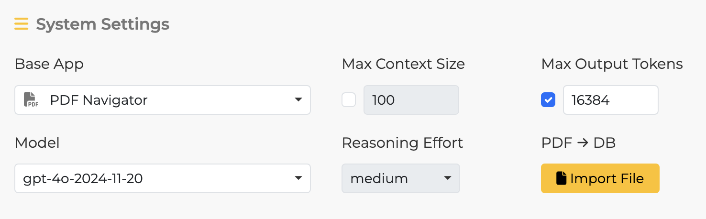
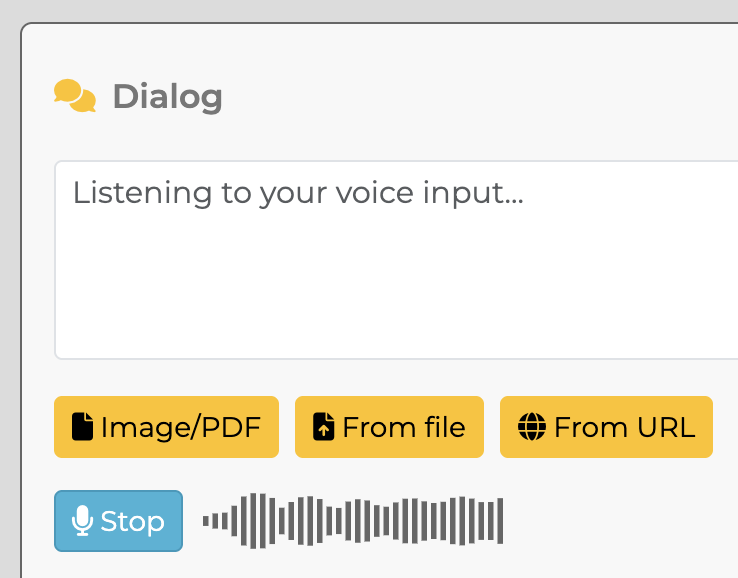

# Settings
{:.no_toc}

[English](/monadic-chat/settings) |
[日本語](/monadic-chat/settings_ja)

## Table of Contents
{:.no_toc}

1. toc
{:toc}

## Monadic Chat Console


**Start** <br />
Starts Monadic Chat. It may take some time for the initial setup on Docker.

**Stop** <br />
Stops Monadic Chat.

**Restart** <br />
Restarts Monadic Chat.

**Open Browser** <br />
Opens the default browser to access `http://localhost:4567` for using Monadic Chat.

**Shared Folder** <br />
Opens the folder shared between host computer and Docker containers. You can use this folder to import and export files.

**Quit**
Quits the Monadic Chat Console. If Monadic Chat is running, it will be stopped first, which may take some time.

## API Token Panel


**API Token** <br />
Enter your OpenAI API key here. Once a valid API key is confirmed, a file named `.env` will be created in the root directory of Monadic Chat, and a variable named `OPENAI_API_KEY` will be defined inside it. The value of this variable will be used thereafter.

```
OPENAI_API_KEY=api_key
```

**Status** <br />
The startup status of Monadic Chat will be displayed.

**OpenAI Models** <br />
A list of OpenAI models available for use from Monadic Chat will be displayed. Model selection is done in the GPT Settings panel.

## GPT Settings Panel


**Base App** <br />
Choose one of the pre-built apps provided in Monadic Chat. Each app has different default parameter values and comes with its own initial prompt. For more information about each Base App's features, refer to [Base Apps](#base-apps).

**Model** <br />
Choose one of the models provided by OpenAI. Each Base App has a default model specified, but you can change it according to your needs.

**Max Tokens** <br />
When this option is turned on, the text (past conversations and new messages) sent to the API will be limited to the specified number of tokens. For more information on how tokens are counted in the OpenAI API, refer to [What are tokens and how to count them](https://help.openai.com/en/articles/4936856-what-are-tokens-and-how-to-count-them).

**Context Size** <br />
This is the maximum number of active utterances to keep in the ongoing chat. Only active utterances are sent as context information to the OpenAI chat API. Inactive utterances are still visible on the screen and will be saved when exporting. (min: 1, max: 100, default: 10)

**Parameters** <br />

- Temperature
- Top P
- Presence Penalty
- Frequency Penalty

These elements are sent as parameters to the API. For more details on each parameter, refer to the [Reference](https://platform.openai.com/docs/api-reference/chat) of the Chat API.

**Initial Prompt for Assistant**<br />
This is the text sent to the API as the initial prompt. You can specify the character settings for the conversation and the format of the response. Each Base App has a default text set according to its purpose, but you can freely change it.

**Show Initial Prompt for AI-User**<br />
Displays the initial prompt given to the AI-user when the AI-user feature is enabled. When the AI-user is enabled, the first message must be created by the (non-AI) user themselves, but thereafter, the AI will "impersonate" the user and create messages on their behalf based on the content of the messages from the AI-assistant. The user can edit or add to the messages created by the AI-user in the text box.

**Enable AI-User**<br />
Specifies whether to enable the AI-user feature.

**Start from assistant**<br />

When this option is turned on, the assistant will make the first utterance when starting the conversation.

**Start Session** <br />
Click this button to start the chat based on the options and parameters specified in the GPT Settings.

## Monadic Chat Info Panel 


**Monadic Chat Info**<br />
This panel displays the link to the related website and the version of Monadic Chat. Clicking on `API Usage` will take you to the OpenAI page. Please note that the API Usage represents the overall usage of the API and may not be solely from Monadic Chat. The parentheses after the version number indicate whether Docker or Local is displayed, depending on the installation style of Monadic Chat.

**Current Base App**<br />
The name and description of the currently selected Base App are displayed here. When Monadic Chat is launched, information about the default Base App, which is `Chat`, is displayed.

## Session Panel


**Reset**<br />
Clicking the `Reset` button will discard the current conversation and return to the initial state. The Base App will also return to the default `Chat`.

**Settings**<br />
Clicking the `Settings` button will not discard the current conversation and will return to the GPT Settings panel. To return to the current conversation, click `Continue Session`.

**Import**<br />
Clicking the `Import` button will discard the current conversation and load the conversation data saved in an external file (JSON). The settings saved in the external file will also be applied.

**Export**<br />
Clicking the `Export` button will save the current values of the settings and conversation data to an external file (JSON).

## Speech Panel


**NOTE**: To use the speech recognition feature, you need to use Google Chrome or Microsoft Edge browsers.

**Automatic Language Detect**<br />
When this setting is turned on, the language used for speech recognition and synthesis will be automatically detected. In this case, the default voice for synthesis will be used. When this setting is turned off, you can specify the language for speech recognition and synthesis using the `Language` selector. You can also specify the voice for synthesis using the `Voice` selector.

**Language**<br />
When `Automatic Language Detect` is turned off, you can specify the language to be used for speech recognition and synthesis here. The available languages may vary depending on the operating system and browser. Since speech recognition is done through the Whisper API, only the languages listed in the [Whisper API FAQ](https://help.openai.com/en/articles/7031512-whisper-api-faq) are supported.

**Voice**<br />
When `Automatic Language Detect` is turned off, you can specify the voice to be used for speech synthesis here. The available voices may vary depending on the operating system and browser.

**Rate**<br />
You can specify the speech rate for speech synthesis between 0.5 and 1.5 (default: 1.0).

## PDF Database Panel


**NOTE**: The PDF Database Panel is only displayed when you have selected a Base App with PDF loading functionality.

**Uploaded PDF**<br />
Here, you can see a list of PDFs that you have uploaded by clicking the `Import PDF` button. When uploading a PDF, you have the option to give it a custom display name. If no name is specified, the original file name will be used. You can upload multiple PDF files. To discard the contents of a PDF file, click on the trash can icon on the right side of its display name.




## Dialog Panel


**Buttons on Message Boxes**<br />

 Copy the message text to the system clipboard

 Play text-to-speech of the message text

 Delete the message text

 Edit the message text (Note: This deletes all the messages following it)

 Current status of the message (Active)

 Current status of the message (Inactive)

**Use easy submit**<br />
**Auto speech**<br />

When `Use easy submit` is turned on, you can automatically send the message in the text area by pressing the Enter key on the keyboard without clicking the `Send` button. If you are using voice input, the message will be automatically sent by pressing the Enter key or clicking the `Stop` button. When `Auto speech` is turned on, the assistant's response will be automatically read out in text-to-speech voice.

When both `Use easy submit` and `Auto speech` are turned on, you can start and stop voice input with just the Enter key on the keyboard, enabling smooth conversation between the user and the assistant through voice.

**Role**<br />
The `role` parameter specifies the role of the message within the text area. The default value is `User`. Other options are used to adjust the conversation data sent to the API as a preceding context. Choosing `User (to add to past messages)` adds the user's message to the conversation, but it is not immediately sent to the API. Instead, it is sent along with the regular `User` role messages as part of the context. The `Assistant (to add to past messages)` role is essentially the same. The `System (to provide additional direction)` role is used when you want to add additional instructions regarding the conversation itself.

**Send**<br />
When you click this button, the message in the text area will be sent to the API.

**Clear**<br />
When you click this button, the text area will be cleared.

**Voice Input**<br />
When you click this button, voice input through the microphone will start, and the display on the button will change to `Stop`. Clicking the `Stop` button will stop the voice input. During voice input, a volume indicator will be displayed on the right side of the button.



<script src="https://cdn.jsdelivr.net/npm/jquery@3.5.0/dist/jquery.min.js"></script>
<script src="https://cdn.jsdelivr.net/npm/lightbox2@2.11.3/src/js/lightbox.js"></script>

---

<script>
  function copyToClipBoard(id){
    var copyText =  document.getElementById(id).innerText;
    document.addEventListener('copy', function(e) {
        e.clipboardData.setData('text/plain', copyText);
        e.preventDefault();
      }, true);
    document.execCommand('copy');
    alert('copied');
  }
</script>
