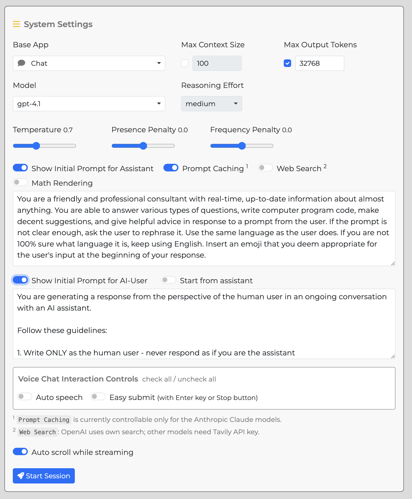
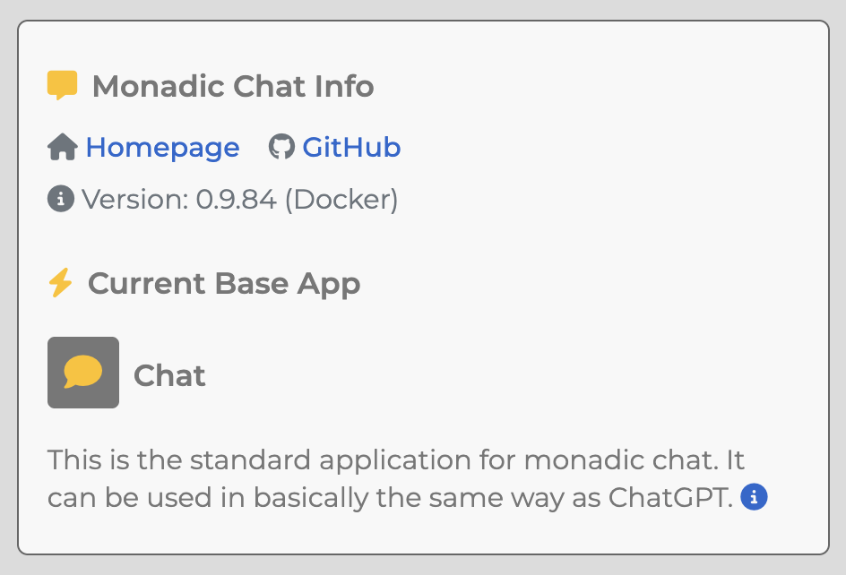
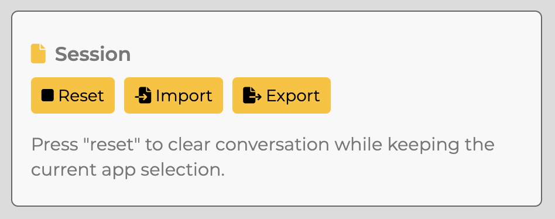
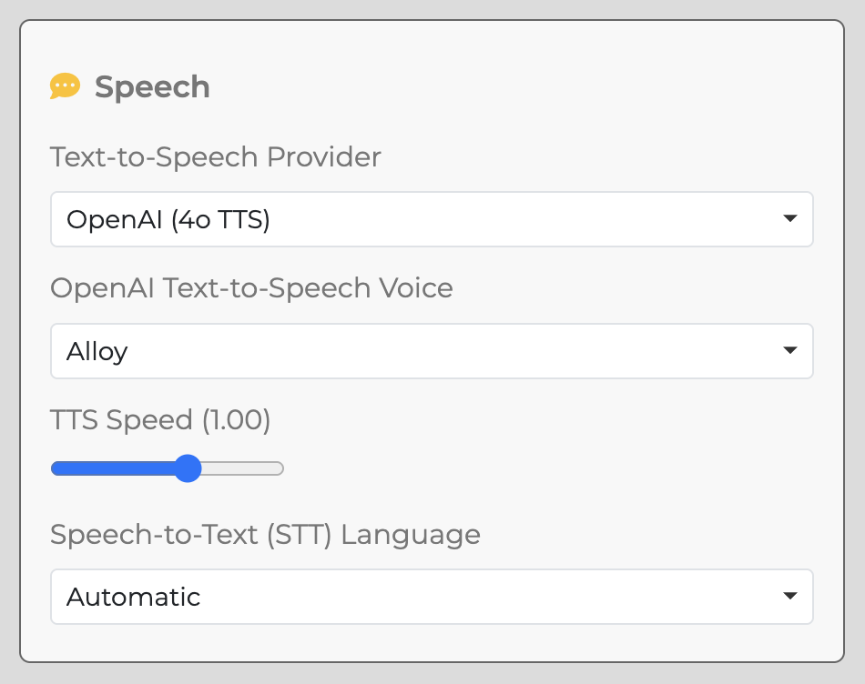

# Settings

 

.png" width="700px"/>

## Console Button Items

**Start**  
Launch Monadic Chat. The initial startup may take some time due to environment setup on Docker.

**Stop**  
Stop Monadic Chat.

**Restart**  
Restart Monadic Chat.

**Open Browser**  
Open the default browser to access Monadic Chat at `http://localhost:4567`.

**Shared Folder**  
Open the folder shared between the host and Docker containers. It can be used for importing and exporting files.

**Quit**
Exit the Monadic Chat Console. If Monadic Chat is running, it will stop first, which may take some time.

### Console Menu Items

**Rebuild**  
Rebuild the Docker images and containers for Monadic Chat.

**Uninstall Images and Containers**  
Remove the Docker images and containers for Monadic Chat.

**Start JupyterLab**  
Launch JupyterLab. It can be accessed at `http://localhost:8888`.

**Stop JupyterLab**  
Stop JupyterLab.

**Import Document DB**  
Import PDF document data into Monadic Chat's PGVector database.

**Export Document DB**  
Export PDF document data stored in Monadic Chat's PGVector database.

## API Token Settings Screen

All settings here are saved in the `~/monadic/data/.env` file.

**OPENAI_API_KEY** (Required) 
Enter your OpenAI API key. This key is used to access the Chat API, DALL-E image generation API, Whisper speech recognition API, and speech synthesis API. It can be obtained from the [OpenAI API page](https://platform.openai.com/docs/guides/authentication).

**VISION_MODEL** 
Select the model used for image and video recognition. Currently, `gpt-4o` and `gpt-4o-mini` are available. The default is `gpt-4o-mini`.

**AI_USER_MODEL** 
Select the model used for the AI User feature, which creates messages on behalf of the user. Currently, `gpt-4o` and `gpt-4o-mini` are available. The default is `gpt-4o-mini`.

**ANTHROPIC_API_KEY** 
Enter your Anthropic API key. This key is required to use the Anthropic Claude (Chat) and Anthropic Claude (Code Interpreter) apps. It can be obtained from [https://console.anthropic.com].

**COHERE_API_KEY** 
Enter your Cohere API key. This key is required to use the Cohere Command R (Chat) and Cohere Command R (Code Interpreter) apps. It can be obtained from [https://dashboard.cohere.com].

**GEMINI_API_KEY** 
Enter your Google Gemini API key. This key is required to use the Google Gemini (Chat) app. It can be obtained from [https://ai.google.dev/].

**MISTRAL_API_KEY** 
Enter your Mistral API key. This key is required to use the Mistral AI (Chat) app. It can be obtained from [https://console.mistral.ai/].

## Chat Settings Screen

**Base App**  
Select one of the basic apps provided by Monadic Chat. Each app has different default parameter values and unique initial prompts. For the characteristics of each app, see [Base Apps](#base-apps).

**Model**  
Select one of the models provided by OpenAI. Each app has a default model specified, but it can be changed according to your purpose.

**Max Tokens**  
When the checkmark is on, the text sent to the API (past interactions and new messages) is limited to the specified number of tokens. For information on how tokens are counted in OpenAI's API, see [What are tokens and how to count them](https://help.openai.com/en/articles/4936856-what-are-tokens-and-how-to-count-them).

Specify the "maximum number of tokens" sent as a parameter to the Chat API. This includes the number of tokens in the text sent as a prompt and the number of tokens in the text returned as a response. For information on how tokens are counted in OpenAI's API, see [What are tokens and how to count them](https://help.openai.com/en/articles/4936856-what-are-tokens-and-how-to-count-them).

**Context Size**  
The maximum number of utterances to keep active in the ongoing chat. Only active utterances are sent to OpenAI's chat API as context information. Inactive utterances can still be referenced on the screen and are also saved when exported.

**Parameters** 

- Temperature
- Top P
- Presence Penalty
- Frequency Penalty

These elements are sent as parameters to the API. For details on each parameter, see the Chat API [Reference](https://platform.openai.com/docs/api-reference/chat).

**Show Initial Prompt** 
Turn on to display or edit the text sent to the API as the initial prompt (also called the system prompt). The initial prompt can specify the character settings of the conversation and the format of the response. Default text is set according to the purpose of each app, but it can be freely changed.

**Show Initial Prompt for AI-User** 
Displays the initial prompt given to the AI user when the AI User feature is enabled. When the AI user is enabled, the first message must be created by the (non-AI) user, but thereafter, the AI will "pretend to be the user" and create messages on behalf of the user based on the content of the messages from the AI assistant. The user can edit or add to the message created by the AI user in the text box.

**Enable AI-User** 
Specify whether to enable the AI User feature.

**Chat Interaction Controls** 
Options to set Monadic Chat in a form suitable for conversation with voice input. If you are having a conversation with voice input, it is recommended to turn on all the following options (`Start from assistant`, `Auto speech`, `Easy submit`). You can turn all options on or off at once by clicking `check all` or `uncheck all`.

**Start from assistant** 

When on, the assistant makes the first utterance when starting a conversation.

**Auto speech** 

When on, the response from the assistant is automatically read aloud with synthesized speech when it is returned.

**Easy submit** 

When on, the message in the text area is automatically sent by pressing the Enter key on the keyboard without clicking the `Send` button. If you are in the middle of voice input, pressing the Enter key or clicking the `Stop` button will automatically send the message.

**Start Session**  
Click this button to start a chat with the options and parameters specified in GPT Settings.

## Info Panel

**Monadic Chat Info** 
Links to related websites and the version of Monadic Chat are shown. Clicking `API Usage` will take you to the OpenAI page. Note that the API Usage shown is the overall API usage and may not be limited to Monadic Chat. The style in which Monadic Chat was installed is displayed in parentheses after the version number, either Docker or Local.

**Current Base App** 
The name and description of the currently selected base app are displayed. When Monadic Chat is launched, information about the default app, `Chat`, is displayed.

## Session Display Panel

**Reset** 
Clicking the `Reset` button will discard the current conversation and return to the initial state. The app selection will also revert to the default `Chat`.

**Settings** 
Clicking the `Settings` button will return to the GPT Settings panel without discarding the current conversation. To return to the current conversation, click `Continue Session`.

**Import** 
Clicking the `Import` button will discard the current conversation and load conversation data saved in an external file (JSON). The settings saved in the external file will also be applied.

**Export** 
Clicking the `Export` button will save the current settings and conversation data to an external file (JSON).

## Speech Settings Panel

**NOTE**: To use the speech feature, you need to use the Google Chrome or Microsoft Edge browser.

**Text-to-Speech (TTS) Voice** 
You can specify the voice used for speech synthesis.

**TTS Speed** 
You can specify the speech speed for speech synthesis between 0.5 and 1.5 (default: 0.0).

**Automatic-Speech-Recognition (ASR) Language** 
Whisper API is used for speech recognition, and if `Automatic` is selected, it automatically recognizes voice input in different languages. If you want to specify a particular language, select the language in the selector.
Reference: [Whisper API FAQ](https://help.openai.com/en/articles/7031512-whisper-api-faq)

## PDF Database Display Panel

**NOTE**: This panel is displayed only when an app with PDF reading functionality is selected.

**Uploaded PDF** 
Here, a list of PDFs uploaded by clicking the `Import PDF` button is displayed. You can assign a unique display name to the file when uploading a PDF. If not specified, the original file name is used. Multiple PDF files can be uploaded. Clicking the trash can icon to the right of the PDF file display name will discard the contents of that PDF file.
