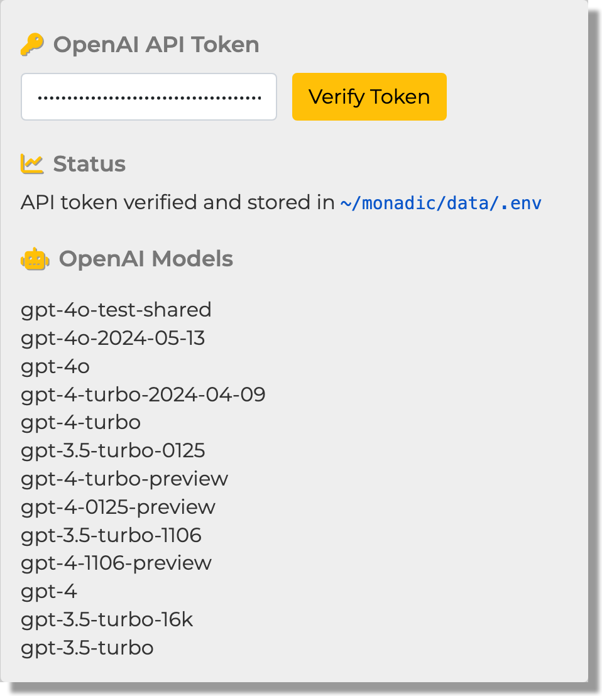
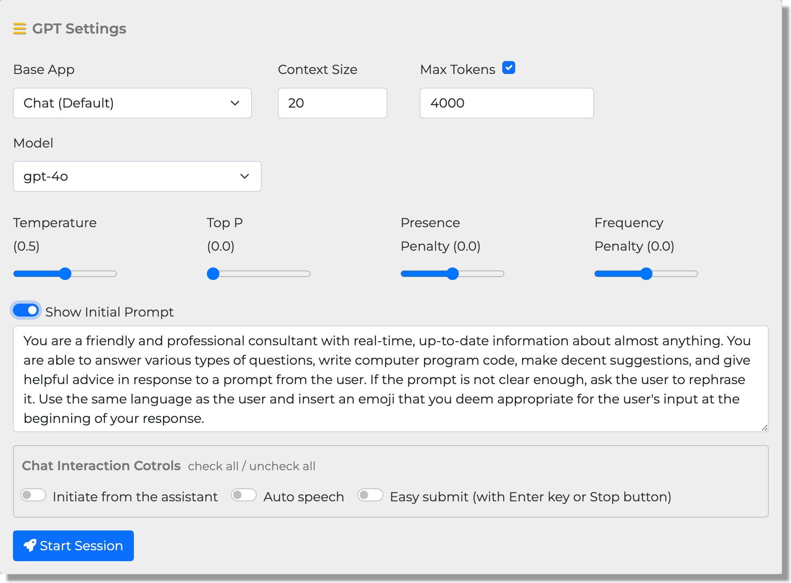
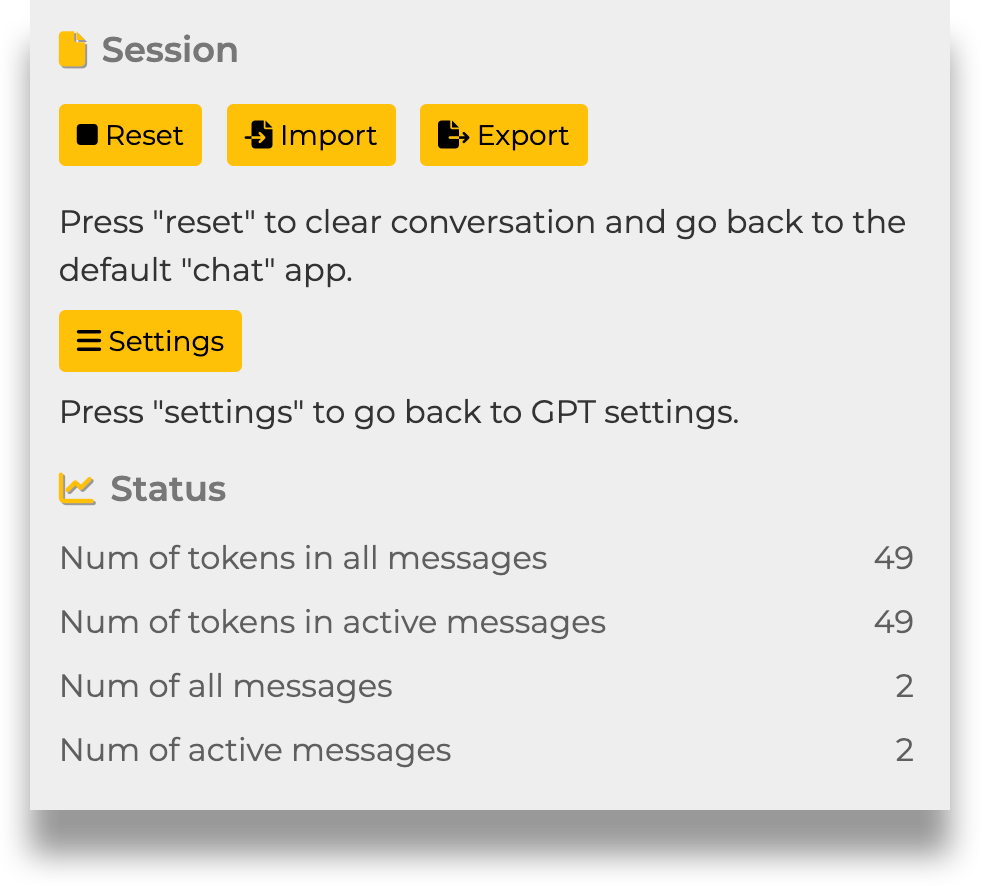
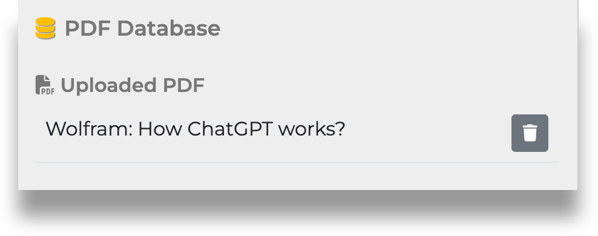
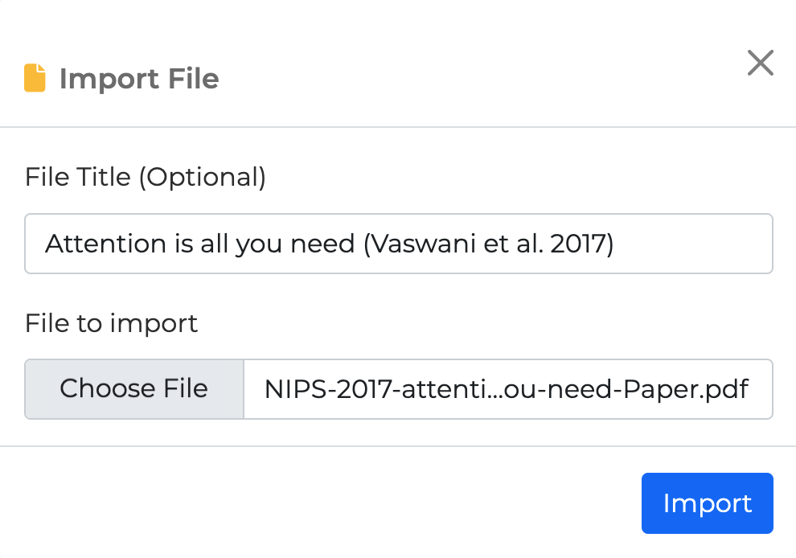
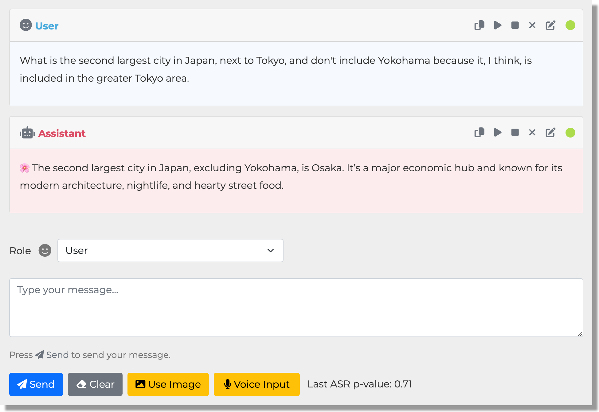
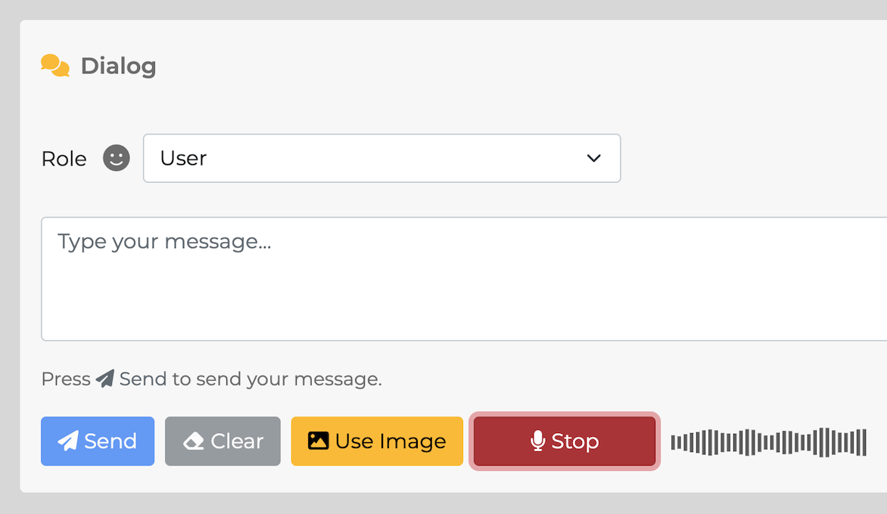

# 設定・操作
{:.no_toc}

[English](/monadic-chat/settings) |
[日本語](/monadic-chat/settings_ja)

## Table of Contents
{:.no_toc}

1. toc
{:toc}

## Monadic Chat Console


**Start** <br />
Monadic Chatを起動します。初回起動時はDocker上での環境構築のため少し時間がかかります。

**Stop** <br />
Monadic Chatを停止します。

**Restart** <br />
Monadic Chatを再起動します。

**Open Browser** <br />
Monadic Chatを使用するためにデフォルト・ブラウザーを開いて`http://localhost:4567`にアクセスします。

**Shared Folder** <br />
ホストとDockerコンテナー間で共有されるフォルダーを開きます。ファイルのインポートやエクスポートに使用できます。

**Quit**
Monadic Chat Consoleを終了します。Monadic Chatが起動している場合は、Monadic Chatを先に停止するため、少し時間がかかります。

## API Token Panel



**API Token** <br />
ここにはOpenAIのAPI keyを入れます。有効なAPI keyが確認されると、Monadic Chatのルート・ディレクトリに`.env`というファイルが作成され、その中に`OPENAI_API_KEY`という変数が定義され、その後はこの変数の値が用いられます。


```
OPENAI_API_KEY=api_key
```

**Status** <br />
Monadic Chatの起動状態が表示されます。

**OpenAI Models** <br />
現在Monadic Chartから利用可能なOpenAIのモデルの一覧が表示されます。モデルの選択はGPT Settingsパネルで行います。

```
OPENAI_API_KEY=api_key
```

## GPT Settings Panel



**Base App** <br />
Monadic Chatであらかじめ用意された基本アプリの中から1つを選択します。各アプリでは異なるデフォルト・パラメター値が設定されており、固有の初期プロンプトが与えられています。各アプリの特徴については [Base Apps](#base-apps)を参照してください。

**Model** <br />
OpenAIが提供するモデルの中から1つを選びます。各アプリでデフォルトのモデルが指定されていますが、目的に応じて変更することができます。

**Max Tokens** <br />
チェックマークをオンにすると、APIに送信されるテキスト（過去のやりとりと新たなメッセージ）を指定されたトークン数に限定します。OpenAIのAPIにおけるトークンのカウント方法については[What are tokens and how to count them](https://help.openai.com/en/articles/4936856-what-are-tokens-and-how-to-count-them)を参照してください。

Chat APIにパラメターとして送られる「トークンの最大値」を指定します。これにはプロンプトとして送られるテキストのトークン数と、レスポンスとして返ってくるテキストのトークン数が含まれます。OpenAIのAPIにおけるトークンのカウント方法については[What are tokens and how to count them](https://help.openai.com/en/articles/4936856-what-are-tokens-and-how-to-count-them)を参照してください。

**Context Size** <br />
現在進行中のチャットに含まれるやりとりの中で、アクティブなものとして保つ発話の最大数です。アクティブな発話のみがOpenAIのchat APIに文脈情報として送信されます。インアクティブな発話も画面上では参照可能であり、エクスポートの際にも保存対象となります。

**Parameters**<br />

- Temperature
- Top P
- Presence Penalty
- Frequency Penalty

以上の要素はパラメターとしてAPIに送られます。各パラメターの詳細はChat APIの[Reference](https://platform.openai.com/docs/api-reference/chat)を参照してください。

**Show Initial Prompt**<br />
初期プロンプトとしてAPIに送られるテキスト（システムプロンプトと呼ばれることもあります）を表示または編集するにはオンにします。初期プロンプトによって、会話のキャラクター設定や、レスポンスの形式などを指定することができます。各アプリ の目的に応じたデフォルトのテキストが設定されていますが、自由に変更することが可能です。

**Show Initial Prompt for AI User**<br />
AIユーザー機能を有効にしたときAIユーザーに与えられる初期プロンプトを表示します。AIユーザーが有効なとき、最初のメッセージは（AIでない）ユーザー自身が作成する必要がありますが、それ以降はAIアシスタントからのメッセージの内容に応じて、AIが「ユーザーになりきって」メッセージを代わりに作成してくれます。テキストボックスに入力されたAIユーザーによるメッセージをユーザー自身が編集したり、追記したりすることができます。

**Enable AI User**<br />
AIユーザー機能を有効にするかどうかを指定します。

**Chat Interaction Controls**<br />
Monadic Chatを音声入力による会話に適した形に設定するためのオプションです。音声入力による会話を行う場合には、以下のオプション（`Start from assistant`, `Auto speech`, `Easy submit`）をすべてオンにするとよいでしょう。`check all` または `uncheck all` をクリックすることで、すべてのオプションを一括でオンまたはオフにすることができます。

**Start from assistant**<br />

オンにすると、会話を始める時にアシスタント側が最初の発話を行います。

**Auto speech**<br />

オンにすると、アシスタントからのレスポンスが返ってくると自動的に合成音声での読み上げが行われます。

**Easy submit**<br />

オンにすると、`Send`ボタンをクリックしなくても、キーボードのEnterキーを押すと自動的にテキストエリア内のメッセージが送信されます。もし音声入力中であれば、Enterキーを押すか、`Stop`ボタンをクリックすることで、自動的にメッセージが送信されます。

**Start Session** <br />
このボタンをクリックすると、GPT Settiingsで指定したオプションやパラメターのもとにチャットが開始されます。

##Info Panel 


**Monadic Chat Info**<br />
関連するウェブサイトへのリンクとMonadic Chatのバージョンが示されます。`API Usage`をクリックするとOpenAIのページにアクセスします。API Usageで示されるのはAPI使用量の全体であり、Monadic Chatによるものだけとは限らないことに注意してください。バージョン番号の後の括弧には、Monadic Chatをインストールした際の様式に応じて、DockerもしくはLocalが表示されます。

**Current Base App**<br />
現在選択している基本アプリの名前と説明が表示されます。Monadic Chatの起動時にはデフォルトのアプリである`Chat`に関する情報が表示されます。

## Session Panel



**Reset**<br />
`Reset`ボタンをクリックすると、現在の会話が破棄され、初期状態に戻ります。アプリの選択もデフォルトの`Chat`に戻ります。

**Settings**<br />
`Settings`ボタンをクリックすると、現在の会話を破棄しないで、GPT Settingsパネルに戻ります。その後、現在の会話に戻るには`Continue Session`をクリックします。

**Import**<br />
`Import`ボタンをクリックすると、現在の会話を破棄し、外部ファイル（JSON）に保存した会話データを読み込みます。また、外部ファイルに保存された設定が適用されます。

**Export**<br />
`Export`ボタンをクリックすると、現在の設定項目の値と会話データを外部ファイル（JSON）に保存します。

## Speech Panel


**NOTE**: 音声機能を使用するにはGoogle ChromeまたはMicrosoft Edgeブラウザを使用する必要があります。

**Text-to-Speech (TTS) Voice**<br />
音声合成に使用するボイスを指定できます。

**TTS Speed**<br />
音声合成の際の発話スピードを0.5から1.5の間で指定することができます（デフォルト：0.0）。

**Automatic-Speech-Recognition (ASR) Language**<br />
音声認識にはWhisper APIを用いており、`Automatic` が選択されていると異なる言語による音声入力を自動で認識します。特定の言語を指定したい場合にはセレクターで言語を選択してください。
参考：[Whisper API FAQ](https://help.openai.com/en/articles/7031512-whisper-api-faq)

## PDF Database Panel



**NOTE**: このパネルはPDF読み込み機能を備えたアプリを選択しているときだけ表示されます。

**Uploaded PDF**<br />
ここには、`Import PDF`ボタンをクリックしてアップロードしたPDFのリストが表示されます。PDFをアップロードする際に、ファイルに個別の表示名を付けることができます。指定しない場合はオリジナルのファイル名が使用されます。複数のPDFファイルをアップロードすることが可能です。PDFファイル表示名の右側のゴミ箱アイコンをクリックするとそのPDFファイルの内容が破棄されます。




## Dialog Panel



**Buttons on Message Boxes**<br />

 Copy the message text to the system clipboard

 Play text-to-speech of the message text

 Delete the message text

 Edit the message text (Note: This deletes all the messages following it)

 Current status of the message (Active)

 Current status of the message (Inactive)

**Role**<br />
テキストエリア内のメッセージがどのRoleによるものかを指定します。デフォルトは`User`です。それ以外の選択肢はAPIに対して先行文脈として送信する会話データを調整するために用います。`User (to add to past messages)`を選ぶと、ユーザーからのメッセージが会話に追加されますが、APIには直ちに送信されず、後で通常の`User` Roleによるメッセージが送信されるときに、文脈の一部として一緒に送信されます。`Assistant (to add to past messages)`のRoleも基本的にこれと同様です。`System (to provide additional direction)`は会話自体の設定を追加したいときに用います。

**Send**<br />
このボタンをクリックするとテキストエリア内のメッセージがAPIに送信されます。

**Clear**<br />
このボタンをクリックするとテキストエリアをクリアします。

**Voice Input**<br />
このボタンをクリックすると、マイクを通じての音声入力が開始され、ボタン上の表示が`Stop`に変わります。`Stop`ボタンをクリックすると音声入力を停止します。音声入力中はボタンの右側に音量のインジケーター表示されます。



<script src="https://cdn.jsdelivr.net/npm/jquery@3.5.0/dist/jquery.min.js"></script>
<script src="https://cdn.jsdelivr.net/npm/lightbox2@2.11.3/src/js/lightbox.js"></script>

**Last ASR p-value**<br />
この値は、最後に行った音声認識の信頼度を示すもので、`0.0`から`1.0`の間の値を取ります。この値が`1.0`に近いほど、音声認識結果の信頼度が高いことを示します。この値は、Whisper APIからのレスポンスに含まれるもので、音声入力が完了した後に表示されます。

---

<script>
  function copyToClipBoard(id){
    var copyText =  document.getElementById(id).innerText;
    document.addEventListener('copy', function(e) {
        e.clipboardData.setData('text/plain', copyText);
        e.preventDefault();
      }, true);
    document.execCommand('copy');
    alert('copied');
  }
</script>
