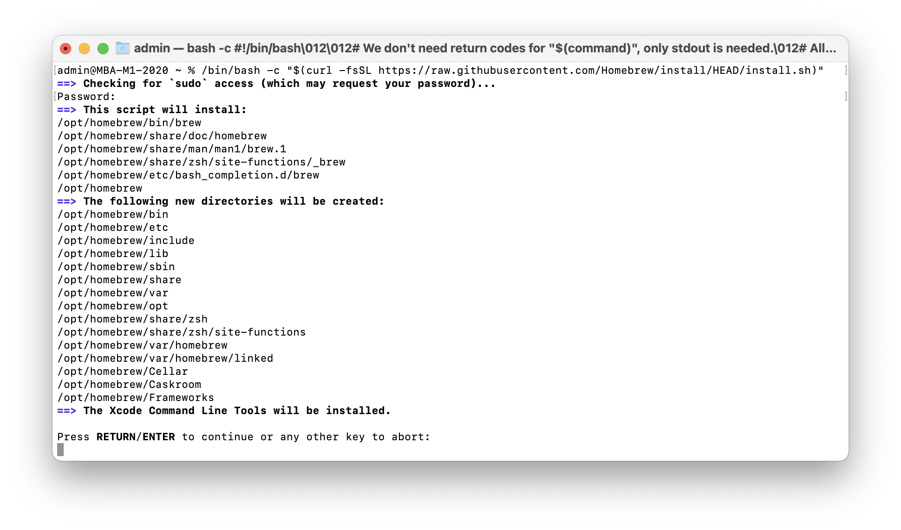
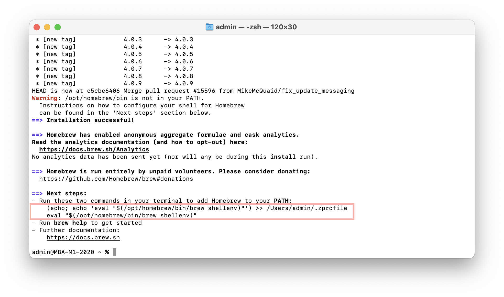
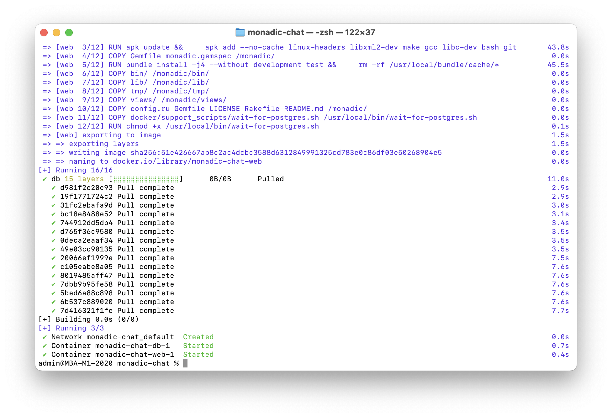
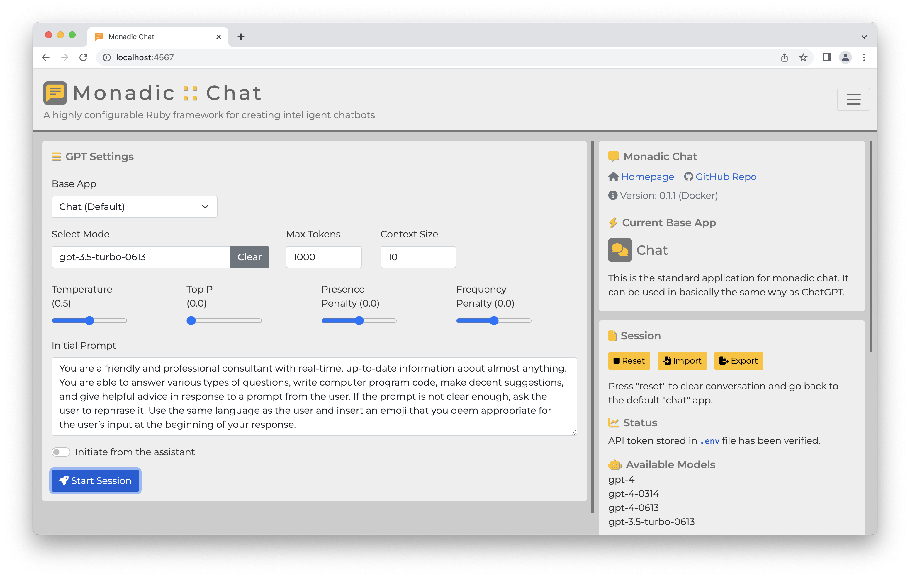

# Setting Up Monadic Chat on MacOS
{:.no_toc}

[English](/monadic-chat-web/setup_mac) |
[日本語](/monadic-chat-web/setup_mac_ja)


## Table of Contents
{:.no_toc}

1. toc
{:toc}

## 1. Install Homebrew and Git

First, install [Homebrew](https://brew.sh), which is a package management system for MacOS.

Open the terminal. The location of the terminal on Mac is `Application -> Utilities -> Terminal.app`.


Once you have opened the terminal, execute the following command (the first `$` represents the command line prompt).

```shell
$ /bin/bash -c "$(curl -fsSL https://raw.githubusercontent.com/Homebrew/install/HEAD/install.sh)" 
```



If you are asked for your password, enter your Mac's password. The password will not be displayed on the screen, so enter it carefully.

You will be asked to press the Enter key to continue. Press the Enter key to continue.



After a while, the installation will be completed. If "Run these two commands in your terminal to add Homebrew to your PATH" is displayed as in the screenshot above, copy the commands and execute them in the terminal.

Next, let's make sure you can use the git command, which is a version control system for source code.

```shell
$ brew install git
```

## 2. Install Docker Desktop

Next, install Docker Desktop, which is software for creating container-based virtual environments.

Choose on of the two different packages depending on your Mac's CPU. You can check the type of CPU on the terminal with the following command:

```shell
$ sysctl -n machdep.cpu.brand_string
```

Download Docker Desktop from [Install Docker Desktop on Mac](https://hub.docker.com/editions/community/docker-ce-desktop-mac), but for Intel, download `Docker Desktop Installer.dmg`, and for Apple Silicon, download `Docker Desktop Installer Apple Silicon.dmg`.


Double-click the downloaded dmg file. Then drag and drop the docker icon to the Applications folder to install it. Once the installation is complete, start Docker Desktop. When you start Docker Desktop first time, you will be asked to accept the service agreement (→ press accept), choose settings (→ use recommended settings), and allow privileged access to apply configuration (→ enter your Mac username and password).

Once everything has been set up, the Docker Desktop icon will appear in the menu bar at the top right of the screen. After Docker Desktop has started, you may close the Docker Desktop Dashboard window if it is open.

## 3. Download and build Monadic Chat

Open the terminal once again and move to the location where you want to copy the Monadic Chat source code. If you use your home directory, execute the following command to go to the home directory:

```shell
$ cd ~
```

Now let us clone the Monadic Chat source code package in the home directory. The following command will download the source code from Github and copy it to the `~/monadic-chat` directory.

```shell
$ git clone https://github.com/yohasebe/monadic-chat.git
```

Then move inside this directory and execute the `start` command as below:

```shell
$ cd ~/monadic-chat
$ ./docker/monadic.sh start
```

The first time you run the `start` command, it may take some time for the build process to finish, but from the second time on, the app will start immediately.



Once the build is complete, the following message will be displayed:

```text
✔️ Container monadic-chat-db-1  Started
✔️ Container monadic-chat-web-1 Starte
```

Now you can access Monadic Chat from your browser at `http://localhost:4567`. 



## 4. Start/Stop/Restart Monadic Chat

To start/stop/restart Monadic Chat, run one of the following commands:

**`start`**

```shell
$ cd ~/monadic-chat
$ ./docker/monadic.sh start
```

**`stop`**

```shell
$ cd ~/monadic-chat
$ ./docker/monadic.sh stop
```

**`restart`**

```shell
$ cd ~/monadic-chat
$ ./docker/monadic.sh restart
```

## 5. Update Monadic Chat

To update Monadic Chat, execute the following command:

**`update`**

```shell
$ cd ~/monadic-chat
$ ./docker/monadic.sh update
```

The above command downloads the latest source code from Github and rebuilds Monadic Chat.

<script src="https://cdn.jsdelivr.net/npm/jquery@3.5.0/dist/jquery.min.js"></script>
<script src="https://cdn.jsdelivr.net/npm/lightbox2@2.11.3/src/js/lightbox.js"></script>

---

<script>
  function copyToClipBoard(id){
    var copyText =  document.getElementById(id).innerText;
    document.addEventListener('copy', function(e) {
        e.clipboardData.setData('text/plain', copyText);
        e.preventDefault();
      }, true);
    document.execCommand('copy');
    alert('copied');
  }
</script>
