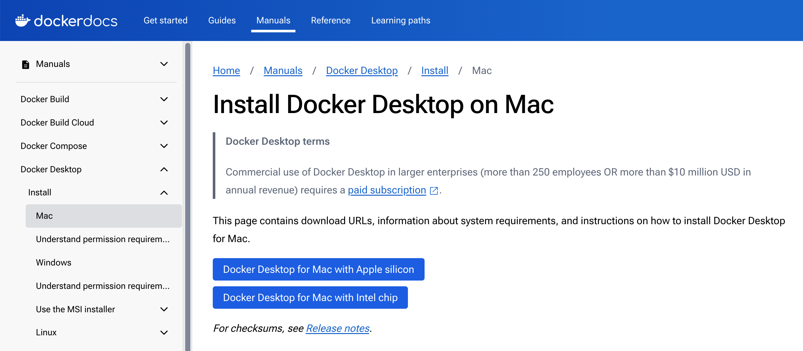

# 環境構築とインストール（MacOS）
{:.no_toc}

[English](/monadic-chat-web/setup) |
[日本語](/monadic-chat-web/setup_ja)


## もくじ
{:.no_toc}

1. toc
{:toc}

## 1. HomebrewとGitのインストール

まずは[Homebrew](https://brew.sh/index_ja)をインストールします。HomebrewはMacOSのパッケージ管理システムです。

ターミナルを開いてください。Macのターミナルの場所は、`Application -> ユーティリティー -> ターミナル.app`です。


ターミナルを開いたら、以下のコマンドを実行してください（最初の`$`はコマンドラインのプロンプトを表しています）。

```shell
$ /bin/bash -c "$(curl -fsSL https://raw.githubusercontent.com/Homebrew/install/HEAD/install.sh)" 
```


If you are asked for your password, enter your Mac's password. The password will not be displayed on the screen, so enter it carefully.

Homebrewのインストール時にEnterキーを押すように求められますので、Enterキーを押してください。


After a while, the installation will be completed. If "Run these two commands in your terminal to add Homebrew to your PATH" is displayed as in the screenshot above, copy the commands and execute them in the terminal.

しばらくするとインストールが完了します。"Run these two commands in your terminal to add Homebrew to your PATH"というメッセージが表示されたら、表示されている2つのコマンドをターミナル上で実行してください（`brew`コマンドのパスを通すためです）。

次に`git`コマンドが使えるようにします。Gitはソースコードのバージョン管理システムです。以下のコマンドを実行してください。

```shell

```shell
$ brew install git
```

## 2. Docker Desktopのインストール

次にDocker Desktopをインストールします。Docker Desktopはコンテナ型の仮想環境を作成するためのソフトウェアです。

ご自身のMacのCPUに応じて異なるパッケージを用います。CPUの種類はターミナル上で以下のコマンドで確認できます。

```shell
$ sysctl -n machdep.cpu.brand_string
```

[Install Docker Desktop on Mac](https://hub.docker.com/editions/community/docker-ce-desktop-mac)からDocker Desktopをダウンロードしてインストールしますが、その際、Intelの場合は`Docker Desktop Installer.dmg`を、Apple Siliconの場合は`Docker Desktop Installer Apple Silicon.dmg`をダウンロードしてください。



ダウンロードしたdmgファイルをダブルクリックするとウィンドウが表示されるので、DockerのアイコンをApplicationsフォルダーにドラッグしてください。インストールが完了したら、Docker Desktopを起動しましょう。その際、service agreementへの同意が求められます（acceptしてください）。また、推奨設定を使用するかどうかを確認されます（特にこだわりがなければ推奨設定を用いてください）。また、内部でosascriptを使用するため、Macのユーザ名とパスワードの入力が求められます。

Docker Desktopの起動が完了すると、メニューバーにDockerのアイコンが表示されます。ここでDocker Desktopのダッシュボード・ウィンドウは閉じてしまって構いません。

## 3. Monadic Chatのダウンロードとビルド

Open the terminal once again and move to the location where you want to copy the Monadic Chat source code. If you use your home directory, execute the following command to go to the home directory:

再びターミナルを開いて、Monadic Chatのソースコードをコピーしたい場所に移動します。ここでは、ホームディレクトリににソースコードをコピーすることにします。次のコマンドでホームディレクトリに移動できます。

```shell
$ cd ~
```

ここで以下のコマンドを実行すると、ホームディレクトリに`monadic-chat`というディレクトリが作成され、その中にソースコードがダウンロードされます。

```shell
$ git clone https://github.com/yohasebe/monadic-chat.git
```

ダウンロードが完了したら、下記のように、ソースコードのディレクトリ内に移動して、次に`start`コマンドを実行してください。

```shell
$ cd ~/monadic-chat
$ ./docker/monadic.sh start
```

初回はビルドに時間がかかりますが、2回目以降はすぐに起動できます。


ソースコードのビルドが成功し、Monadic Chatが無事に起動すると、以下のメッセージが表示されます。

```text
✔️ Container monadic-chat-db-1  Started
✔️ Container monadic-chat-web-1 Starte
```

Macでは、デフォルト・ブラウザ上でホーム画面が開きます。もし画面が開かない場合は、ブラウザで`http://localhost:4567`を開いてください（または再読み込みしてください）。


## 4. Monadic Chatの起動/停止/再起動

Monadic Chatを起動/停止/再起動するには、以下のコマンドを実行します。

**`start`**

```shell
$ cd ~/monadic-chat
$ ./docker/monadic.sh start
```

**`stop`**

```shell
$ cd ~/monadic-chat
$ ./docker/monadic.sh stop
```

**`restart`**

```shell
$ cd ~/monadic-chat
$ ./docker/monadic.sh restart
```

## 5. Monadic Chatのアップデート

Monadic Chatを最新版に更新するには、以下のコマンドを実行します。

**`update`**

```shell
$ cd ~/monadic-chat
$ ./docker/monadic.sh update
```

これにより、Githubから最新のソースコードがダウンロードされ、Monadic Chatが再ビルドされます。

<script src="https://cdn.jsdelivr.net/npm/jquery@3.5.0/dist/jquery.min.js"></script>
<script src="https://cdn.jsdelivr.net/npm/lightbox2@2.11.3/src/js/lightbox.js"></script>

---

<script>
  function copyToClipBoard(id){
    var copyText =  document.getElementById(id).innerText;
    document.addEventListener('copy', function(e) {
        e.clipboardData.setData('text/plain', copyText);
        e.preventDefault();
      }, true);
    document.execCommand('copy');
    alert('copied');
  }
</script>
