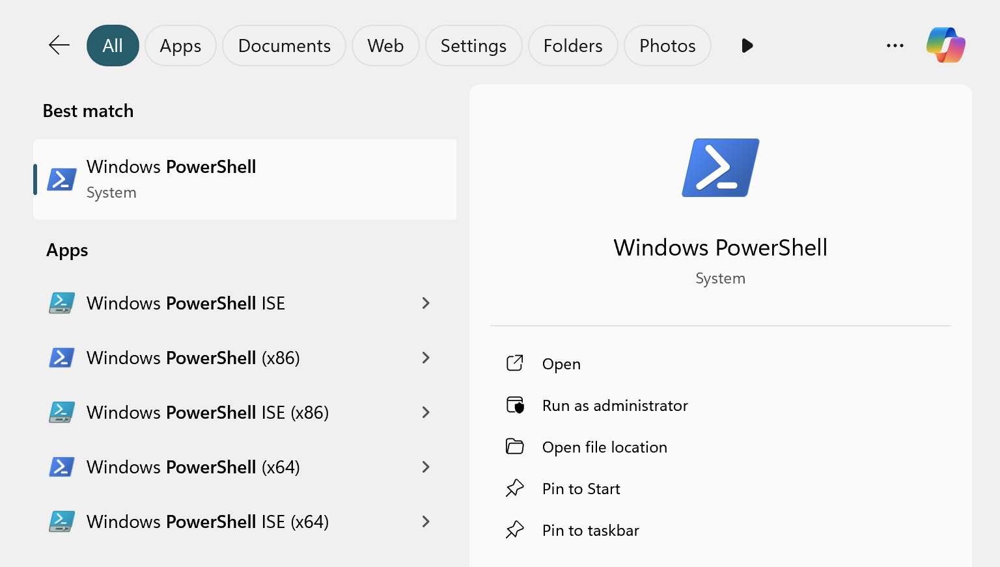
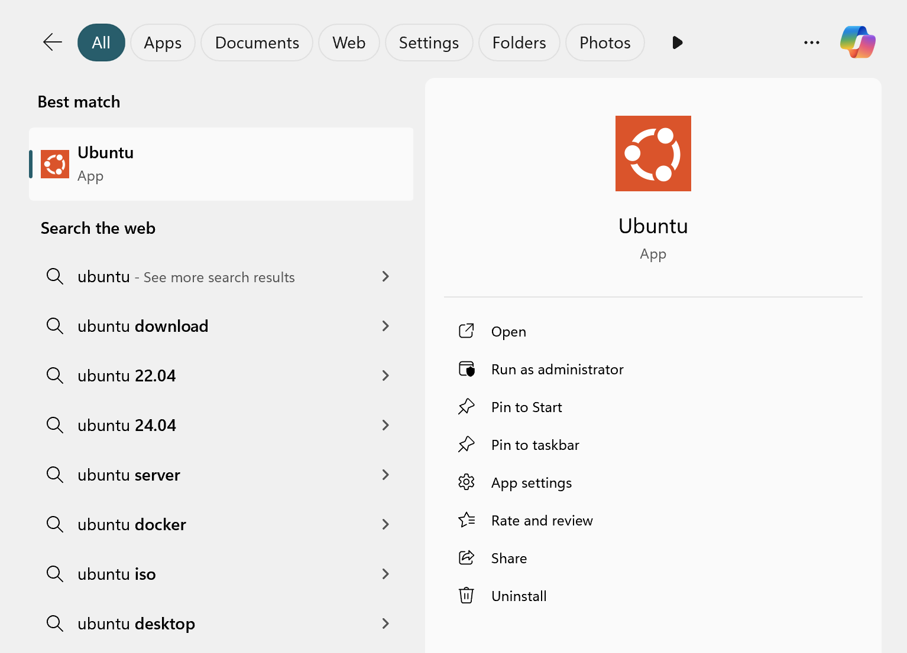

# 環境構築とインストール（Windows 11 Home）
{:.no_toc}

[English](/monadic-chat-web/setup) |
[日本語](/monadic-chat-web/setup_ja)


## もくじ
{:.no_toc}

1. toc
{:toc}

## 1. WSL2のインストール

まずはをインストールします。[WSL2](https://brew.sh)はWindows上でLinux環境を実現する仕組みです。

PowerShellを管理者モードで開きます。Windowsの検索ボックスでPowerShellを検索し、"管理者として実行"を選択してpowershell.exeを起動してください。



次にPowerShell上で次のコマンドを実行します（最初の`>`はコマンドラインのプロンプトを表します）。

```shell

```shell
> wsl --install
```


そしてコンピュータを再起動します。再起動後、WSL2とそのデフォルトのLinuxディストリビューションであるUbuntuがインストールされます。このプロセスの中で、Linux環境のユーザ名とパスワードを入力するよう求められます。任意のユーザ名とパスワードを入力してください。このユーザ名とパスワードは後で覚えておく必要があります。

これでWSL2のインストールは完了です。Windows上でUbuntuが使えるようになりました。Windowsの検索ボックスで"Ubuntu"を検索し、Ubuntuのターミナルを開いてみてください。



## 2. Docker Desktopのインストール

次に、コンテナを使った仮想環境を作成するためのソフトウェアであるDocker Desktopをインストールします。

[Install Docker Desktop on Windows](https://hub.docker.com/editions/community/docker-ce-desktop-windows)からDocker Desktopをダウンロードします。


ダウンロードしたexeファイルをダブルクリックしてインストールを開始します。インストールが完了したら、Docker Desktopを起動します。Docker Desktopを初めて起動するとき、サービス契約に同意するかどうか（→同意する）、設定を選択するかどうか（→推奨設定を使用する）を求められます。

これらが完了すると、画面右下のタスクトレイにDocker Desktopのアイコンが表示されます。Docker Desktopが起動したら、Docker Desktop Dashboardウィンドウを閉じて構いません。

## 3. Monadic Chatのダウンロードとビルド

Ubuntuのターミナルを再度開き、Monadic Chatのソースコードをコピーしたい場所に移動します。ホームディレクトリを使う場合は、以下のコマンドを実行してホームディレクトリに移動してください。

```shell
$ cd ~
```

Now let us clone the Monadic Chat source code package in the home directory. The following command will download the source code from Github and copy it to the `~/monadic-chat` directory.

ここにMonadic Chatのソースコードをダウンロードします。以下のコマンドを実行すると、Githubからソースコードがダウンロードされ、すべての必要なファイルが`~/monadic-chat`ディレクトリの中にコピーされます。

```shell
$ git clone https://github.com/yohasebe/monadic-chat.git
```

Then move inside this directory and execute the `start` command as below:

このディレクトリの中に移動して、以下のように`start`コマンドを実行してください。

```shell
$ cd ~/monadic-chat
$ ./docker/monadic.sh start
```

The first time you run the `start` command, it may take some time for the build process to finish, but from the second time on, the app will start immediately.

`start`コマンドを実行するのが初めての場合、ビルドに若干の時間がかかります。いったんビルドが完了すると、2回目以降はアプリがすぐに起動します。


ビルドが成功して、Monadic Chatが起動すると、以下のようなメッセージが表示されます。

```text
✔️ Container monadic-chat-db-1  Started
✔️ Container monadic-chat-web-1 Started
```

このメッセージが表示されたら、ブラウザで`http://localhost:4567`にアクセスしてMonadic Chatにアクセスできます。


## 4. Monadic Chatの起動/停止/再起動

Monadic Chatを起動/停止/再起動するには、以下のコマンドを実行します。

**`start`**

```shell
$ cd ~/monadic-chat
$ ./docker/monadic.sh start
```

**`stop`**

```shell
$ cd ~/monadic-chat
$ ./docker/monadic.sh stop
```

**`restart`**

```shell
$ cd ~/monadic-chat
$ ./docker/monadic.sh restart
```

## 5. Monadic Chatのアップデート

Monadic Chatを最新版に更新するには、以下のコマンドを実行します。


**`update`**

```shell
$ cd ~/monadic-chat
$ ./docker/monadic.sh update
```

これにより、Githubから最新のソースコードがダウンロードされ、Monadic Chatが再ビルドされます。

<script src="https://cdn.jsdelivr.net/npm/jquery@3.5.0/dist/jquery.min.js"></script>
<script src="https://cdn.jsdelivr.net/npm/lightbox2@2.11.3/src/js/lightbox.js"></script>

---

<script>
  function copyToClipBoard(id){
    var copyText =  document.getElementById(id).innerText;
    document.addEventListener('copy', function(e) {
        e.clipboardData.setData('text/plain', copyText);
        e.preventDefault();
      }, true);
    document.execCommand('copy');
    alert('copied');
  }
</script>
