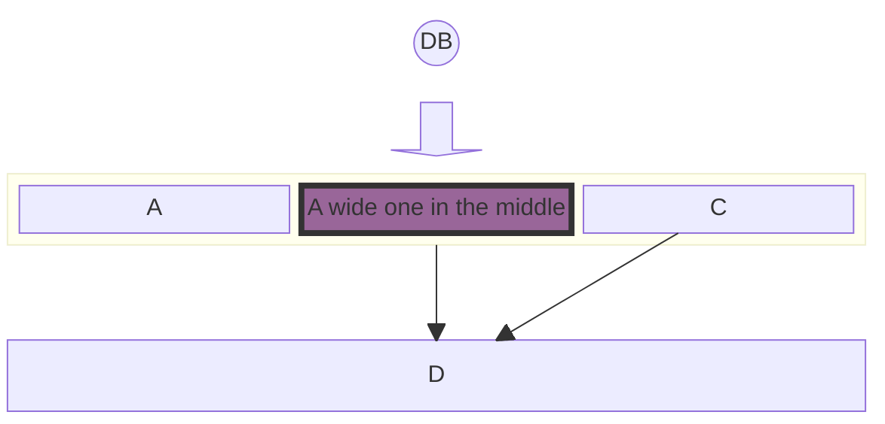
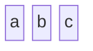
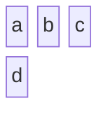

# Block Diagrams Documentation

## Introduction to Block Diagrams

### Simple Block Diagrams

#### Basic Structure

At its core, a block diagram consists of blocks representing different entities or components. In Mermaid, these blocks are easily created using simple text labels. The most basic form of a block diagram can be a series of blocks without any connectors.

**Example - Simple Block Diagram**:
To create a simple block diagram with three blocks labeled 'a', 'b', and 'c', the syntax is as follows:

This example will produce a horizontal sequence of three blocks. Each block is automatically spaced and aligned for optimal readability.

### Defining the number of columns to use

#### Column Usage

While simple block diagrams are linear and straightforward, more complex systems may require a structured layout. Mermaid allows for the organization of blocks into multiple columns, facilitating the creation of more intricate and detailed diagrams.

**Example - Multi-Column Diagram:**
In scenarios where you need to distribute blocks across multiple columns, you can specify the number of columns and arrange the blocks accordingly. Here's how to create a block diagram with three columns and four blocks, where the fourth block appears in a second row:

