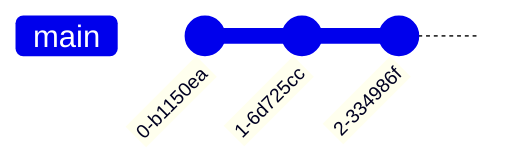
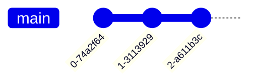
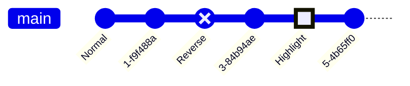
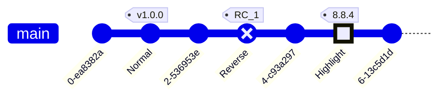
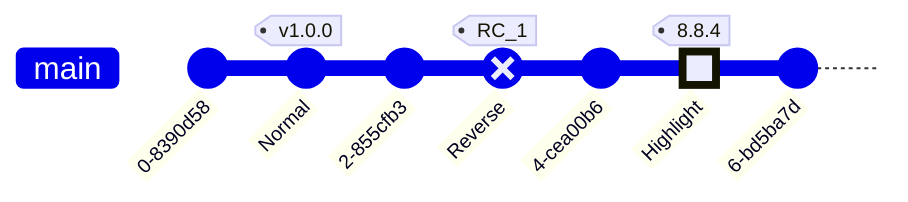
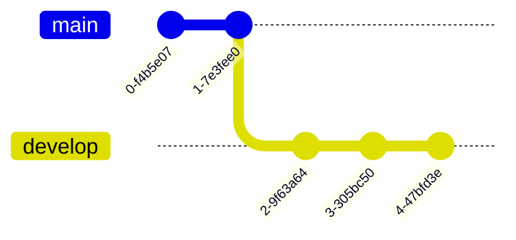
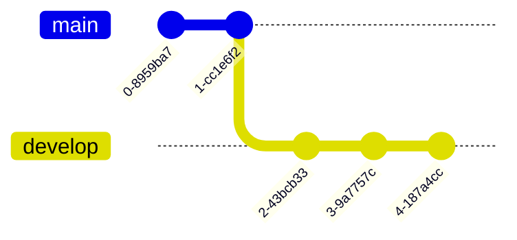

# Gitgraph Diagrams

> A Git Graph is a pictorial representation of git commits and git actions(commands) on various branches.

These kind of diagram are particularly helpful to developers and devops teams to share their Git branching strategies. For example, it makes it easier to visualize how git flow works.

Mermaid can render Git diagrams

In Mermaid, we support the basic git operations like:

- _commit_ : Representing a new commit on the current branch.
- _branch_ : To create & switch to a new branch, setting it as the current branch.
- _checkout_ : To checking out an existing branch and setting it as the current branch.
- _merge_ : To merge an existing branch onto the current branch.

With the help of these key git commands, you will be able to draw a gitgraph in Mermaid very easily and quickly.
Entity names are often capitalized, although there is no accepted standard on this, and it is not required in Mermaid.

## Syntax

Mermaid syntax for a gitgraph is very straight-forward and simple. It follows a declarative-approach, where each commit is drawn on the timeline in the diagram, in order of its occurrences/presence in code. Basically, it follows the insertion order for each command.

First thing you do is to declare your diagram type using the **gitgraph** keyword. This `gitgraph` keyword, tells Mermaid that you wish to draw a gitgraph, and parse the diagram code accordingly.

Each gitgraph, is initialized with **_main_** branch. So unless you create a different branch, by-default the commits will go to the main branch. This is driven with how git works, where in the beginning you always start with the main branch (formerly called as **_master_** branch). And by-default, `main` branch is set as your **_current branch_**.

You make use of **_commit_** keyword to register a commit on the current branch. Let see how this works:

A simple gitgraph showing three commits on the default (**_main_**) branch:

If you look closely at the previous example, you can see the default branch `main` along with three commits. Also, notice that by default each commit has been given a unique & random ID. What if you wanted to give your own custom ID to a commit? Yes, it is possible to do that with Mermaid.

### Adding custom commit id

For a given commit you may specify a custom ID at the time of declaring it using the `id` attribute, followed by `:` and your custom value within a `""` quote. For example: `commit id: "your_custom_id"`

Let us see how this works with the help of the following diagram:

In this example, we have given our custom IDs to the commits.

### Modifying commit type

In Mermaid, a commit can be of three type, which render a bit different in the diagram. These types are:

- `NORMAL` : Default commit type. Represented by a solid circle in the diagram
- `REVERSE` : To emphasize a commit as a reverse commit. Represented by a crossed solid circle in the diagram.
- `HIGHLIGHT` : To highlight a particular commit in the diagram. Represented by a filled rectangle in the diagram.

For a given commit you may specify its type at the time of declaring it using the `type` attribute, followed by `:` and the required type option discussed above. For example: `commit type: HIGHLIGHT`

NOTE: If no commit type is specified, `NORMAL` is picked as default.

Let us see how these different commit type look with the help of the following diagram:

In this example, we have specified different types to each commit. Also, see how we have included both `id` and `type` together at the time of declaring our commits.

### Adding Tags

For a given commit you may decorate it as a **tag**, similar to the concept of tags or release version in git world.
You can attach a custom tag at the time of declaring a commit using the `tag` attribute, followed by `:` and your custom value within `""` quote. For example: `commit tag: "your_custom_tag"`

Let us see how this works with the help of the following diagram:

In this example, we have given custom tags to the commits. Also, see how we have combined all these attributes in a single commit declaration. You can mix-match these attributes as you like.

### Create a new branch

In Mermaid, in-order to create a new branch, you make use of the `branch` keyword. You also need to provide a name of the new branch. The name has to be unique and cannot be that of an existing branch. A branch name that could be confused for a keyword must be quoted within `""`. Usage examples: `branch develop`, `branch "cherry-pick"`

When Mermaid, reads the `branch` keyword, it creates a new branch and sets it as the current branch. Equivalent to you creating a new branch and checking it out in Git world.

Let see this in an example:

In this example, see how we started with default `main` branch, and pushed two commits on that.
Then we created the `develop` branch, and all commits afterwards are put on the `develop` branch as it became the current branch.

### Checking out an existing branch

In Mermaid, in order to switch to an existing branch, you make use of the `checkout` keyword. You also need to provide a name of an existing branch. If no branch is found with the given name, it will result in console error. Usage example: `checkout develop`

When Mermaid, reads the `checkout` keyword, it finds the given branch and sets it as the current branch. Equivalent to checking out a branch in the Git world.

Let see modify our previous example:

In this example, see how we started with default `main` branch, and pushed two commits on that.
Then we created the `develop` branch, and all three commits afterwards are put on the `develop` branch as it became the current branch.
After this we made use of the `checkout` keyword to set the current branch as `main`, and all commit that follow are registered against the current branch, i.e. `main`.

### Merging two branches

In Mermaid, in order to merge or join to an existing branch, you make use of the `merge` keyword. You also need to provide the name of an existing branch to merge from. If no branch is found with the given name, it will result in console error. Also, you can only merge two separate branches, and cannot merge a branch with itself. In such case an error is throw.

Usage example: `merge develop`

When Mermaid, reads the `merge` keyword, it finds the given branch and its head commit (the last commit on that branch), and joins it with the head commit on the **current branch**. Each merge results in a **_merge commit_**, represented in the diagram with **filled double circle**.

Let us modify our previous example to merge our two branches:

In this example, see how we started with default `main` branch, and pushed two commits on that.
Then we created the `develop` branch, and all three commits afterwards are put on the `develop` branch as it became the current branch.
After this we made use of the `checkout` keyword to set the current branch as `main`, and all commits that follow are registered against the current branch, i.e. `main`.
After this we merge the `develop` branch onto the current branch `main`, resulting in a merge commit.
Since the current branch at this point is still `main`, the last two commits are registered against that.

You can also decorate your merge with similar attributes as you did for the commit using:

- `id`--> To override the default ID with custom ID
- `tag`--> To add a custom tag to your merge commit
- `type`--> To override the default shape of merge commit. Here you can use other commit type mentioned earlier.

And you can choose to use none, some or all of these attributes together.
For example: `merge develop id: "my_custom_id" tag: "my_custom_tag" type: REVERSE`

Let us see how this works with the help of the following diagram:

### Cherry Pick commit from another branch

Similar to how 'git' allows you to cherry-pick a commit from **another branch** onto the **current** branch, Mermaid also supports this functionality. You can also cherry-pick a commit from another branch using the `cherry-pick` keyword.

To use the `cherry-pick` keyword, you must specify the id using the `id` attribute, followed by `:` and your desired commit id within a `""` quote. For example:

`cherry-pick id: "your_custom_id"`

Here, a new commit representing the cherry-pick is created on the current branch, and is visually highlighted in the diagram with a **cherry** and a tag depicting the commit id from which it is cherry-picked from.

A few important rules to note here are:

1.  You need to provide the `id` for an existing commit to be cherry-picked. If given commit id does not exist it will result in an error. For this, make use of the `commit id:$value` format of declaring commits. See the examples from above.
2.  The given commit must not exist on the current branch. The cherry-picked commit must always be a different branch than the current branch.
3.  Current branch must have at least one commit, before you can cherry-pick, otherwise it will cause an error is throw.
4.  When cherry-picking a merge commit, providing a parent commit ID is mandatory. If the parent attribute is omitted or an invalid parent commit ID is provided, an error will be thrown.
5.  The specified parent commit must be an immediate parent of the merge commit being cherry-picked.

Let see an example:

