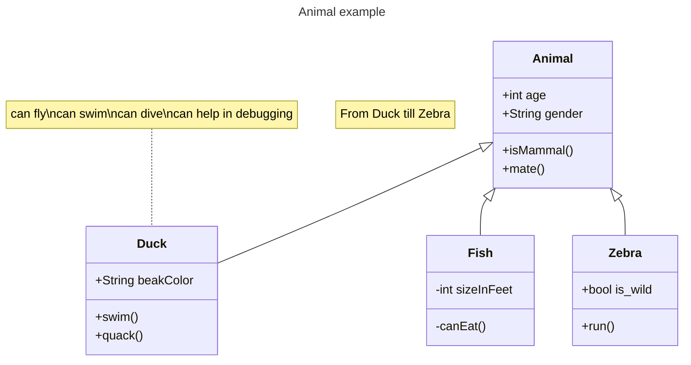
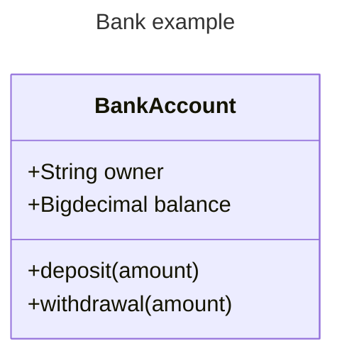
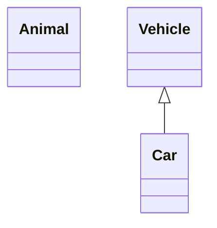
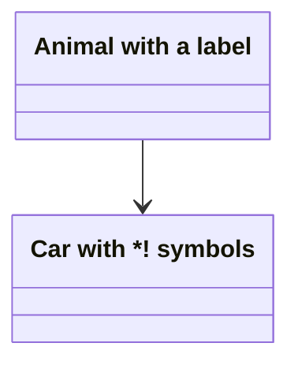
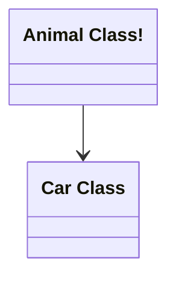
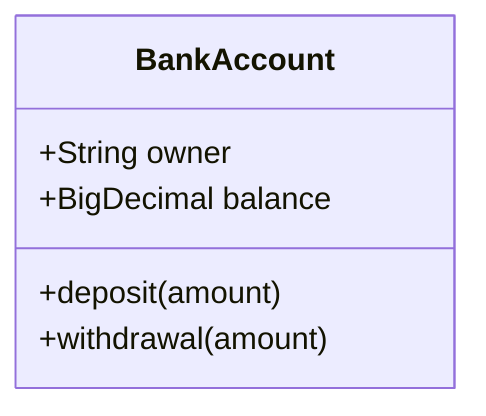
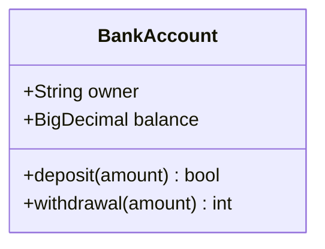
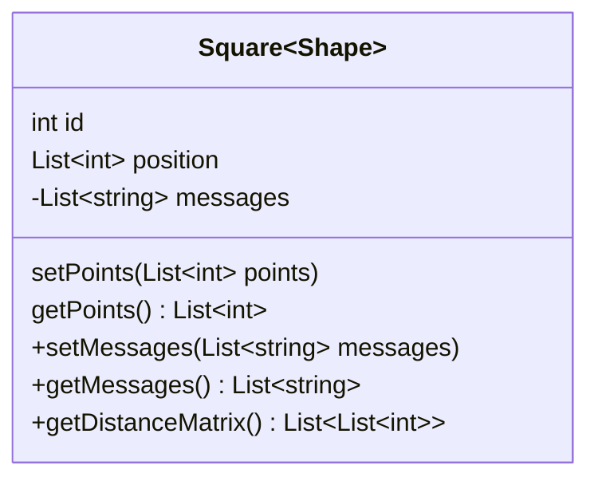
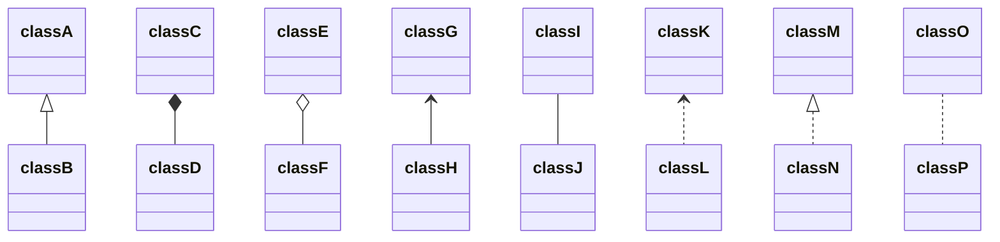

# Class Diagrams Examples




























```mermaid
classDiagram
  classA --|> classB : Inheritance
  classC --* classD : Composition
  classE --o classF : Aggregation
  classG --> classH : Association
  classI -- classJ : Link(Solid)
  classK ..> classL : Dependency
  classM ..|> classN : Realization
  classO .. classP : Link(Dashed)

```

```mermaid
classDiagram
  classA --|> classB : Inheritance
  classC --* classD : Composition
  classE --o classF : Aggregation
  classG --> classH : Association
  classI -- classJ : Link(Solid)
  classK ..> classL : Dependency
  classM ..|> classN : Realization
  classO .. classP : Link(Dashed)

```

```mermaid
classDiagram
  classA <|-- classB : implements
  classC *-- classD : composition
  classE o-- classF : aggregation
```

```mermaid
classDiagram
  classA <|-- classB : implements
  classC *-- classD : composition
  classE o-- classF : aggregation
```

```mermaid
classDiagram
  Animal <|--|> Zebra
```

```mermaid
classDiagram
  Animal <|--|> Zebra
```

```mermaid
classDiagram
  namespace BaseShapes {
    class Triangle
    class Rectangle {
      double width
      double height
    }
  }
```

```mermaid
classDiagram
  namespace BaseShapes {
    class Triangle
    class Rectangle {
      double width
      double height
    }
  }
```

```mermaid
classDiagram
  Customer "1" --> "*" Ticket
  Student "1" --> "1..*" Course
  Galaxy --> "many" Star : Contains
```

```mermaid
classDiagram
  Customer "1" --> "*" Ticket
  Student "1" --> "1..*" Course
  Galaxy --> "many" Star : Contains
```

```mermaid
classDiagram
  class Shape
  <<interface>> Shape
  Shape : noOfVertices
  Shape : draw()
```

```mermaid
classDiagram
  class Shape
  <<interface>> Shape
  Shape : noOfVertices
  Shape : draw()
```

```mermaid
classDiagram
  class Shape{
    <<interface>>
    noOfVertices
    draw()
  }
  class Color{
    <<enumeration>>
    RED
    BLUE
    GREEN
    WHITE
    BLACK
  }
```

```mermaid
classDiagram
  class Shape{
    <<interface>>
    noOfVertices
    draw()
  }
  class Color{
    <<enumeration>>
    RED
    BLUE
    GREEN
    WHITE
    BLACK
  }

```

```mermaid
classDiagram
  %% This whole line is a comment classDiagram class Shape <<interface>>
  class Shape{
    <<interface>>
    noOfVertices
    draw()
  }
```

```mermaid
classDiagram
  %% This whole line is a comment classDiagram class Shape <<interface>>
  class Shape{
    <<interface>>
    noOfVertices
    draw()
  }
```

```mermaid
classDiagram
  direction RL
  class Student {
    -idCard : IdCard
  }
  class IdCard{
    -id : int
    -name : string
  }
  class Bike{
    -id : int
    -name : string
  }
  Student "1" --o "1" IdCard : carries
  Student "1" --o "1" Bike : rides
```

```mermaid
classDiagram
  direction RL
  class Student {
    -idCard : IdCard
  }
  class IdCard{
    -id : int
    -name : string
  }
  class Bike{
    -id : int
    -name : string
  }
  Student "1" --o "1" IdCard : carries
  Student "1" --o "1" Bike : rides
```

```mermaid
classDiagram
  note "This is a general note"
  note for MyClass "This is a note for a class"
  class MyClass{
  }
```

```mermaid
classDiagram
  class Shape
  link Shape "https://www.github.com" "This is a tooltip for a link"
  class Shape2
  click Shape2 href "https://www.github.com" "This is a tooltip for a link"
```

```mermaid
classDiagram
  class Shape
  callback Shape "callbackFunction" "This is a tooltip for a callback"
  class Shape2
  click Shape2 call callbackFunction() "This is a tooltip for a callback"
```

```mermaid
classDiagram
  class Class01
  class Class02
  callback Class01 "callbackFunction" "Callback tooltip"
  link Class02 "https://www.github.com" "This is a link"
  class Class03
  class Class04
  click Class03 call callbackFunction() "Callback tooltip"
  click Class04 href "https://www.github.com" "This is a link"
```
