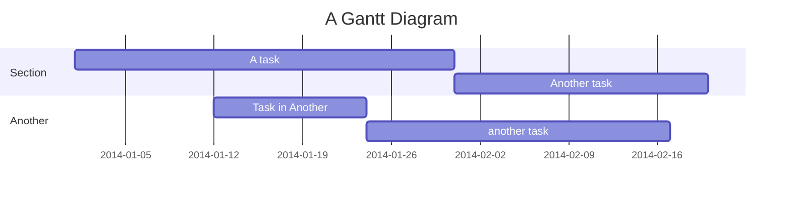
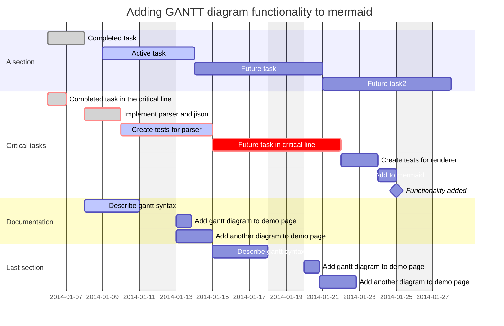
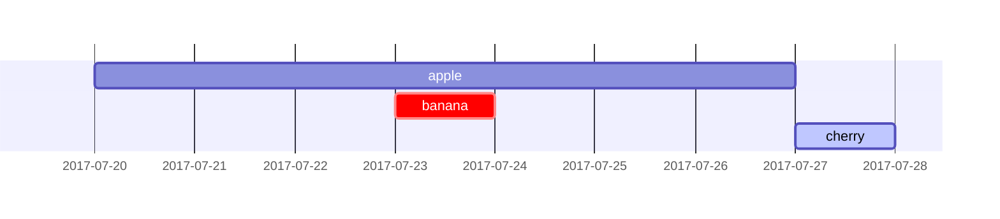
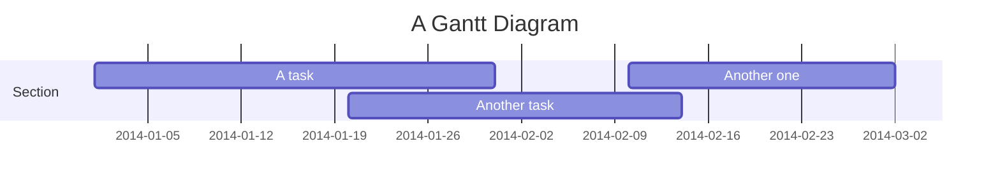

# Gantt Diagram Examples

```mermaid
gantt
  title A Gantt Diagram
  dateFormat YYYY-MM-DD
  section Section
    A task          :a1, 2014-01-01, 30d
    Another task    :after a1, 20d
  section Another
    Task in Another :2014-01-12, 12d
    another task    :24d
```

```mermaid
gantt
  dateFormat  YYYY-MM-DD
  title       Adding GANTT diagram functionality to mermaid
  excludes    weekends
  %% (`excludes` accepts specific dates in YYYY-MM-DD format, days of the week ("sunday") or "weekends", but not the word "weekdays".)

  section A section
  Completed task            :done,    des1, 2014-01-06,2014-01-08
  Active task               :active,  des2, 2014-01-09, 3d
  Future task               :         des3, after des2, 5d
  Future task2              :         des4, after des3, 5d

  section Critical tasks
  Completed task in the critical line :crit, done, 2014-01-06,24h
  Implement parser and jison          :crit, done, after des1, 2d
  Create tests for parser             :crit, active, 3d
  Future task in critical line        :crit, 5d
  Create tests for renderer           :2d
  Add to mermaid                      :1d
  Functionality added                 :milestone, 2014-01-25, 0d

  section Documentation
  Describe gantt syntax               :active, a1, after des1, 3d
  Add gantt diagram to demo page      :after a1  , 20h
  Add another diagram to demo page    :doc1, after a1  , 48h

  section Last section
  Describe gantt syntax               :after doc1, 3d
  Add gantt diagram to demo page      :20h
  Add another diagram to demo page    :48h
```

```mermaid
gantt
  apple :a, 2017-07-20, 1w
  banana :crit, b, 2017-07-23, 1d
  cherry :active, c, after b a, 1d
```

```mermaid
gantt
  dateFormat HH:mm
  axisFormat %H:%M
  Initial milestone : milestone, m1, 17:49, 2m
  Task A : 10m
  Task B : 5m
  Final milestone : milestone, m2, 18:08, 4m
```

```mermaid
gantt
  tickInterval 1week
  weekday monday
```

```mermaid
---
displayMode: compact
---
gantt
  title A Gantt Diagram
  dateFormat  YYYY-MM-DD

  section Section
  A task           :a1, 2014-01-01, 30d
  Another task     :a2, 2014-01-20, 25d
  Another one      :a3, 2014-02-10, 20d
```

```mermaid
gantt
  title A Gantt Diagram
  %% This is a comment
  dateFormat YYYY-MM-DD
  section Section
    A task          :a1, 2014-01-01, 30d
    Another task    :after a1, 20d
  section Another
    Task in Another :2014-01-12, 12d
    another task    :24d
```
