# Gitgraph Diagram Examples

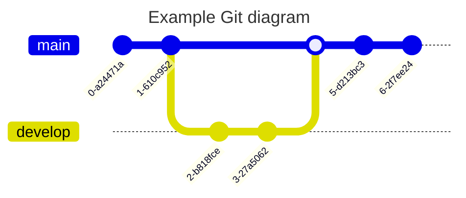
```mermaid
---
title: Example Git diagram
---
gitGraph
   commit
   commit
   branch develop
   checkout develop
   commit
   commit
   checkout main
   merge develop
   commit
   commit
```

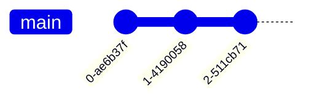
```mermaid
    gitGraph
       commit
       commit
       commit
```

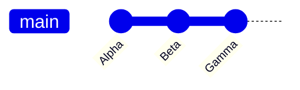
```mermaid
    gitGraph
       commit id: "Alpha"
       commit id: "Beta"
       commit id: "Gamma"
```

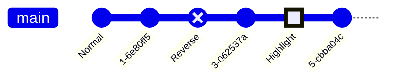
```mermaid
    gitGraph
       commit id: "Normal"
       commit
       commit id: "Reverse" type: REVERSE
       commit
       commit id: "Highlight" type: HIGHLIGHT
       commit
```

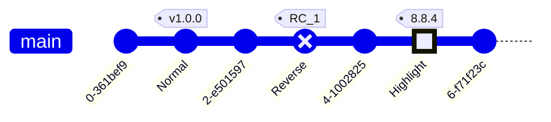
```mermaid
    gitGraph
       commit
       commit id: "Normal" tag: "v1.0.0"
       commit
       commit id: "Reverse" type: REVERSE tag: "RC_1"
       commit
       commit id: "Highlight" type: HIGHLIGHT tag: "8.8.4"
       commit
```

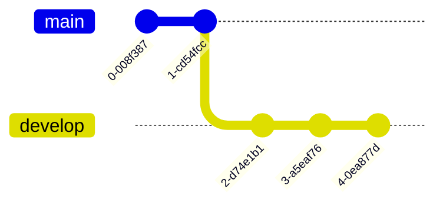
```mermaid
    gitGraph
       commit
       commit
       branch develop
       commit
       commit
       commit
```

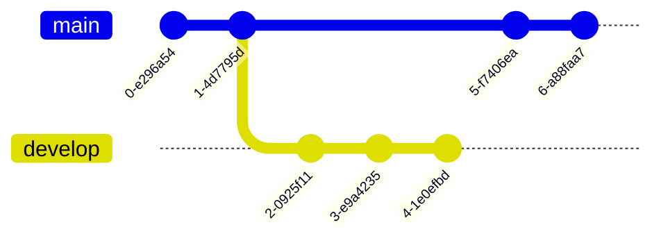
```mermaid
    gitGraph
       commit
       commit
       branch develop
       commit
       commit
       commit
       checkout main
       commit
       commit
```

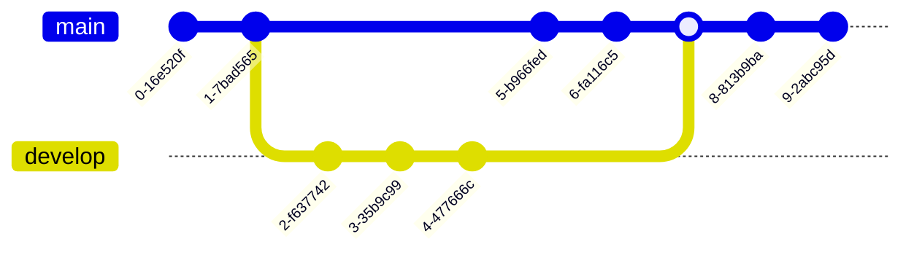
```mermaid
    gitGraph
       commit
       commit
       branch develop
       commit
       commit
       commit
       checkout main
       commit
       commit
       merge develop
       commit
       commit
```

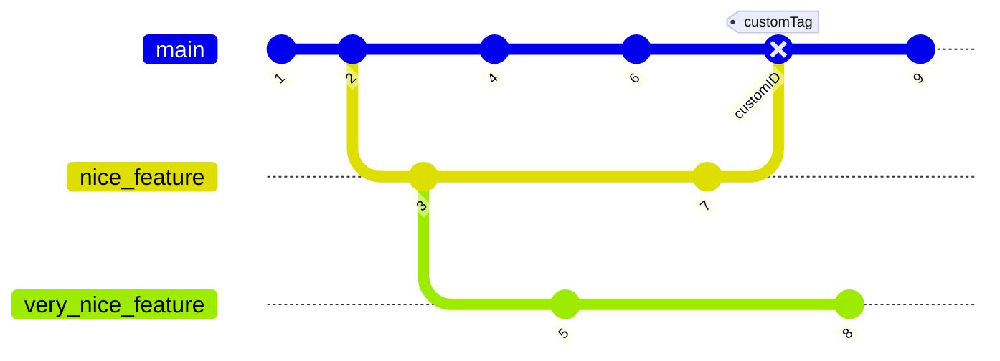
```mermaid
    gitGraph
       commit id: "1"
       commit id: "2"
       branch nice_feature
       checkout nice_feature
       commit id: "3"
       checkout main
       commit id: "4"
       checkout nice_feature
       branch very_nice_feature
       checkout very_nice_feature
       commit id: "5"
       checkout main
       commit id: "6"
       checkout nice_feature
       commit id: "7"
       checkout main
       merge nice_feature id: "customID" tag: "customTag" type: REVERSE
       checkout very_nice_feature
       commit id: "8"
       checkout main
       commit id: "9"
```

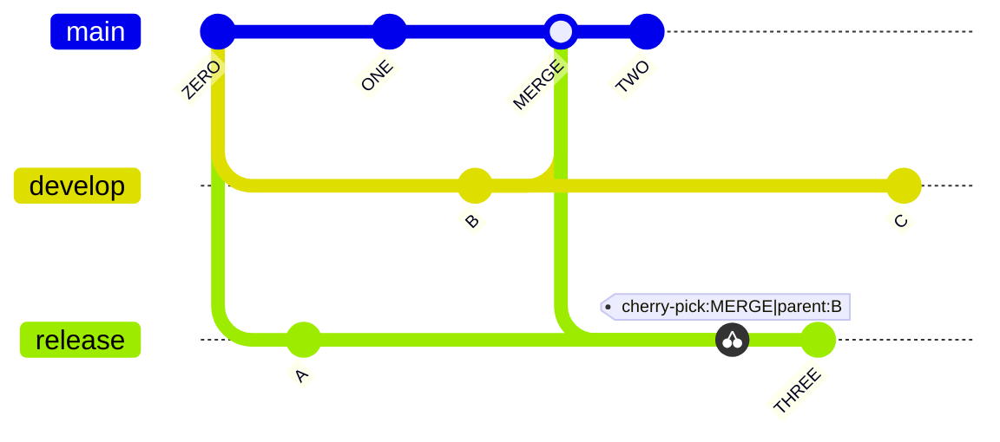
```mermaid
    gitGraph
        commit id: "ZERO"
        branch develop
        branch release
        commit id:"A"
        checkout main
        commit id:"ONE"
        checkout develop
        commit id:"B"
        checkout main
        merge develop id:"MERGE"
        commit id:"TWO"
        checkout release
        cherry-pick id:"MERGE" parent:"B"
        commit id:"THREE"
        checkout develop
        commit id:"C"
```

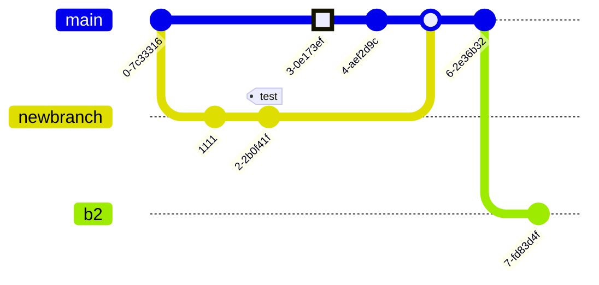
```mermaid
gitGraph:
    commit "Ashish"
    branch newbranch
    checkout newbranch
    commit id:"1111"
    commit tag:"test"
    checkout main
    commit type: HIGHLIGHT
    commit
    merge newbranch
    commit
    branch b2
    commit
```
