# Mindmap Examples

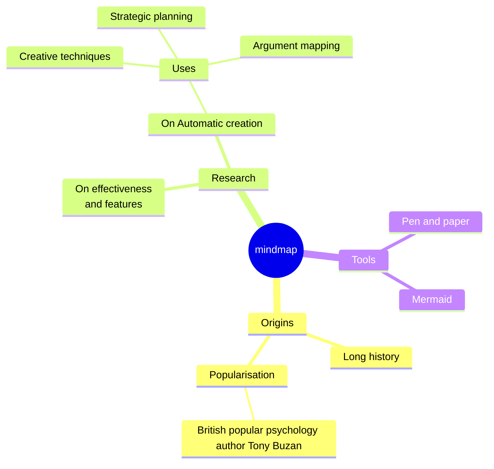
```mermaid
mindmap
  root((mindmap))
    Origins
      Long history
      ::icon(fa fa-book)
      Popularisation
        British popular psychology author Tony Buzan
    Research
      On effectiveness<br/>and features
      On Automatic creation
        Uses
            Creative techniques
            Strategic planning
            Argument mapping
    Tools
      Pen and paper
      Mermaid
```

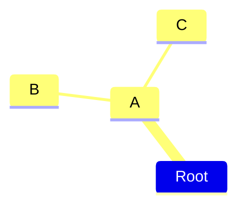
```mermaid
mindmap
Root
    A
      B
      C
```

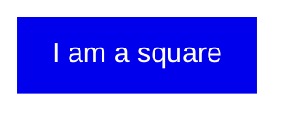
```mermaid
mindmap
    id[I am a square]
```

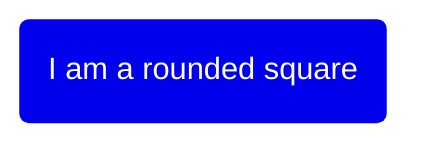
```mermaid
mindmap
    id(I am a rounded square)
```

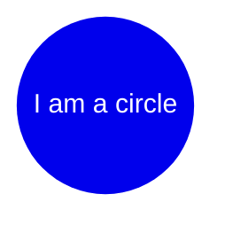
```mermaid
mindmap
    id((I am a circle))
```

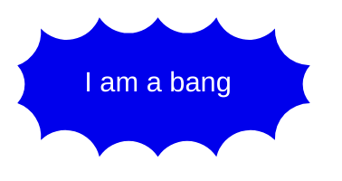
```mermaid
mindmap
    id))I am a bang((
```

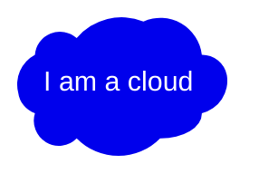
```mermaid
mindmap
    id)I am a cloud(
```

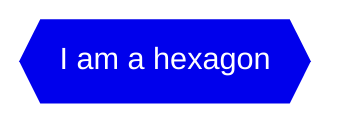
```mermaid
mindmap
    id{{I am a hexagon}}
```

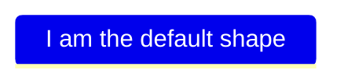
```mermaid
mindmap
    I am the default shape
```

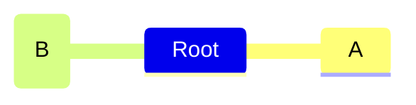
```mermaid
mindmap
    Root
        A
        ::icon(fa fa-book)
        B(B)
        ::icon(mdi mdi-skull-outline)
```

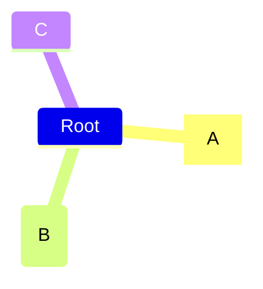
```mermaid
mindmap
    Root
        A[A]
        :::urgent large
        B(B)
        C
```

```mermaid
mindmap
Root
    A
        B
      C
```

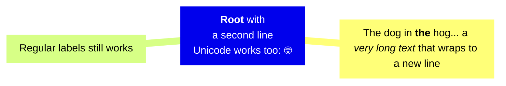
```mermaid
mindmap
    id1["`**Root** with
a second line
Unicode works too: 🤓`"]
      id2["`The dog in **the** hog... a *very long text* that wraps to a new line`"]
      id3[Regular labels still works]
```

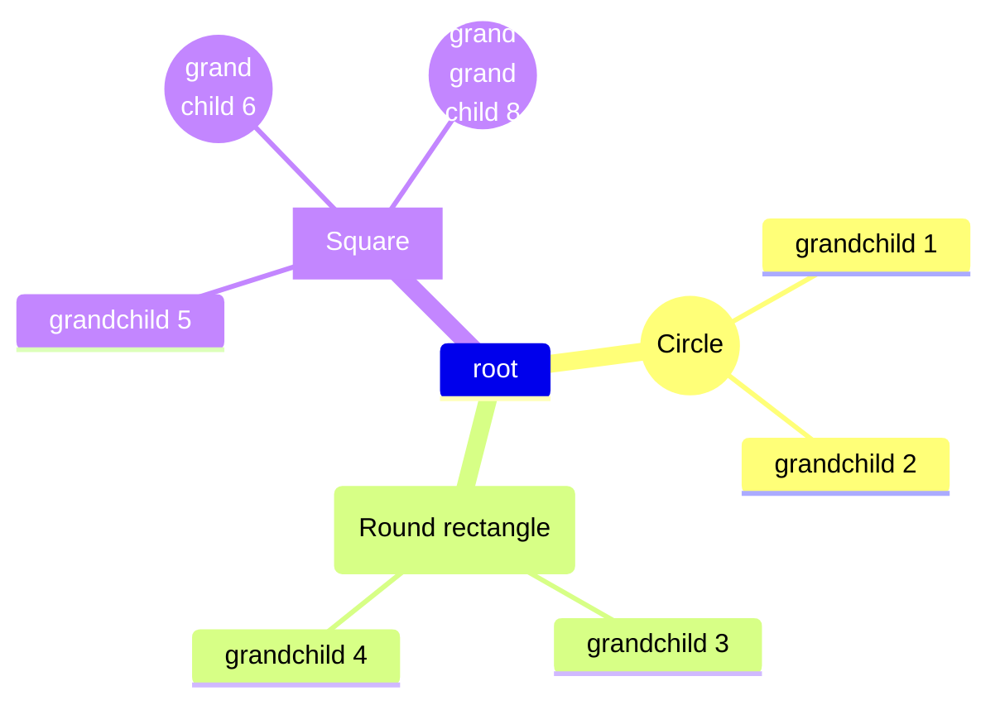
```mermaid
mindmap
root
    child1((Circle))
        grandchild 1
        grandchild 2
    child2(Round rectangle)
        grandchild 3
        grandchild 4
    child3[Square]
        grandchild 5
        ::icon(mdi mdi-fire)
        gc6((grand<br/>child 6))
        ::icon(mdi mdi-fire)
        gc7((grand<br/>grand<br/>child 8))
```
