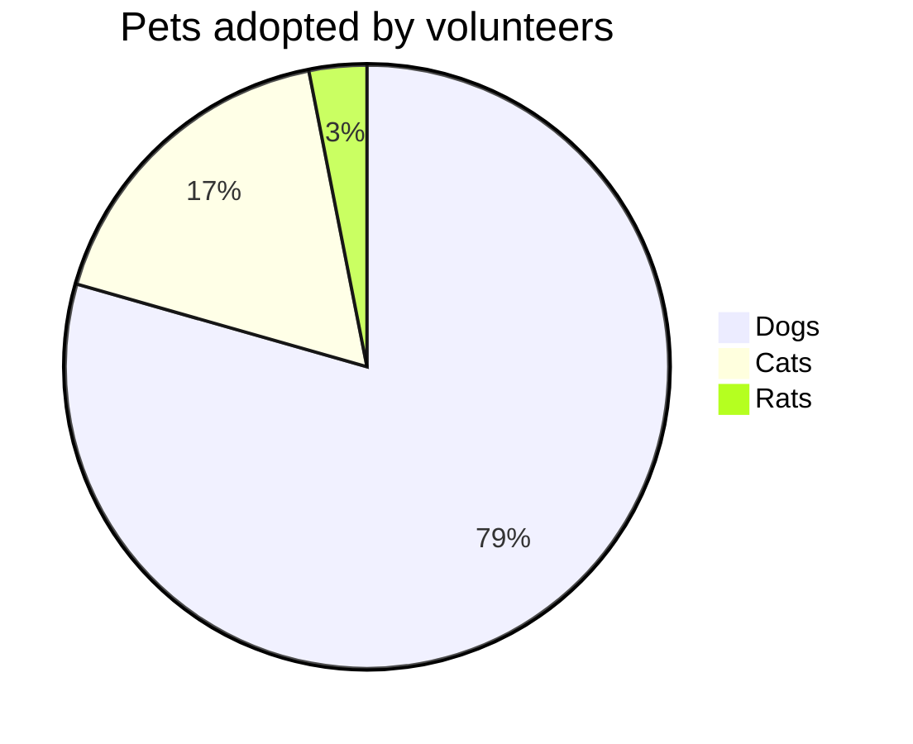
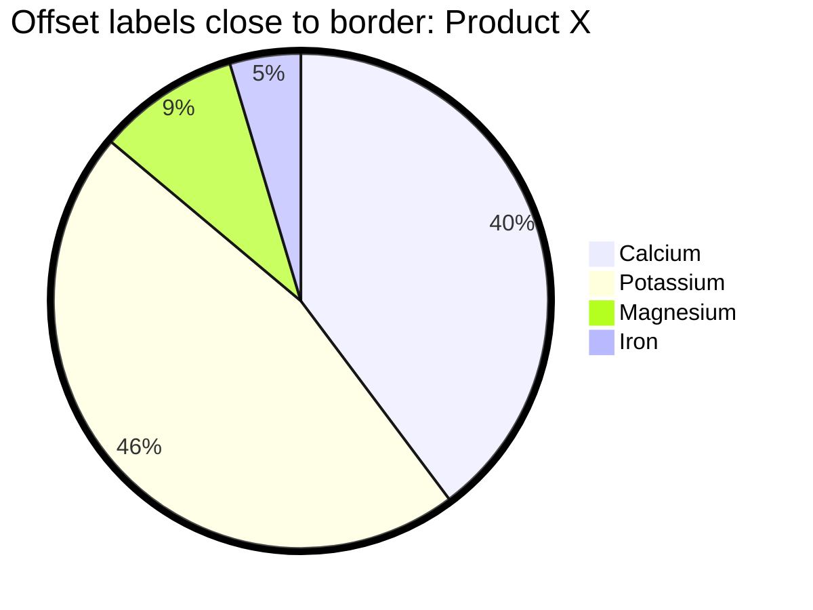
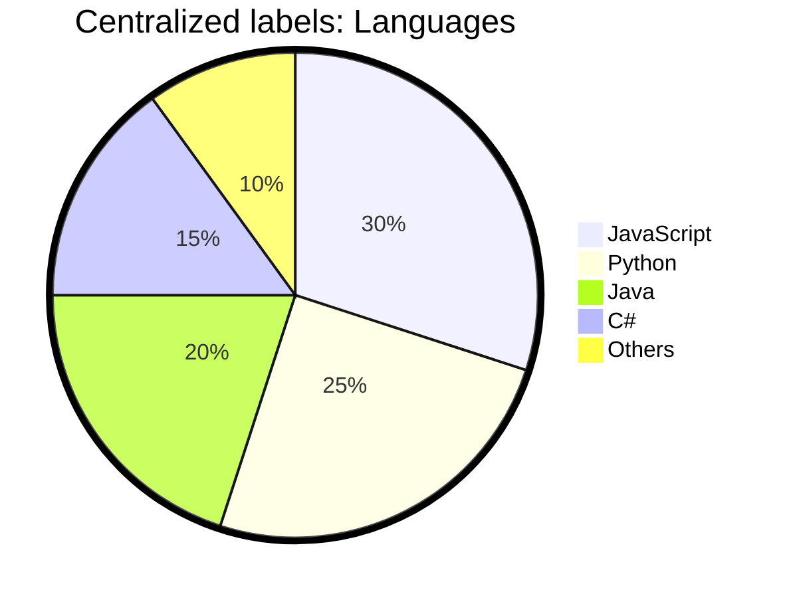
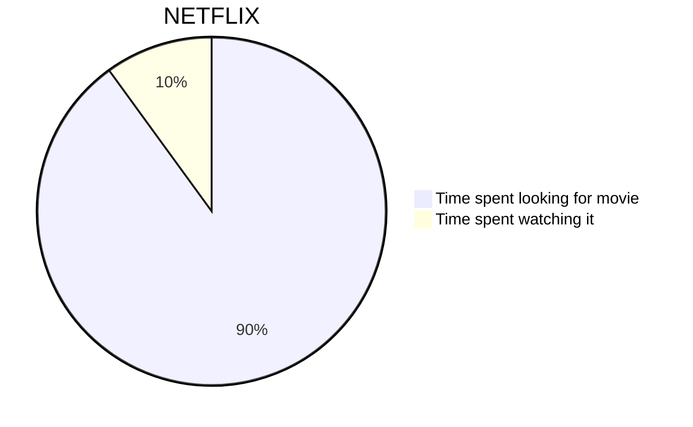
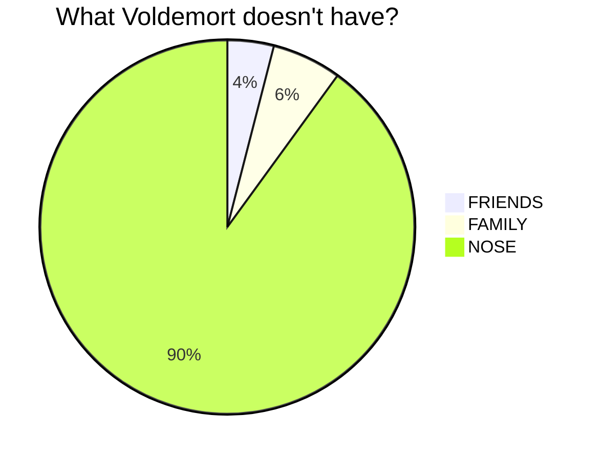

# Pie Chart diagram Examples

```mermaid
pie title Pets adopted by volunteers
    "Dogs" : 386
    "Cats" : 85
    "Rats" : 15
```

```mermaid
%%{init: {"pie": {"textPosition": 0.9}, "themeVariables": {"pieOuterStrokeWidth": "5px"}}}%%
pie
  title Offset labels close to border: Product X
  accTitle: Key elements in Product X
  accDescr: This is a pie chart showing the key elements in Product X.
  "Calcium": 42.96
  "Potassium": 50.05
  "Magnesium": 10.01
  "Iron": 5
```

```mermaid
%%{init: {"pie": {"textPosition": 0.45}, "themeVariables": {"pieOuterStrokeWidth": "5px"}}}%%
pie
  title Centralized labels: Languages
  accTitle: Key elements in Product X
  accDescr: This is a pie chart showing the key elements in Product X.
  "JavaScript": 30
  "Python": 25
  "Java": 20
  "C#": 15
  "Others": 10
```

```mermaid
pie
title NETFLIX
  "Time spent looking for movie" : 90
  "Time spent watching it" : 10
```

```mermaid
pie title What Voldemort doesn't have?
         "FRIENDS" : 2
         "FAMILY" : 3
         "NOSE" : 45
```

