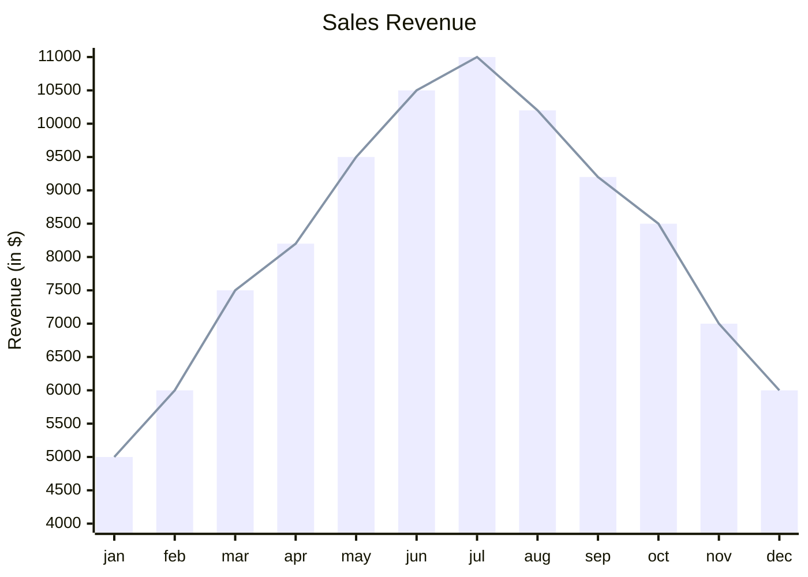
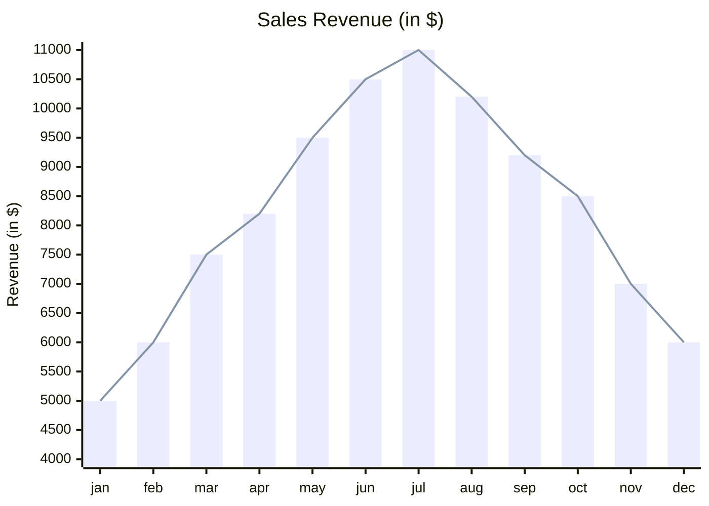
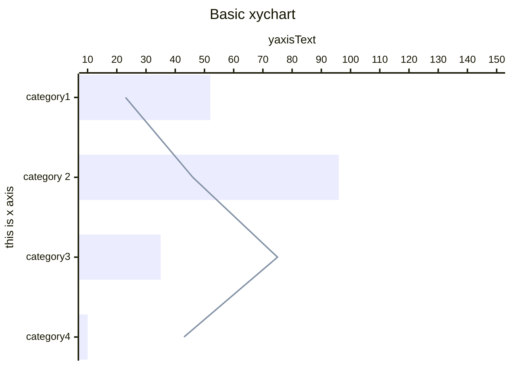
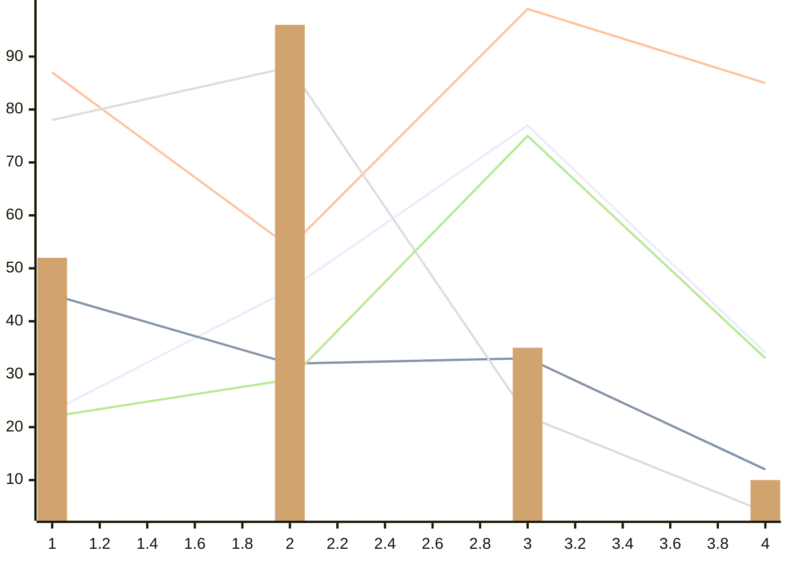
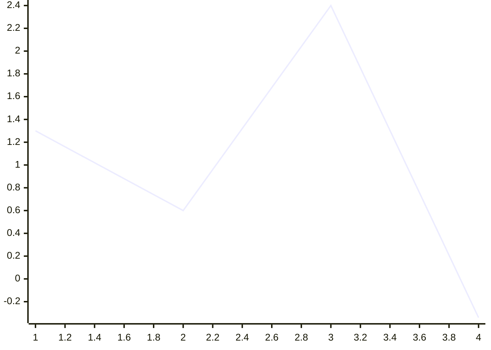
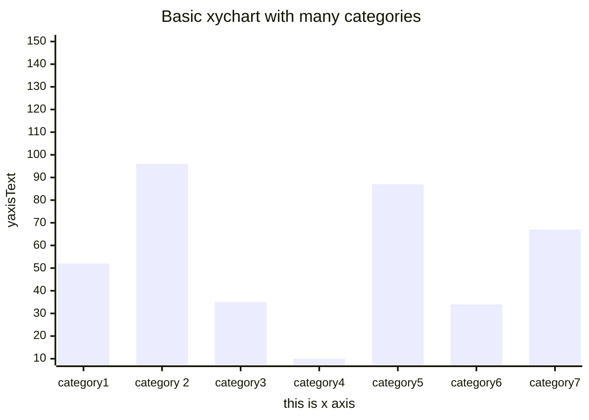
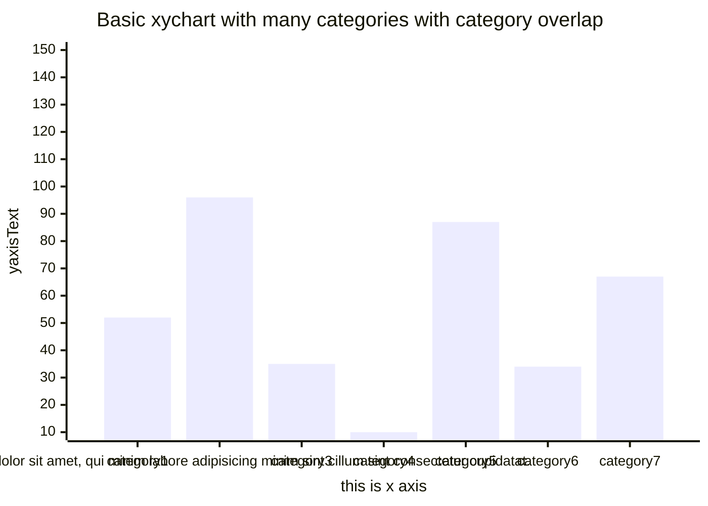

# XY Chart Examples

```mermaid
xychart-beta
  title "Sales Revenue"
  x-axis [jan, feb, mar, apr, may, jun, jul, aug, sep, oct, nov, dec]
  y-axis "Revenue (in $)" 4000 --> 11000
  bar [5000, 6000, 7500, 8200, 9500, 10500, 11000, 10200, 9200, 8500, 7000, 6000]
  line [5000, 6000, 7500, 8200, 9500, 10500, 11000, 10200, 9200, 8500, 7000, 6000]
```

```mermaid
xychart-beta
  title "Sales Revenue (in $)"
  x-axis [jan, feb, mar, apr, may, jun, jul, aug, sep, oct, nov, dec]
  y-axis "Revenue (in $)" 4000 --> 11000
  bar [5000, 6000, 7500, 8200, 9500, 10500, 11000, 10200, 9200, 8500, 7000, 6000]
  line [5000, 6000, 7500, 8200, 9500, 10500, 11000, 10200, 9200, 8500, 7000, 6000]
```

```mermaid
xychart-beta horizontal
  title "Basic xychart"
  x-axis "this is x axis" [category1, "category 2", category3, category4]
  y-axis yaxisText 10 --> 150
  bar "sample bat" [52, 96, 35, 10]
  line [23, 46, 75, 43]
```

```mermaid
xychart-beta
  line [23, 46, 77, 34]
  line [45, 32, 33, 12]
  line [87, 54, 99, 85]
  line [78, 88, 22, 4]
  line [22, 29, 75, 33]
  bar [52, 96, 35, 10]
```

```mermaid
    xychart-beta
    line [+1.3, .6, 2.4, -.34]
```

```mermaid
xychart-beta
  title "Basic xychart with many categories"
  x-axis "this is x axis" [category1, "category 2", category3, category4, category5, category6, category7]
  y-axis yaxisText 10 --> 150
  bar "sample bar" [52, 96, 35, 10, 87, 34, 67, 99]
```

```mermaid
xychart-beta
  title "Basic xychart with many categories with category overlap"
  x-axis "this is x axis" [category1, "Lorem ipsum dolor sit amet, qui minim labore adipisicing minim sint cillum sint consectetur cupidatat.", category3, category4, category5, category6, category7]
  y-axis yaxisText 10 --> 150
  bar "sample bar" [52, 96, 35, 10, 87, 34, 67, 99]
```
